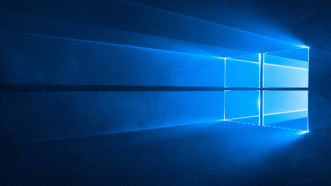
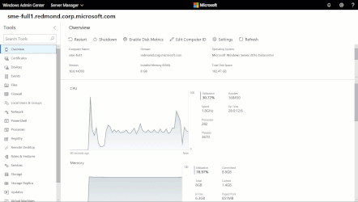

# Windows Admin Center (formerly Project Honolulu)

Windows Admin Center is generally available and can be deployed in production environments. It comes at no additional cost beyond Windows!

## [Download now](http://aka.ms/honolulucurrent)
<!-- Or [plan Windows Admin Center for your environment](/plan/installation-options.md) -->

********************

Quick links: [Documentation](../overview.md) | [Give feedback](todo) | [Recent updates](todo) | [For developers](../extend/how-sdk-works.md)

********************

<!-- # 
<iframe src="https://www.youtube.com/embed/CX4vKnisRj8" width="560" height="315" allowfullscreen></iframe> -->

<!-- UPDATE VIDEO -->

### Windows Admin Center is a lightweight, browser-based GUI toolset for managing servers, clusters, and hyper-converged infrastructure. It's the evolution of familiar in-box managment tools plus so much more.

<!--     -->

<!-- |   |   |   |
|:-:|:-:|:-:|
|   |  |   | -->

<table border="0" style="padding:0">
        <tr> 
          <td style="width:48%" width="48%">   </td>
		  <td style="width:4%" width="4%"> 
		  </td>
		  <td style="width:48%" width="48%">  </td>
        </tr> 
</table>

|   |   |
|:-:|:--|
|   | <b>Simple & lightweight</b>   Familiar tools are streamlined to make management tasks a breeze. Install in under 5 minutes and manage servers in your environment immediately, no target configuration required.  |
|   | <b>Built for the future</b>   Integration with Azure services helps you leverage the power of the hybrid world. Manage Hyper-Converged clusters with powerful yet simple tools.  |
|   | <b>Secure management</b>   Control who can manage servers and get unparalleled insight into the actions administrators perform in your environment.  |

<!-- 

<table>
	<tr style="border: 0;">
		<td style="padding: 10px; border: 0; width:100px">
			
		</td>
		<td style="padding: 10px; border: 0;">
			<b>Simple & lightweight</b>   Familiar tools are streamlined to make management tasks a breeze. Install in under 5 minutes and manage servers in your environment immediately, no target configuration required.
		</td>
	</tr>
    	<tr style="border: 0;">
		<td style="padding: 10px; border: 0; width:100px">
			
		</td>
		<td style="padding: 10px; border: 0;">
			<b>Built for the future</b>   Integration with Azure services helps you leverage the power of the hybrid world. Manage Hyper-Converged clusters with powerful yet simple tools.
		</td>
	</tr>
    	<tr style="border: 0;">
		<td style="padding: 10px; border: 0; width:100px">
			
		</td>
		<td style="padding: 10px; border: 0;">
			<b>Secure management</b>   Control who can manage servers and get unparalleled insight into the actions administrators perform in your environment.
		</td>
	</tr>
</table> -->

[Learn how Windows Admin Center can improve management of your server envrionment.](../overview.md)

********************

##  See how companies use Windows Admin Center in their production environments 

|   Case study 1   |     Case study 2 |    Case study 3  |
|:-:|:-:|:-:|

<!-- 

<table align="center" border="0" cellpadding="0">
	<tr style="border: 0">
		<td style="padding: 20px; border: 0;" align="center">
			  
            Case study 1
		</td>
		<td style="padding: 10px; border: 0;" align="center">
			  
            Case study 2
		</td>
        <td style="padding: 10px; border: 0;" align="center">
			  
            Case study 3
		</td>
	</tr>
</table>

********************
 -->

## Related products

Windows Admin Center is designed for managing a single server or cluster. It complements but does not replace existing Microsoft monitoring and management solutions, such as Remote Server Administration Tools (RSAT), System Center, Operations Management Suite, Intune, or Azure Stack. 

[Learn how Windows Admin Center complements other Microsoft management solutions.](related-management.md)

********************
<!-- <table border="0" cellpadding="0">
    <tr style="border: 0">
        <td style="border: 0;" align="center"> Follow us </td>
        <td style="padding: 10px; border: 0;" align="center"> <a target="_blank" class="mscom-link twitter-follow-link" title="Follow us on Twitter" aria-label="Follow us on Twitter" data-info="Twitter" href="https://twitter.com/servermgmt"><picture><source srcset="//img-prod-cms-rt-microsoft-com.akamaized.net/cms/api/am/imageFileData/REOolR" media="(min-width:0)"></picture></a>
        </td>
        <td style="padding: 10px; border: 0;" align="center"><a target="_blank" class="mscom-link blogs-follow-link" title="Follow us on Blogs" aria-label="Follow us on Blogs" data-info="Blogs" href="https://blogs.technet.microsoft.com/servermanagement/"><picture><source srcset="//img-prod-cms-rt-microsoft-com.akamaized.net/cms/api/am/imageFileData/REOtyw" media="(min-width:0)"></picture></a>
        </td> -->

### Follow us: &nbsp; <a target="_blank" class="mscom-link twitter-follow-link" title="Follow us on Twitter" aria-label="Follow us on Twitter" data-info="Twitter" href="https://twitter.com/servermgmt"><picture><source srcset="//img-prod-cms-rt-microsoft-com.akamaized.net/cms/api/am/imageFileData/REOolR" media="(min-width:0)"></picture></a>&nbsp; <a target="_blank" class="mscom-link blogs-follow-link" title="Follow us on Blogs" aria-label="Follow us on Blogs" data-info="Blogs" href="https://blogs.technet.microsoft.com/servermanagement/"><picture><source srcset="//img-prod-cms-rt-microsoft-com.akamaized.net/cms/api/am/imageFileData/REOtyw" media="(min-width:0)"></picture></a>

<!-- 
<li class=" mr-1"><a target="_blank" class="mscom-link youtube-user-follow-link" title="Follow us on YouTube" aria-label="Follow us on YouTube" data-info="YouTube-User" href="https://www.youtube.com/user/MSCloudOS"><picture><source srcset="//img-prod-cms-rt-microsoft-com.akamaized.net/cms/api/am/imageFileData/REOtyx" media="(min-width:0)"></picture></a></li> -->
<!-- 

<section class="light-background bg-grey-d7 main-content " id="Default_SHARE_FollowUsToolbar" role="region" aria-label="Social media links">

<h2 class="c-heading-4 fl pt-0 pb-0 xs-pt-1 follow-us-label">Follow us</h2><ul class="follow-us-links pl-1 width-auto"><li class=" mr-1"><a target="_blank" class="mscom-link twitter-follow-link" title="Follow us on Twitter" aria-label="Follow us on Twitter" data-info="Twitter" href="https://twitter.com/servermgmt"><picture><source srcset="//img-prod-cms-rt-microsoft-com.akamaized.net/cms/api/am/imageFileData/REOolR" media="(min-width:0)"></picture></a></li><li class=" mr-1"><a target="_blank" class="mscom-link blogs-follow-link" title="Follow us on Blogs" aria-label="Follow us on Blogs" data-info="Blogs" href="https://blogs.technet.microsoft.com/servermanagement/"><picture><source srcset="//img-prod-cms-rt-microsoft-com.akamaized.net/cms/api/am/imageFileData/REOtyw" media="(min-width:0)"></picture></a></li></ul>

<h2 class="c-heading-4 fl pt-0 pb-0 xs-pt-1 social-share-label">Share this page</h2><ul class="social-share-links  pl-1 width-auto"><li class=" mr-1"><a title="Share this page on Facebook" class="mscom-link facebook-link" aria-label="Share this page on Facebook" href="https://www.facebook.com/dialog/feed?app_id=114189562003069&amp;link=https://www.microsoft.com/en-us/cloud-platform/windows-server&amp;redirect_uri=http%3A%2F%2Fwww.facebook.com" target="_blank" data-info="Facebook"><picture><source media="(min-width:0)" srcset="//img-prod-cms-rt-microsoft-com.akamaized.net/cms/api/am/imageFileData/REOqXz"></picture></a></li><li class=" mr-1"><a title="Share this page on Twitter" class="mscom-link twitter-link" aria-label="Share this page on Twitter" href="https://twitter.com/intent/tweet?url=https://www.microsoft.com/en-us/cloud-platform/windows-server&amp;via=Microsoft" target="_blank" data-info="Twitter"><picture><source media="(min-width:0)" srcset="//img-prod-cms-rt-microsoft-com.akamaized.net/cms/api/am/imageFileData/REOolR"></picture></a></li><li class=" mr-1"><a title="Share this page on Linkedin" class="mscom-link linkedin-link" aria-label="Share this page on Linkedin" href="http://www.linkedin.com/shareArticle?mini=true&amp;url=https://www.microsoft.com/en-us/cloud-platform/windows-server&amp;title=Windows Server %7C Microsoft&amp;summary=Increase security, evolve your datacenter, and innovate faster with Microsoft Windows Server—the cloud-ready operating system." target="_blank" data-info="Linkedin"><picture><source media="(min-width:0)" srcset="//img-prod-cms-rt-microsoft-com.akamaized.net/cms/api/am/imageFileData/REOtyy"></picture></a></li></ul>

</section>
 -->