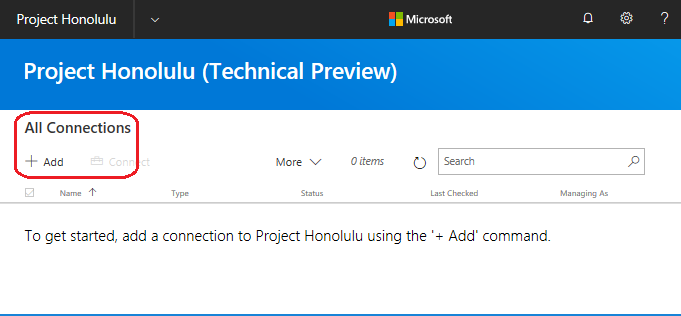
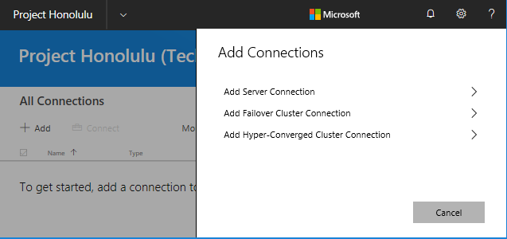
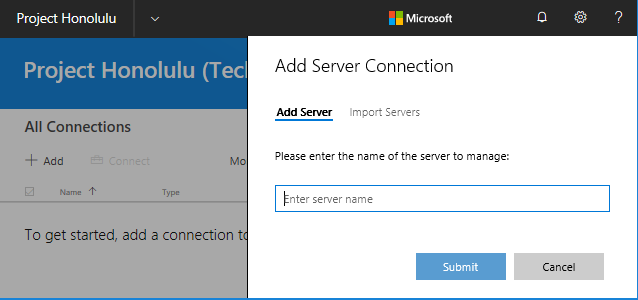
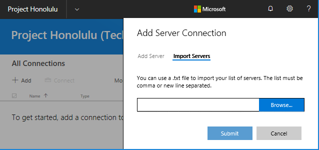
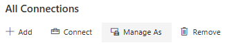
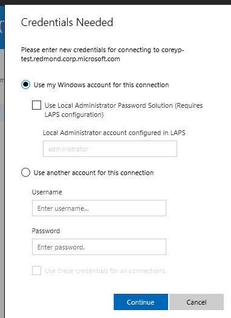

# Launch Windows Admin Center

>Applies To: Windows Server (Semi-Annual Channel), Windows Server 2016, Windows Server 2012 R2, Windows Server 2012, Windows 10

[this is from an end-user perspective - starting point]
[add info about tagging, etc]

## Connecting to managed nodes and clusters ##

After you have completed the installation of Windows Admin Center, you can add servers or clusters to manage from the main overview page.

 **Add a single server or a cluster as a managed node**

 1. Click **+ Add** under **All Connections**.

    

 2. Choose to add a Server, Failover Cluster or Hyper-Converged Cluster connection:
    
    

 3. Type the name of the server or cluster to manage and click **Submit**. The server or cluster will be added to your connection list on the overview page.

    

   **-- OR --**  

**Bulk import multiple servers**

 1. On the **Add Server Connection** page, choose the **Import Servers** tab.

    

 2. Click **Browse** and select a text file that contains a comma, or new line separated, list of FQDNs for the servers you want to add.

## Authenticate with the managed node ##

Windows Admin Center supports several mechanisms for authenticating with a managed node. Single sign-on is the default.

**Single Sign-on**

You can use your current Windows credentials to authenticate with the managed node. This is the default, and Windows Admin Center attempts the sign-on when you add a server. 

**Single sign-on when deployed as a Service on Windows Server**

If you have installed Windows Admin Center on Windows Server, additional configuration is required for single sign-on.  [Configure your environment for delegation](..\configure\user-access-control.md)

**-- OR --**

**Use *Manage As* to Specify credentials**

Under **All Connections**, select a server from the list and choose **Manage As** to specify the credentials that you will use to authenticate to the managed node:

If Windows Admin Center is running in service mode on Windows Server, but you do not have Kerberos delegation configured, you must re-enter your Windows credentials:

You may apply the credentials to all connections, which will cache them for that
specific browser session. If you reload your browser, you must re-enter your
**Manage As** credentials.

**Local Administrator Password Solution (LAPS)**

If your environment uses [LAPS](https://technet.microsoft.com/en-us/mt227395.aspx), you can use LAPS credentials to authenticate with the managed node. **If you test this scenario, please** [provide feedback](http://aka.ms/HonoluluFeedback).
