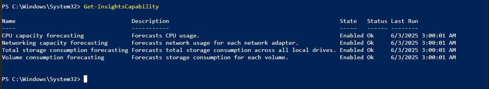
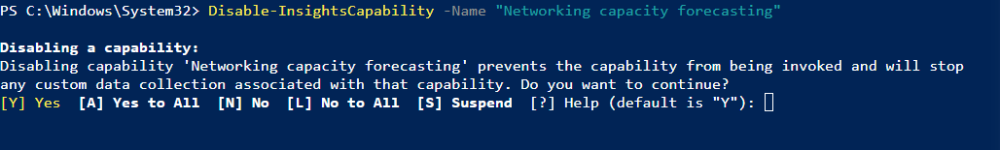
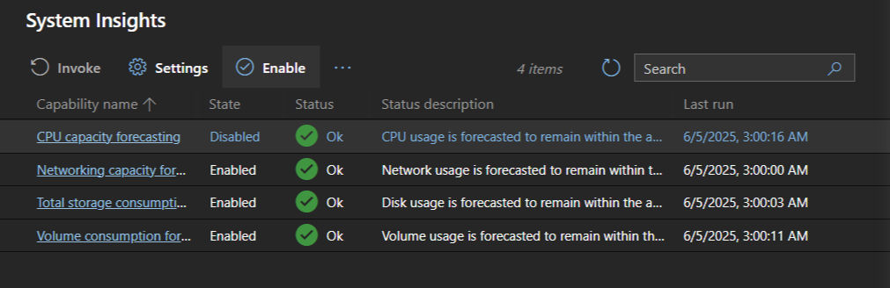
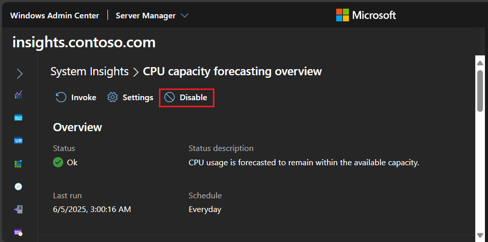
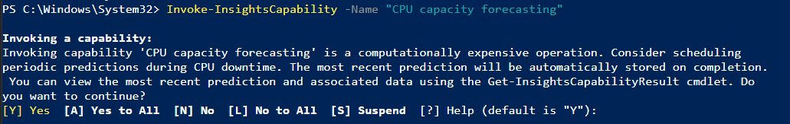
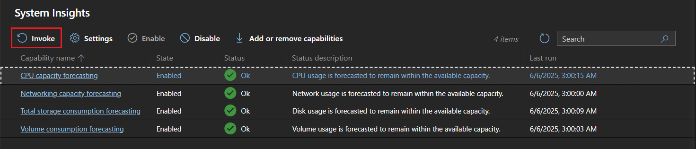
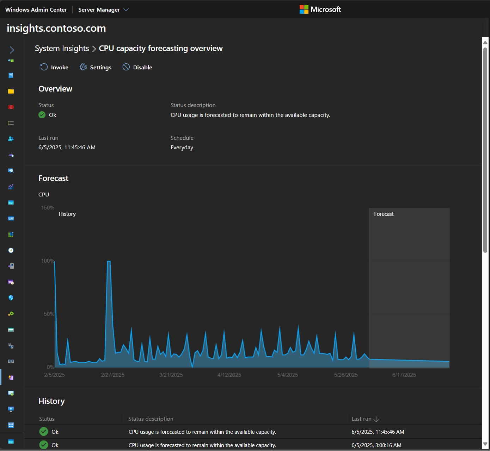
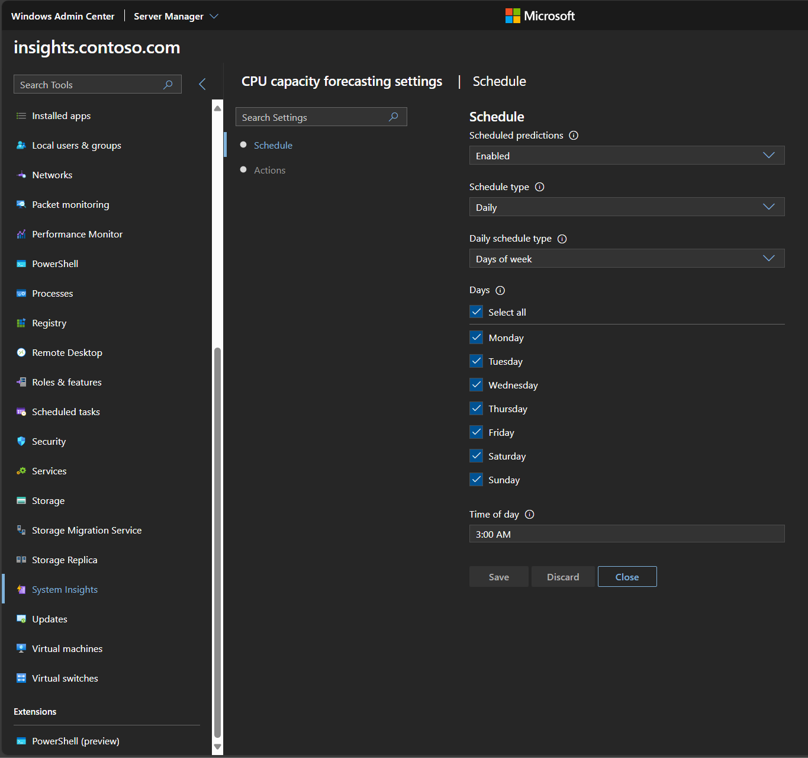
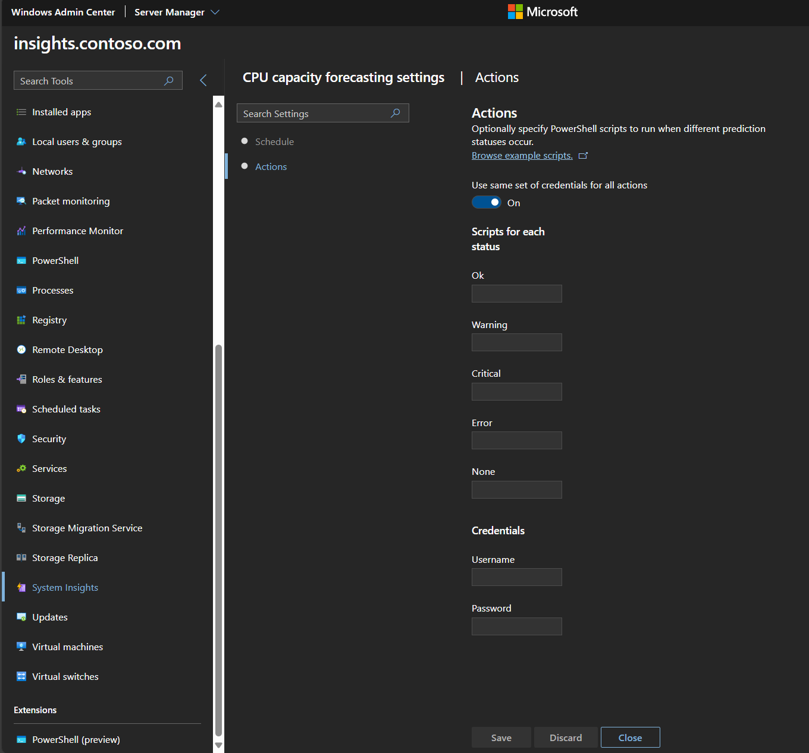

# Manage System Insights capabilities in Windows Admin Center

System Insights capabilities can be managed and configured to meet your deployment needs. This article explains how to adjust settings for each capability using **PowerShell** or **Windows Admin Center**, with step-by-step examples and screenshots.

## View capabilities

### [PowerShell](#tab/PowerShell)

You can list all of the available capabilities using the [Get-InsightsCapability](/powershell/module/systeminsights/get-insightscapability) cmdlet:

1. Open PowerShell. Enter the following command:

```PowerShell
Get-InsightsCapability
```



### [Windows Admin Center](#tab/windows-admin-center)

These capabilities are also visible in System Insights extension:

1. From Windows Admin Center, open Server Manager.
1. Select your server.
1. Select System Insights from the list of extensions.

[  ](media/system-insights-overview.png#lightbox)

---

## Enable and disable a capability

Each capability can be enabled or disabled. Disabling a capability prevents that capability from being invoked, and for non-default capabilities, disabling a capability stops all data collection for that capability. By default, all capabilities are enabled, and you can check the state of a capability before changing it.

### [PowerShell](#tab/PowerShell)

To enable a capability, use the **Enable-InsightsCapability** cmdlet:

1. Open PowerShell, and enter the following command replacing the name of the capability with the capability of your choice.

    ```PowerShell
    Enable-InsightsCapability -Name "CPU capacity forecasting"
    ```

To disable a capability, use the **Disable-InsightsCapability** cmdlet:

1. Open PowerShell, and enter the following command replacing the name of the capability with the capability of your choice.

    ```PowerShell
    Disable-InsightsCapability -Name "Networking capacity forecasting"
    ```

1. You're prompted to confirm the capability you're disabling.

    [  ](media/disable-insights-capability.png#lightbox)

### [Windows Admin Center](#tab/windows-admin-center)

These settings can be toggled by selecting a capability in Windows Admin Center.

To enable a capability:

1. Open the **Systems Insights** extension.
1. Select the row of the capability you want to enable.
1. Select **Enable** in the top menu.
1. The capability is enabled.

    [  ](media/enable-capability.png#lightbox)

To disable a capability:

1. Open the **Systems Insights** extension.
1. Select the name of the capability you want to disable.
1. Select **Disable** in the top menu of the capability overview page.
1. The capability is disabled.

    [  ](media/disable-capability.png#lightbox)

---

### Invoke a capability

Invoking a capability immediately runs the capability to retrieve a prediction, and administrators can invoke a capability any time in Windows Admin Center, or by using the **Invoke-InsightsCapability** cmdlet. To make sure invoking a capability doesn't conflict with critical operations on your machine, consider scheduling predictions during off-business hours.

### [PowerShell](#tab/PowerShell)

1. Open PowerShell, and enter the following command replacing the name of the capability with the capability of your choice.

    ```PowerShell
    Invoke-InsightsCapability -Name "CPU capacity forecasting"
    ```

1. Confirm that you want to invoke the capability.

    [  ](media/invoke-insights-capability.png#lightbox)

### [Windows Admin Center](#tab/windows-admin-center)

1. Open the **Systems Insights** extension.

1. Select the row of the capability you want to invoke.

1. Select the **Invoke** button in Windows Admin Center.

    [  ](media/invoke-cpu-capacity-forecasting.png#lightbox)

1. A notification appears and shows the capability was successfully invoked.

---

## Retrieve capability results

### [PowerShell](#tab/PowerShell)

Once a capability is invoked, the most recent results are visible using **Get-InsightsCapability** or **Get-InsightsCapabilityResult**. These cmdlets output the most recent **Status** and **Status Description** of each capability, which describe the result of each prediction. The **Status** and **Status Description** fields are further described in the [understanding capabilities document](understanding-capabilities.md).

Additionally, you can use the **Get-InsightsCapabilityResult** cmdlet to view the last 30 prediction results and to retrieve the data associated with the prediction:

```PowerShell
# Specify the History parameter to see the last 30 prediction results.
Get-InsightsCapabilityResult -Name "CPU capacity forecasting" -History

# Use the Output field to locate and then show the results of "CPU capacity forecasting."
# Specify the encoding as UTF8, so that Get-Content correctly parses non-English characters.
$Output = Get-Content (Get-InsightsCapabilityResult -Name "CPU capacity forecasting").Output -Encoding UTF8 | ConvertFrom-Json
$Output.ForecastingResults
```

### [Windows Admin Center](#tab/windows-admin-center)

The System Insights extension automatically shows the prediction history and parses the results of the JSON result, giving you an intuitive, high-fidelity graph of each forecast:

[  ](media/cpu-forecasting.png#lightbox)

---

### Use the event log to retrieve capability results

System Insights logs an event each time a capability finishes a prediction. These events are visible in the **Microsoft-Windows-System-Insights/Admin** channel, and System Insights publishes a different event ID for each status:

| Prediction status | Event ID |
| --------------- | --------------- |
| Ok | 151 |
| Warning | 148 |
| Critical | 150 |
| Error | 149 |
| None | 132 |

Use [Azure Monitor](https://azure.microsoft.com/services/monitor/) or [System Center Operations Manager](/system-center/scom/welcome) to aggregate these events and see prediction results across a group of machines.

## Set a capability schedule

In addition to on-demand predictions, you can configure periodic predictions for each capability so that the specified capability is automatically invoked on a predefined schedule. Each default capability is scheduled to run every day at 3am. You can, however, create custom schedules for each capability, and System Insights supports a variety of schedule types.

### [PowerShell](#tab/PowerShell)

Use the **Get-InsightsCapabilitySchedule** cmdlet to see capability schedules. Use the pipeline `|` in PowerShell to see information for all capabilities returned by the **Get-InsightsCapability** cmdlet.

```PowerShell
Get-InsightsCapability | Get-InsightsCapabilitySchedule
```

Periodic predictions are enabled by default though they can be disabled at any time using the **Enable-InsightsCapabilitySchedule** and **Disable-InsightsCapabilitySchedule** cmdlets:

```PowerShell
Enable-InsightsCapabilitySchedule -Name "Total storage consumption forecasting"
Disable-InsightsCapabilitySchedule -Name "Volume consumption forecasting"
```

You can create custom schedules for each capability using the **Set-InsightsCapabilitySchedule** cmdlet:

```PowerShell
Set-InsightsCapabilitySchedule -Name "CPU capacity forecasting" -Daily -DaysInterval 2 -At 4:00PM
Set-InsightsCapabilitySchedule -Name "Networking capacity forecasting" -Daily -DaysOfWeek Saturday, Sunday -At 2:30AM
Set-InsightsCapabilitySchedule -Name "Total storage consumption forecasting" -Hourly -HoursInterval 2 -DaysOfWeek Monday, Wednesday, Friday
Set-InsightsCapabilitySchedule -Name "Volume consumption forecasting" -Minute -MinutesInterval 30
```

Because the default capabilities analyze daily data, it's recommended to use daily schedules for these capabilities. Learn more about the [default capabilities](understanding-capabilities.md).

### [Windows Admin Center](#tab/windows-admin-center)

You can also use Windows Admin Center to view and set schedules for each capability.

1. Select the name of the capability you want to schedule.
1. Select **Settings** on the capability overview page.
1. The **Schedule** tab shows the current schedule, and can be updated to run on a different schedule.

[  ](media/cpu-capacity-forecast-schedule.png#lightbox)

---

## Create remediation actions

System Insights enables you to kick off custom remediation scripts based on the result of a capability. For each capability, you can configure a custom PowerShell script for each prediction status, allowing administrators to take corrective action automatically, rather than requiring manual intervention.

Sample remediation actions include running disk cleanup, extending a volume, running deduplication, live migrating VMs, and setting up Azure File Sync.

### [PowerShell](#tab/PowerShell)

You can see the actions for each capability using the **Get-InsightsCapabilityAction** cmdlet:

```PowerShell
Get-InsightsCapability | Get-InsightsCapabilityAction
```

You can create new actions or delete existing actions using the **Set-InsightsCapabilityAction** and **Remove-InsightsCapabilityAction** cmdlets. Each action is run using credentials that are specified in the **ActionCredential** parameter.

```PowerShell
$Cred = Get-Credential
Set-InsightsCapabilityAction -Name "CPU capacity forecasting" -Type Warning -Action "C:\Users\Public\WarningScript.ps1" -ActionCredential $Cred
Set-InsightsCapabilityAction -Name "CPU capacity forecasting" -Type Critical -Action "C:\Users\Public\CriticalScript.ps1" -ActionCredential $Cred

Remove-InsightsCapabilityAction -Name "CPU capacity forecasting" -Type Warning
```

### [Windows Admin Center](#tab/windows-admin-center)

You can also use Windows Admin Center to set remediation actions.

1. Select the name of the capability you want to specify actions for.
1. Select **Settings** on the capability overview page.
1. The **Actions** tab shows the current actions. Browse example scripts, set scripts to run for each status, and enter credentials in this tab.

[  ](media/cpu-capacity-forecast-actions.png#lightbox)

---

## Related content

To learn more about System Insights, use the following resources:

- [System Insights PowerShell documentation](/powershell/module/systeminsights/)
- [System Insights overview](overview.md)
- [Understanding capabilities](understanding-capabilities.md)
- [Adding and developing capabilities](adding-and-developing-capabilities.md)
- [System Insights FAQ](faq.md)
