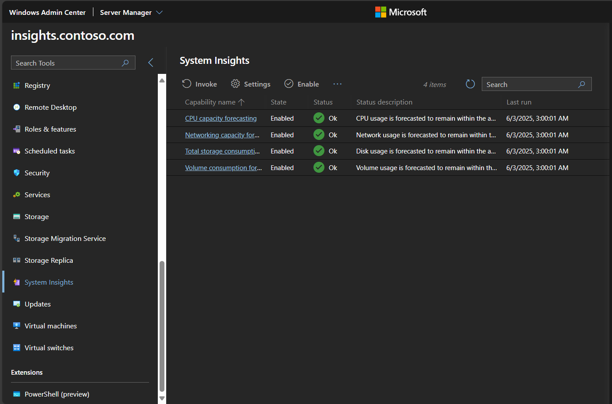

# What is System Insights?

System Insights brings predictive analytics to Windows Server, enabling you to forecast and manage server resources proactively. By analyzing local system data with machine learning models, System Insights helps you anticipate potential issues and optimize resource usage—reducing the need for reactive troubleshooting. This overview explains how System Insights works, its key features, and how you can use it to improve server management.

System Insights is available on Windows Server 2019 and newer. It runs on both host and guest machines, on any hypervisor, and in any cloud.

System Insights is preinstalled on Windows Server.

## Available capabilities

System Insights provides four capabilities that are enabled by default:

- CPU capacity forecasting - Forecasts CPU usage.
- Networking capacity forecasting - Forecasts network usage for each network adapter.
- Total storage consumption forecasting - Forecasts total storage consumption across all local drives.
- Volume consumption forecasting - Forecasts storage consumption for each volume.

System Insights also has an [extensible infrastructure](adding-and-developing-capabilities.md), so Microsoft and third parties can add new predictive capabilities to System Insights without updating the operating system.

## Manage System Insights

You can manage System Insights through [Windows Admin Center](../windows-admin-center/overview.md), or [directly through PowerShell](/powershell/module/systeminsights/). Configure each predictive capability separately according to the needs of your deployment. All prediction results are published to the event log, so you can use [Azure Monitor](https://azure.microsoft.com/services/monitor/) or [System Center Operations Manager](/system-center/scom/welcome?view=sc-om-1807&preserve-view=true) to easily aggregate and view predictions across a group of machines.

## Local functionality of System Insights

System Insights runs completely locally on Windows Server. All of your data is collected, persisted, and analyzed directly on your machine, so that you can realize predictive analytics capabilities without any cloud connectivity.

Your system data is stored on your machine, and this data is analyzed by predictive capabilities that don't require retraining in the cloud. With System Insights, you can retain your data on your machine and still benefit from predictive analytics capabilities.

## Related content

To learn more about System Insights, use the following resources:

- [Understand capabilities](understanding-capabilities.md)
- [Manage capabilities](managing-capabilities.md)
- [Add and develop capabilities](adding-and-developing-capabilities.md)
- [System Insights FAQ](faq.md)
