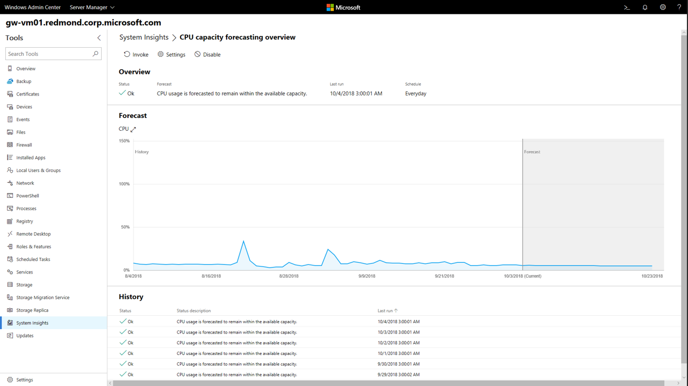
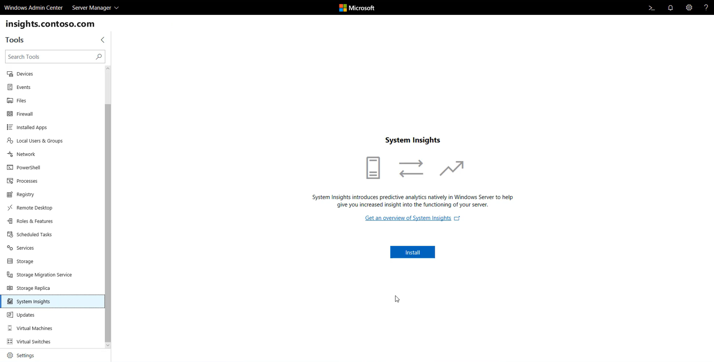

# System Insights overview

>Applies To: Windows Server 2019

System Insights is a new predictive analytics feature in Windows Server 2019. The System Insights predictive capabilities - each backed by a machine-learning model - locally analyze Windows Server system data, such as performance counters and events, providing insight into the functioning of your servers and helping you reduce the operational expenses associated with reactively managing issues in your deployments. 

In Windows Server 2019, System Insights ships with four default capabilities focused on capacity forecasting, predicting future resource for compute, networking, and storage based on your previous usage patterns. System Insights also ships with an [extensible infrastructure](adding-and-developing-capabilities.md), so Microsoft and 3rd parties can add new predictive capabilities to System Insights without updating the operating system. 

You can manage System Insights through an intuitive [Windows Admin Center](https://docs.microsoft.com/windows-server/manage/windows-admin-center/overview) extension or [directly through PowerShell](https://aka.ms/SystemInsightsPowerShell), and System Insights allows you to configure each predictive capability separately according to the needs of your deployment. All prediction results are published to the event log, which allows you to use [Azure Monitor](https://azure.microsoft.com/services/monitor/) or [System Center Operations Manager](https://docs.microsoft.com/system-center/scom/welcome?view=sc-om-1807) to easily aggregate and see predictions across a group of machines.



## Local functionality
System Insights runs completely locally on Windows Server. Using new functionality introduced in Windows Server 2019, all of your data is collected, persisted, and analyzed directly on your machine, allowing you to realize predictive analytics capabilities without any cloud-connectivity.

Your system data is stored on your machine, and this data is analyzed by predictive capabilities that don't require retraining in the cloud. With System Insights, you can retain your data on your machine and still benefit from predictive analytics capabilities. 

## Get started

<iframe src="https://www.youtube-nocookie.com/embed/AJxQkx5WSaA" width="560" height="315" allowfullscreen></iframe>

>[!TIP]
>Watch these short videos to learn the information you need to get started and confidently manage System Insights: [Getting started with System Insights in 10 minutes](https://blogs.technet.microsoft.com/filecab/2018/07/24/getting-started-with-system-insights-in-10-minutes/)

### Requirements
System Insights is available on any Windows Server 2019 instance. It runs on both host and guest machines, on any hypervisor, and in any cloud.

### Install System Insights
>[!IMPORTANT]
>System Insights collects and stores up to a year's worth of data locally. If you would like to retain your data when upgrading your operating system, **make sure you use In-Place Upgrade**.

#### Install the feature
You can install System Insights using the extension within Windows Admin Center:



You can also install System Insights directly through Server Manager by adding the **System-Insights** feature, or by using PowerShell:

```PowerShell
Add-WindowsFeature System-Insights -IncludeManagementTools
```

## Provide feedback
We'd love to hear your feedback to help us improve this feature. You can use the following channels to submit feedback:
- **Feedback Hub**: Use the Feedback Hub tool in Windows 10 to file a bug or feedback. When doing so, please specify:
    - **Category**: Server 
    - **Subcategory**: System Insights
- **UserVoice**: Submit feature requests through our [UserVoice page](https://windowsserver.uservoice.com/forums/295071-management-tools). Share with your colleagues to upvote items that are important to you.
- **Email**: If you'd like to submit your feedback privately to the feature team, send an email to system-insights-feed@microsoft.com. Please keep in mind that we still may request you to use Feedback Hub or UserVoice.

## See also
To learn more about System Insights, use the following resources:

- [Understanding capabilities](understanding-capabilities.md)
- [Managing capabilities](managing-capabilities.md)
- [Adding and developing capabilities](adding-and-developing-capabilities.md)
- [System Insights FAQ](faq.md)