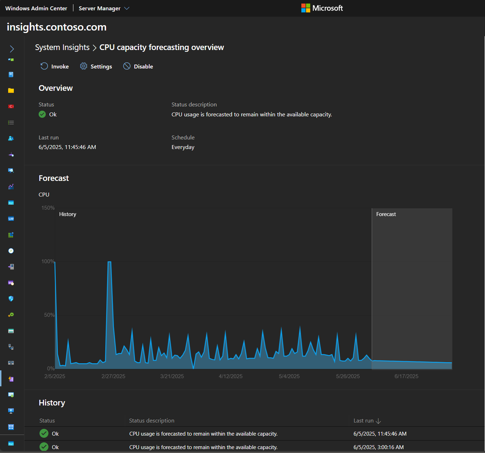

# System Insights overview

>Applies To: Windows Server Insider Preview build 17692 and later

System Insights is a new feature that introduces predictive analytics natively to Windows Server. These predictive capabilities locally analyze Windows Server system data, such as performance counters or ETW events, helping IT administrators proactively detect and address problematic behavior in their deployments. 

You can manage System Insights through an intuitive [Windows Admin Center](https://docs.microsoft.com/windows-server/manage/windows-admin-center/overview) extension or [directly through PowerShell](https://aka.ms/SystemInsightsPowerShell), and System Insights allows you to configure each capability separately according to the needs of your deployment, helping you reduce the operational expenses associated with monitoring your Windows Server instances. In Windows Server 2019, System Insights introduces default capabilities focused on capacity forecasting, predicting future resource usage for compute, network, and storage.



## Local functionality
System Insights runs completely locally on Windows Server. Using new functionality introduced in Windows Server 2019, all of your data is collected, persisted, and analyzed directly on your machine, allowing you to realize predictive analytics capabilities without any cloud-connectivity.

Your system data is stored on your machine, and this data is analyzed by predictive capabilities that don't require retraining in the cloud. With System Insights, you can retain your data on your machine and still benefit from advanced analytics capabilities. 


## Get started
### Requirements
System Insights is currently available in Windows Server 2019 Insider Preview Build 17692. 

System Insights runs on any Windows Server 2019 instance. It runs on both host and guest machines, on any hypervisor, and in any cloud.

### Install System Insights

>[!IMPORTANT]
>System Insights collects and stores up to a year's worth of data locally. If you would like to retain your data when upgrading your operating system to the latest build, **make sure you use In-Place Upgrade**.

#### Install the feature
You can install System Insights directly through Server Manager by adding the **System-Insights** feature, or by using PowerShell:

```PowerShell
Add-WindowsFeature System-Insights -IncludeManagementTools
```
You can also use the System Insights extension within Windows Admin Center to add System Insights. After installing the System Insights extension, click to enable System Insights:


#### Install the Windows Admin Center extension

Download the latest System Insights extension [using the Windows Admin Center extension manager](https://docs.microsoft.com/en-us/windows-server/manage/windows-admin-center/configure/using-extensions). 

If you have a previous System Insights extension installed, make sure to uninstall it and install the latest extension.

## Provide feedback
>[!IMPORTANT]
>Before reporting any bugs, please ensure you're running the latest build. Visit [this page](https://www.microsoft.com/en-us/software-download/windowsinsiderpreviewserver) to get the latest Windows Server 2019 Preview build, and download the latest System Insights extension for Windows Admin Center [using the extension manager](https://docs.microsoft.com/en-us/windows-server/manage/windows-admin-center/configure/using-extensions).

We'd love to hear your feedback to help us improve this feature. You can use the following channels to submit feedback:
- **Feedback Hub**: Use the Feedback Hub tool in Windows 10 to file a bug or feedback. When doing so, please specify:
    - **Category**: Server 
    - **Subcategory**: System Insights
- **UserVoice**: Submit feature requests through our [UserVoice page](https://windowsserver.uservoice.com/forums/295071-management-tools). Share with your colleagues to upvote items that are important to you.
- **Email**: If you'd like to submit your feedback privately to the feature team, send an email to system-insights-feed@microsoft.com. Please keep in mind that we still may request you to use Feedback Hub or UserVoice.

## See also
To learn more about System Insights, use the following resources:

- [Understanding capabilities](understanding-capabilities.md)
- [Managing capabilities](managing-capabilities.md)
- [Adding and developing capabilities](adding-and-developing-capabilities.md)
- [System Insights FAQ](faq.md)