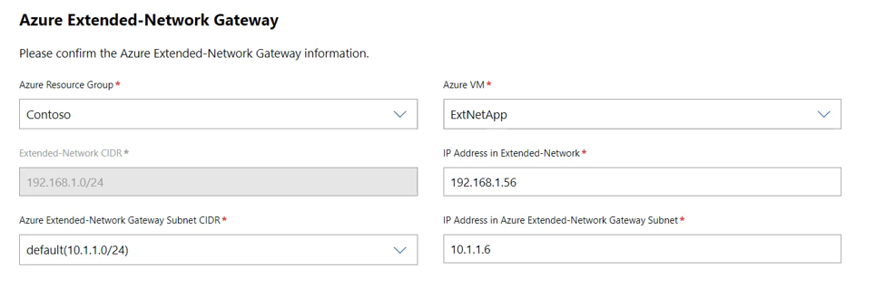

# Extend your on-premises subnets into Azure using extended network for Azure

>Applies to: Windows Admin Center, Windows Admin Center Preview

## Overview

Extended network for Azure enables you to stretch an on-premises subnet into Azure to let on-premises virtual machines keep their original on-premises private IP addresses when migrating to Azure.

The network is extended using a bidirectional VXLAN tunnel between two Windows Server 2019 VMs acting as virtual appliances, one running on-premises and the other running in Azure, each also connected to the subnet to be extended.
Each subnet that you are going to extend requires one pair of appliances. Multiple subnets can be extended using multiple pairs.

> [!NOTE]
> Extended network for Azure should only be used for machines that cannot have their IP address changed when migrating to Azure. It is always better to change the IP address and connect it to a subnet that wholly exists in Azure, if that is an option.

## Planning

To prepare to use extended network for Azure, you must identify which subnet you want to stretch, then perform the following steps:

### Capacity planning

You can extend up to 250 IP addresses using extended network for Azure. You can expect an aggregate throughput of about 700 Mbps, with some variability depending on the CPU speed of the extended network for Azure virtual appliances.

### Configuration in Azure

Before you use Windows Admin Center, you must perform the following steps through the Azure Portal:

1. Create a Virtual network in Azure that contains at least two subnets, in addition to subnets required for your gateway connection. One of the subnets you create must use the same subnet CIDR as the on-premises subnet you want to extend. The subnet must be unique within your routing domain so that it does not overlap with any on-premises subnets.

2. Configure a virtual network gateway to use a site-to-site or ExpressRoute connection to connect the virtual network to your on-premises network.

3. Create a Windows Server 2022 Azure Edition VM in Azure that is capable of running nested virtualization. This is one of your two virtual appliances. Connect the primary network interface to the routable subnet, and the second network interface to the extended subnet.

> [!NOTE]
> Extended network for Azure requires Windows Server 2022 Azure Edition for the VM that is running in Azure.   

4. Start the VM, enable the Hyper-V role, and reboot. For example:

    ```powershell
    Install-WindowsFeature -Name Hyper-V -IncludeManagementTools -Restart
    ```

5. Create two external virtual switches in the VM and connect one to each of the network interfaces. For example:

    ```powershell
    New-VMSwitch -Name "External" -AllowManagementOS $true -NetAdapterName "Ethernet"
    New-VMSwitch -Name "Extended" -AllowManagementOS $true -NetAdapterName "Ethernet 2"
    ```

### On-premises configuration

You must also perform some manual configuration in your on-premises infrastructure, including creating a VM to serve as the on-premises virtual appliance:

1. Make sure the subnets are available on the physical machine where you will deploy the on-premises VM (virtual appliance). This includes the subnet you want to extend and a second subnet that is unique and doesn't overlap with any subnets in the Azure virtual network.

2. Create a Windows Server 2019 or 2022 VM on any hypervisor that supports nested virtualization. This is the on-premises virtual appliance. We recommend that you create this as a highly available VM in a cluster. Connect a virtual network adapter to the routable subnet and a second virtual network adapter to the extended subnet.

3. Start the VM, then run this command from a PowerShell session in the VM to enable the Hyper-V role, and restart the VM:

    ```powershell
    Install-WindowsFeature -Name Hyper-V -IncludeManagementTools -Restart
    ```

4. Run the following commands in a PowerShell session in the VM to create two external virtual switches in the VM and connect one to each of the network interfaces:

    ```powershell
    New-VMSwitch -Name "External" -AllowManagementOS $true -NetAdapterName "Ethernet"
    New-VMSwitch -Name "Extended" -AllowManagementOS $true -NetAdapterName "Ethernet 2"
    ```

### Additional prerequisites

If you have a firewall between your on-premises network and Azure, you must configure it to allow for asymmetric routing. This may include steps to disable sequence number randomization and enabling TCP state bypass. Refer to your firewall vendor documentation for these steps.

## Deploy

Deployment is driven through Windows Admin Center.

### Install and configure Windows Admin Center

1. [Download and install Windows Admin Center](../overview.md) onto any computer capable of running Windows Admin Center, other than the two virtual appliances you created earlier.

2. In Windows Admin Center, select **Settings** (from the upper-right corner of the page) > **Extensions**. Then select **Extensions**:

    

3. On the **Available extensions** tab, select **Extended network**, and then select **Install**.

    After a few seconds you should see a message indicating a successful installation.

4. [Connect Windows Admin Center to Azure](azure-integration.md), if you haven’t already done so. If you skip this step now, we'll ask you to do so later in the process.

5. In Windows Admin Center, go to **All connections** > **Add** and then select **Add** in the **Windows Server** tile. Enter the server name (and credentials if required) for the on-premises virtual appliance.

    .

6. Click on **Extended network** to begin. The first time you will be presented with an overview and a setup button:

    

### Deploy extended network for Azure

1. Click **Set up** to begin the configuration.

2. Click **Next** to proceed past the Overview.

3. On the **Upload Package** panel, you will need to download the extended network for Azure agent package and upload it to the virtual appliance. Follow the instructions on the panel.

    > [!IMPORTANT]
    > Scroll down if necessary and click **Upload** before you click **Next: Extended-Network Setup**.

4. Select the Subnet CIDR of the on-premises network that you want to extend. The list of subnets is read in from the virtual appliance. If you have not connected the virtual appliance to the correct set of subnets, you will not see the desired subnet CIDR in this list.

5. Click **Next** after selecting the Subnet CIDR.

6. Select the subscription, resource Group and virtual network that you are extending into:

    

    The region (Azure location) and subnet are selected automatically. Select Next: Extended-Network Gateway Setup to proceed.

7. You will now configure the virtual appliances. The on-premises gateway should have its information populated automatically:

    

    If it looks correct, you can click **Next**.

8. For the Azure virtual appliance you will need to select the resource group and VM to use:

    

> [!NOTE]
> The VM list for the Azure virtual appliance only includes Azure VMs that contain Windows Server 2022 Azure Edition.  If you do not see your VM in the list, make sure it is the Azure Edition and re-create if it is not. 

9. After selecting the VM, you will also need to select the Azure Extended-Network Gateway Subnet CIDR. Then click **Next: Deploy**.

10. Review the summary information then click **Deploy** to begin the deployment process. Deployment will take approximately 5-10 minutes. When deployment is complete, you will see the following panel for managing the extended IP addresses, and the status should say **OK**:

    

## Manage

Each IP address that you want to be reachable across the extended network will need to be configured. You can configure up to 250 addresses to extend.
To extend an address

1. Click on **Add IPv4 Addresses**:

    

2. You will see the **Add new IPv4 Addresses** flyout on the right:

    

3. Use the **Add** button to manually add an address. Addresses that you add that are on-premises will be reachable by the Azure Addresses that you add to the Azure Address list, and vice versa.

4. Extended network for Azure scans the network to discover IP addresses, and populates the Suggestion lists based on this scan. To extend these addresses, you must use the dropdown list and select the checkbox next to the discovered address. Not all addresses will be discovered. Optionally, use the **Add** button to manually add addresses that are not discovered automatically.

    

5. Click **Submit** when complete. You will see the status change to **Updating**, then **Progressing**, and finally back to **OK** when the configuration is complete.

    Your addresses are now extended. Use the Add IPv4 Addresses button to add additional addresses at any time. If an IP address is no longer in use at either end of the extended network, select the checkbox next to it and select Remove IPv4 Addresses.

If you no longer want to use extended network for Azure, click the **Remove Azure Extended-Network** button. This will uninstall the agent from the two virtual appliances and remove the extended IP addresses. The network will stop being extended. You will have to re-run the setup after removing it, if you want to start using the extended network again.

## Troubleshooting

If you receive an error during the deployment of extended network for Azure, use the following steps:

1. Verify that the on-premises virtual appliances is using Windows Server 2019 or 2022.  Verify that the Azure virtual appliance is using Windows Server 2022 Azure Edition.

2. Verify that you are not running Windows Admin Center on one of the virtual appliances. We recommend that you run Windows Admin Center from an on-premises network.

3. Make sure you can remote into the on-premises VM from the Windows Admin Center gateway using `enter-pssession`.

4. If there is a firewall between Azure and on-premises, confirm that it is configured to allow UDP traffic on the selected port (default 4789). Use a tool such as ctsTraffic to configure a listener and a sender. Verify that traffic can be sent in both directions on the specified port.

5. Use pktmon to verify that packets are being sent and received as expected. Run pktmon on each virtual appliance:

    ```powershell
    Pktmon start –etw
    ```

6. Run the extended network for Azure configuration, then stop the trace:

    ```powershell
    Pktmon stop
    Netsh trace convert input=<path to pktmon etl file>
    ```

7. Open the text file that is produced from each virtual appliance and search for UDP traffic on the specified port (default 4789). If you see traffic sent from the on-premises virtual appliance, but not received by the Azure virtual appliance, you need to verify the routing and firewall between the appliances. If you see traffic sent from on-premises into Azure, you should then see the Azure virtual appliance send a packet in response. If that packet is never received by the on-premises virtual appliance, you need to verify that the routing is correct and there is not a firewall blocking traffic in between.

### Diagnosing the data path after initial configuration

Once extended network for Azure is configured, additional issues that you may encounter are typically due to firewalls blocking traffic, or MTU exceeded if the failure is intermittent.

1. Verify that both virtual appliances are up and running.

2. Verify that the extended network agent is running on each of the virtual appliances:

    ```powershell
    get-service extnwagent
    ```

3. If the status is not Running, you can start it with:

    ```powershell
    start-service extnwagent
    ```

4. Use packetmon as described in step 5 above while traffic is sent between two VMs on the extended network to verify that traffic is received by the virtual appliances, sent out over the configured UDP port and then received and forwarded by the other virtual appliance.
