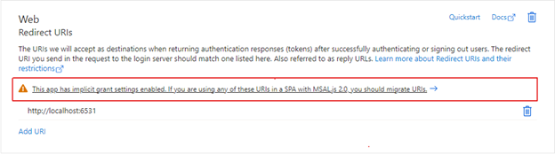
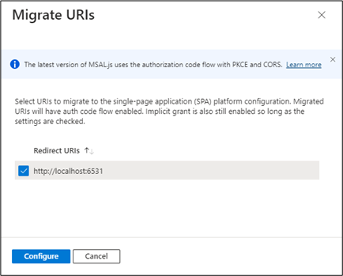

# Configuring Azure integration

Windows Admin Center supports several optional features that integrate with Azure services. [Learn about the Azure integration options available with Windows Admin Center.](./index.md)

To allow the Windows Admin Center gateway to communicate with Azure to leverage Microsoft Entra authentication for gateway access, or to create Azure resources on your behalf (for example, to protect VMs managed in Windows Admin Center using Azure Site Recovery), you need to first register your Windows Admin Center gateway with Azure. You only need to do this action once for your Windows Admin Center gateway - the setting is preserved when you update your gateway to a newer version.

## Register your gateway with Azure

The first time you try to use an Azure integration feature in Windows Admin Center, you're prompted to register the gateway to Azure. You can also register the gateway by going to the **Azure** tab in Windows Admin Center Settings. Only Windows Admin Center gateway administrators can register the Windows Admin Center gateway with Azure. [Learn more about Windows Admin Center user and administrator permissions](../configure/user-access-control.md#gateway-access-role-definitions).


The guided in-product steps create a Microsoft Entra app in your directory, which allows Windows Admin Center to communicate with Azure. To view the Microsoft Entra app that is automatically created, go to the **Azure** tab of Windows Admin Center settings. The **View in Azure** hyperlink lets you view the Microsoft Entra app in the Azure portal.

The Microsoft Entra app created is used for all points of Azure integration in Windows Admin Center, including [Microsoft Entra authentication to the gateway](../configure/user-access-control.md#azure-active-directory). Windows Admin Center automatically configures the permissions needed to create and manage Azure resources on your behalf:

- Microsoft Graph
    - Application.ReadWrite.All
- Azure Service Management
    - user_impersonation

<a name='manual-azure-ad-app-configuration'></a>

### Manual Microsoft Entra app configuration

If you want to configure a Microsoft Entra app manually, rather than using the Microsoft Entra app that Windows Admin Center automatically creates during the gateway registration process, follow these steps:

1. Grant the Microsoft Entra app the required API permissions listed earlier. To do this, go to your Microsoft Entra app in the Azure portal. Go to the Azure portal > **Microsoft Entra ID** > **App registrations** > select the Microsoft Entra app you want to use. Then, go to the **API permissions** tab and add the required API permissions.
1. Add the Windows Admin Center gateway URL to the reply URLs (also known as the redirect URIs). Go to your Microsoft Entra app, and then go to **Manifest**. Find the `replyUrlsWithType` key in the manifest. Within the key, add an object containing two keys: `url` and `type`. The `url` key should have a value of the Windows Admin Center gateway URL, appending a wildcard at the end. The `type` key should have a value of `Web`. For example:

    ```json
    "replyUrlsWithType": [
            {
                    "url": "http://localhost:6516/*",
                    "type": "Single-Page Application"
            }
    ],
    ```

> [!NOTE]
> If you enable Microsoft Defender Application Guard for your browser, you can't register Windows Admin Center with Azure or sign into Azure.

## Troubleshooting Azure sign-in errors

### The redirect URI doesn't match the URIs configured for this application
If you recently migrated your data from an older version of Windows Admin Center to Windows Admin Center version 2410, your redirect URIs might be misconfigured. This misconfiguration can happen if you didn't complete the Azure Registration step in the migration wizard. This misconfiguration occurs because Windows Admin Center changed the way it performs authentication based on [general Microsoft guidance](/entra/identity-platform/v2-oauth2-implicit-grant-flow#prefer-the-auth-code-flow). Where it previously used the implicit grant flow, it now uses the authorization code flow.

You must add two redirect URIs to the Single-Page Application (SPA) platform. An example of these redirect URIs is:
```
https://myMachineName.domain.com:6600
https://myMachineName.domain.com:6600/signin-oidc
```

In this example, the numerical value refers to the port referenced in your Windows Admin Center installation. 

All redirect URIs for Windows Admin Center must contain: 
- The Fully Qualified Domain Name (FQDN) or hostname of your gateway machine, with no mention of localhost
- The HTTPS prefix, not HTTP

[Learn how to reconfigure your redirect URIs](/troubleshoot/entra/entra-id/app-integration/error-code-AADSTS50011-redirect-uri-mismatch). 

After adding the proper redirect URIs, clean up old, unused redirect URIs.

### Cross-origin token redemption permitted only for single-page application
If you recently updated your Windows Admin Center instance to a newer version and previously registered your gateway with Azure, you might encounter an error stating "cross-origin token redemption is permitted only for the 'Single-Page Application' client type" when signing into Azure. This error appears because Windows Admin Center changed the way it performs authentication based on [general Microsoft guidance](/entra/identity-platform/v2-oauth2-implicit-grant-flow#prefer-the-auth-code-flow). Where it previously used the implicit grant flow, it now uses the authorization code flow.

If you want to continue using your existing app registration for your Windows Admin Center application, use [Microsoft Entra admin center](https://entra.microsoft.com/) to update the registration's redirect URIs to the Single-Page Application (SPA) platform. This change enables the authorization code flow with Proof Key for Code Exchange (PKCE) and cross-origin resource sharing (CORS) support for applications that use that registration.

Follow these steps for application registrations that are currently configured with **Web** platform redirect URIs:
1.	Sign in to the [Microsoft Entra admin center](https://entra.microsoft.com/).
1. Navigate to **Identity** > **Applications** > **App registrations**, select your application, and then select **Authentication**.
1.	In the **Web** platform tile under **Redirect URIs**, select the warning banner indicating that you should migrate your URIs.

1. Select the redirect URI for your application and then select **Configure**. These redirect URIs now appear in the **Single-page application** platform tile, showing that CORS support with the authorization code flow and PKCE is enabled for these URIs.


Instead of updating existing URIs, you can create a new application registration for your gateway. App registrations that are newly created for Windows Admin Center through the gateway registration flow create Single-Page Application platform redirect URIs. 

If you can't migrate your application registration's redirect URIs to use auth code flow, you can continue to use the existing application registration as is. To do so, you must unregister your Windows Admin Center gateway and re-register with the same application registration ID.

## Stay updated

[Follow us on Twitter](https://twitter.com/servermgmt)

[Read our Blogs](https://techcommunity.microsoft.com/t5/windows-admin-center-blog/bg-p/Windows-Admin-Center-Blog)
