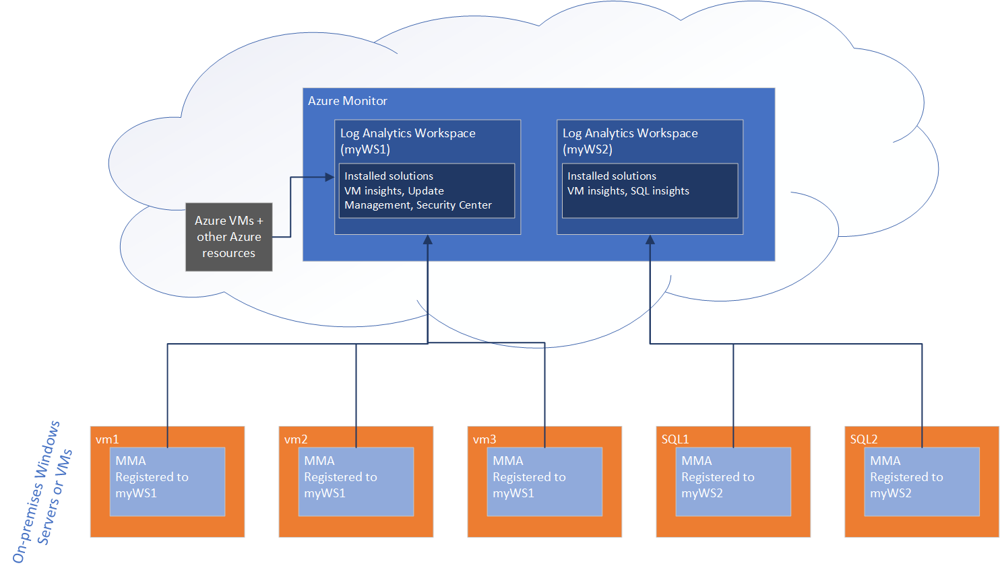

# Monitor servers and configure alerts with Azure Monitor from Windows Admin Center

[Learn more about Azure integration with Windows Admin Center.](../plan/azure-integration-options.md)

[Azure Monitor](https://docs.microsoft.com/azure/azure-monitor/overview) is a solution that collects, analyzes, and acts on telemetry from a variety of resources, including Windows Servers and VMs, both on-premises and in the cloud. Though Azure Monitor pulls data from Azure VMs, and other Azure resources, this article focuses on how Azure Monitor works with on-premises servers and VMs, specifically with Windows Admin Center. If you're interested to learn how you can use Azure Monitor to get email alerts about your hyper-converged cluster, read about [using Azure Monitor to send emails for Health Service Faults](https://docs.microsoft.com/windows-server/storage/storage-spaces/configure-azure-monitor).

## How does Azure Monitor work?
 
Data generated from on-premises Windows Servers is collected in a Log Analytics workspace in Azure Monitor. Within a workspace, you can enable various monitoring solutions—sets of logic that provide insights for a particular scenario. For example, Azure Update Management, Azure Security Center, and Azure Monitor for VMs are all monitoring solutions that can be enabled within a workspace. 

When you enable a monitoring solution in a Log Analytics workspace, all the servers reporting to that workspace will start collecting data relevant to that solution, so that the solution can generate insights for all the servers in the workspace. 

To collect telemetry data on an on-premises server and push it to the Log Analytics workspace, Azure Monitor requires the installation of the Microsoft Monitoring Agent, or the MMA. Certain monitoring solutions also require a secondary agent. For example, Azure Monitor for VMs also depends on a ServiceMap agent for additional functionality that this solution provides. 

Some solutions, like Azure Update Management, also depend on Azure Automation, which enables you to centrally manage resources across Azure and non-Azure environments. For example, Azure Update Management uses Azure Automation to schedule and orchestrate installation of updates across machines in your environment, centrally, from the Azure portal.

## How does Windows Admin Center enable you to use Azure Monitor?

From within WAC, you can enable two monitoring solutions:

- [Azure Update Management](azure-update-management.md) (in the Updates tool)
- Azure Monitor for VMs (in server Settings), a.k.a Virtual Machines insights

You can get started using Azure Monitor from either of these tools. If you've never used Azure Monitor before, WAC will automatically provision a Log Analytics workspace (and Azure Automation account, if needed), and install and configure the Microsoft Monitoring Agent (MMA) on the target server. It will then install the corresponding solution into the workspace. 

For instance, if you first go to the Updates tool to setup Azure Update Management, WAC will:

1. Install the MMA on the machine
2. Create the Log Analytics workspace and the Azure Automation account (since an Azure Automation account is necessary in this case)
3. Install the Update Management solution in the newly created workspace.

If you want to add another monitoring solution from within WAC on the same server, WAC will simply install that solution into the existing workspace to which that server is connected. WAC will additionally install any other necessary agents.

If you connect to a different server, but have already setup a Log Analytics workspace (either through WAC or manually in the Azure Portal), you can also install the MMA agent on the server and connect it up to an existing workspace. When you connect a server into a workspace, it automatically starts collecting data and reporting to solutions installed in that workspace.

## Azure Monitor for virtual machines (a.k.a. Virtual Machine insights)
>Applies To: Windows Admin Center Preview

When you set up Azure Monitor for VMs in server Settings, Windows Admin Center enables the Azure Monitor for VMs solution, also known as Virtual Machine insights. This solution allows you to monitor server health and events, create email alerts, get a consolidated view of server performance across your environment, and visualize apps, systems, and services connected to a given server.

> [!NOTE]
> Despite its name, VM insights works for physical servers as well as virtual machines.

With Azure Monitor's free 5 GB of data/month/customer allowance, you can easily try this out for a server or two without worry of getting charged. Read on to see additional benefits of onboarding servers into Azure Monitor, such as getting a consolidated view of systems performance across the servers in your environment.

### **Set up your server for use with Azure Monitor**

From the Overview page of a server connection, click the new button "Manage alerts", or go to Server Settings > Monitoring and alerts. Within this page, onboard your server to Azure Monitor by clicking "Set up" and completing the setup pane. Admin Center takes care of provisioning the Azure Log Analytics workspace, installing the necessary agent, and ensuring the VM insights solution is configured. Once complete, your server will send performance counter data to Azure Monitor, enabling you to view and create email alerts based on this server, from the Azure portal.

### **Create email alerts**

Once you've attached your server to Azure Monitor, you can use the intelligent hyperlinks within the Settings > Monitoring and alerts page to navigate to the Azure Portal. Admin Center automatically enables performance counters to be collected, so you can easily [create a new alert](https://docs.microsoft.com/azure/azure-monitor/platform/alerts-log) by customizing one of many pre-defined queries, or writing your own.

### **Get a consolidated view across multiple servers **

If you onboard multiple servers to a single Log Analytics workspace within Azure Monitor, you can get a consolidated view of all these servers from the [Virtual Machines Insights solution](https://docs.microsoft.com/azure/azure-monitor/insights/vminsights-overview) within Azure Monitor.  (Note that only the Performance and Maps tabs of Virtual Machines Insights for Azure Monitor will work with on-premises servers – the health tab functions only with Azure VMs.) To view this in the Azure portal, go to Azure Monitor > Virtual Machines (under Insights), and navigate to the "Performance" or "Maps" tabs.

### **Visualize apps, systems, and services connected to a given server**

When Admin Center onboards a server into the VM insights solution within Azure Monitor, it also lights up a capability called [Service Map](https://docs.microsoft.com/azure/azure-monitor/insights/service-map). This capability automatically discovers application components and maps the communication between services so that you can easily visualize connections between servers with great detail from the Azure portal. You can find this by going to the Azure portal > Azure Monitor > Virtual Machines (under Insights), and navigating to the "Maps" tab.

> [!NOTE]
> The visualizations for Virtual Machines Insights for Azure Monitor are offered in 6 public regions currently.  For the latest information, check the [Azure Monitor for VMs documentation](https://docs.microsoft.com/azure/azure-monitor/insights/vminsights-onboard#log-analytics).  You must deploy the Log Analytics workspace in one of the supported regions to get the additional benefits provided by the Virtual Machines Insights solution described above.

## Disabling Monitoring

To completely disconnect your server from the Log Analytics workspace, uninstall the MMA agent. This means that this server will no longer send data to the workspace, and all the solutions installed in that workspace will no longer collect and process data from that server. However, this does not affect the workspace itself – all the resources reporting to that workspace will continue to do so. To uninstall the MMA agent within WAC, go to Apps & Features, find the Microsoft Monitoring Agent, and click Uninstall.

If you want to turn off a specific solution within a workspace, you will need to [remove the monitoring solution from the Azure portal](https://docs.microsoft.com/azure/azure-monitor/insights/solutions#remove-a-management-solution). Removing a monitoring solution means that the insights created by that solution will no longer be generated for _any_ of the servers reporting to that workspace. For example, if I uninstall the Azure Monitor for VMs solution, I will no longer see insights about VM or server performance from any of the machines connected to my workspace.