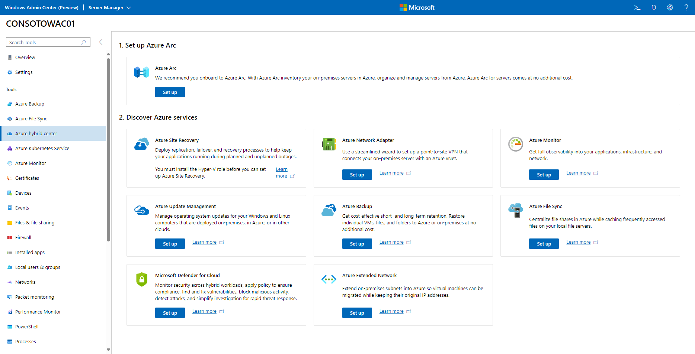

# Connecting Windows Server to Azure hybrid services

You can extend on-premises deployments of Windows Server to the cloud by using Azure hybrid services. These cloud services provide an array of useful functions, both for extending on-premises into Azure, and for centrally managing from Azure.

Using Azure hybrid services within Windows Admin Center, you can:

- [Protect virtual machines and use cloud-based backup and disaster recovery (HA/DR)](#back-up-and-protect-your-on-premises-servers-and-vms).
- [Extend on-premises capacity with storage and compute in Azure, and simplify network connectivity to Azure](#extend-on-premises-capacity-with-azure).
- [Centralize monitoring, governance, configuration, and security across your applications, network, and infrastructure with the help of cloud-intelligent Azure management services](#centrally-manage-your-hybrid-environment-from-azure).

You can set up most Azure hybrid services by downloading an app and doing some manual configuration. Many Azure hybrid services are integrated directly into Windows Admin Center to provide a simplified setup experience and a server-centric view of the services. Windows Admin Center also provides convenient intelligent hyperlinks to the Azure portal to see connected Azure resources as well as a centralized view of your hybrid environment.

## Discover integrated services in the Azure hybrid services tool

The Azure hybrid services tool in [Windows Admin Center](../overview.md) consolidates all the integrated Azure services into a centralized hub where you can easily discover all the available Azure services that bring value to your on-premises or hybrid environment.

If you connect to a server with Azure services already enabled, the Azure hybrid services tool lets you see all enabled services on that server in a single glance. You can easily get to the relevant tool within Windows Admin Center, launch out to the Azure portal for deeper management of those Azure services, or learn more with documentation at your fingertips.

From the Azure hybrid services tool, you can:

- Back up your Windows Server from Windows Admin Center with [Azure Backup](azure-backup.md)
- Protect your Hyper-V Virtual Machines from Windows Admin Center with [Azure Site Recovery](azure-site-recovery.md)
- Sync your file server with the cloud, using [Azure File Sync](azure-file-sync.md)
- Manage operating system updates for all your Windows servers, both on-premises or in the cloud, with [Azure Update Management](azure-update-management.md)
- Monitor servers, both on-premises or in the cloud, and configure alerts with [Azure Monitor](azure-monitor.md)
- Apply governance policies to your on-premises servers through Azure Policy using [Azure Arc for servers](/azure/azure-arc/servers/overview)
- Secure your servers and get advanced threat protection with [Microsoft Defender for Cloud](/azure/security-center/windows-admin-center-integration)
- Connect your on-premises servers to an Azure Virtual Network with [Azure Network Adapter](https://aka.ms/WACNetworkAdapter)
- Make Azure VMs look like your on-premises network with [Azure Extended Network](/azure/virtual-network/subnet-extension#extend-your-subnet-to-azure)

## Azure hybrid service regional support

You can register the Windows Admin Center gateway in both public and private Azure clouds. Today, Microsoft supports gateway registration in Azure Global, Azure China, and Azure US Government. When you register a gateway, Windows Admin Center assumes that all other Azure operations, including the use of Azure hybrid services, will be performed in that cloud.

The regional support for each Azure hybrid service is different. Broadly, the following table shows the clouds supported for each Azure hybrid service in Windows Admin Center:

| Azure hybrid service | Azure global | Azure China | Azure US Government |
| ------------- | ------ | ------ | ------ |
| Azure Arc | yes | no | yes |
| Azure Backup|yes|yes|yes|
| Azure Extended Network|yes|yes|yes|
| Azure File Sync|yes|yes|yes|
| Azure Monitor|yes|yes|yes|
| Azure Network Adapter|yes|yes|yes|
| Microsoft Defender for Cloud|yes|yes|yes|
| Azure Site Recovery |yes|yes|no|
| Azure Update Management |yes|yes|no|

For a more detailed regional support breakdown for each service, see [Azure products available by region](https://azure.microsoft.com/global-infrastructure/services/).

## Back up and protect your on-premises servers and VMs

- **Back up your Windows servers with [Azure Backup](/azure/backup/backup-overview)**
You can back up your Windows servers to Azure. Backing up your Windows servers helps to protect you from accidental or malicious deletions, corruption, and ransomware.
For more info, see [Back up your servers with Azure Backup](azure-backup.md).

- **Protect your Hyper-V virtual machines with [Azure Site Recovery](/azure/site-recovery/site-recovery-overview)**
You can replicate workloads running on VMs so that your business-critical infrastructure is protected in case of a disaster. Windows Admin Center streamlines setup and the process of replicating your virtual machines on your Hyper-V servers or clusters, making it easier to bolster the resiliency of your environment with Azure Site Recovery's disaster recovery service.
For more info, see [Protect your VMs with Azure Site Recovery and Windows Admin Center](azure-site-recovery.md).

- **Use synchronous or asynchronous block-based replication to a VM in Azure using [Storage Replica](../../../storage/storage-replica/storage-replica-overview.md)**
You can configure block-based or volume-based replication on a server-to-server level using Storage Replica to a secondary server or VM. Windows Admin Center lets you create an Azure VM specifically for your replication target, helping you to right-size and correctly configure storage on a new Azure VM.
For more info, see [Server-to-server replication with Storage Replica](../../../storage/storage-replica/server-to-server-storage-replication.md).

## Extend on-premises capacity with Azure

### Extend storage capacity

- **Sync your file server with the cloud by using [Azure File Sync](/azure/storage/files/storage-sync-files-planning)**
Sync files on this server with Azure file shares. Keep all your files local or use cloud tiering to free up space and cache only the most frequently used files on the server, tiering cold data to the cloud. You can back up data in the cloud, eliminating the need to worry about on-premises server backup. Additionally, multi-site-sync can keep a set of files in sync across multiple servers.
For more info, see [Sync your file server with the cloud by using Azure File Sync](azure-file-sync.md).

- **Migrate storage to a VM in Azure using [Storage Migration Service](../../../storage/storage-migration-service/overview.md)**
Use the step-by-step tool to inventory data on Windows and Linux servers and then transfer the data to a new Azure VM. Windows Admin Center can create a new Azure VM for the job that is right-sized and correctly configured to receive the data from your source server.
For more info, see [Use Storage Migration Service to migrate a server](../../../storage/storage-migration-service/migrate-data.md).

### Extend compute capacity

- **Create a new Azure virtual machine without leaving Windows Admin Center**
From the *All Connections* page within Windows Admin Center, go to **Add** and select **Create new** under **Azure VM**. You even can domain-join your Azure VM and configure storage from within this step-by-step creation tool.

- **Leverage Azure to achieve quorum on your failover cluster with a quorum witness**
Instead of investing in additional hardware to achieve quorum on a 2-node cluster, you can use an Azure storage account to serve as the cluster witness for your Azure Local cluster or other failover cluster.
For more info, see [quorum witness](../../../failover-clustering/deploy-quorum-witness.md).

### Simplify network connectivity between your on-premises and Azure networks

- **Connect your on-premises servers to an Azure Virtual Network with [Azure Network Adapter](https://aka.ms/WACNetworkAdapter)**
Let Windows Admin Center simplify setting up a point-to-site VPN from an on-premises server into an Azure virtual network.

- **Make Azure VMs look like your on-premises network with [Azure Extended Network](/azure/virtual-network/subnet-extension#extend-your-subnet-to-azure)**
Windows Admin Center can set up a site-to-site VPN and extend your on-premises IP addresses into your Azure vNet to let you more easily migrate workloads into Azure without breaking dependencies on IP addresses.

## Centrally manage your hybrid environment from Azure

- **Monitor and get email alerts for all the servers in your environment with [Azure Monitor for Virtual Machines](/azure/azure-monitor/insights/vminsights-overview)**
You can use Azure Monitor, also known as Virtual Machines Insights, to monitor server health and events, create email alerts, get a consolidated view of server performance across your environment, and visualize apps, systems, and services connected to a given server. Windows Admin Center also can set up default email alerts for server health performance and cluster health events.
For more info, see [Connect your servers to Azure Monitor and configure email notifications](azure-monitor.md).

- **Centrally manage operating system updates for all your Windows Servers with [Azure Update Management](/azure/automation/update-management/overview)**
You can manage updates and patches for multiple servers and VMs from a single place, instead of on a per-server basis. With Azure Update Management, you quickly can assess the status of available updates, schedule installation of required updates, and review deployment results to verify updates that apply successfully. This is possible whether your servers are Azure VMs, hosted by other cloud providers, or on-premises.
For more info, see [Use Windows Admin Center to manage operating system updates with Azure Update Management](azure-update-management.md).

- **Improve your security posture and get advanced threat protection with [Microsoft Defender for Cloud](/azure/security-center/security-center-intro)**
Microsoft Defender for Cloud is a unified infrastructure security management system that strengthens the security posture of your data centers, and provides advanced threat protection across your hybrid workloads in the cloud - whether they're in Azure or not - as well as on premises. With Windows Admin Center, you can easily set up and connect your servers to Microsoft Defender for Cloud.
For more info, see [Integrate Microsoft Defender for Cloud with Windows Admin Center (Preview)](/azure/security-center/windows-admin-center-integration).

- **Apply policies and ensure compliance across your hybrid environment with [Azure Arc for servers](/azure/azure-arc/servers/overview) and [Azure Policy](/azure/governance/policy/overview)**
Inventory, organize, and manage on-premises servers from Azure. You can govern servers using Azure policy, control access using RBAC, and enable additional management services from Azure.

## Clusters versus stand-alone servers and VMs

Azure hybrid services work with Windows Servers in the following configurations:

- Stand-alone physical servers and virtual machines (VMs)
- Clusters, including hyper-converged clusters certified by the [Azure Local](/azure/azure-local/overview), and [Windows Server Software-Defined (WSSD)](https://www.microsoft.com/cloud-platform/software-defined-datacenter) programs
<!-- Alternate link that might be more helpful than the second link in the preceding bullet for WSSD: https://learn.microsoft.com/en-us/troubleshoot/windows-server/software-defined-networking/software-defined-data-center-and-networking -->

### Services for stand-alone servers and VMs

This is the complete list of Azure services that provide functionality to stand-alone servers and VMs:

- Back up your Windows Server from Windows Admin Center with [Azure Backup](azure-backup.md)
- Protect your Hyper-V Virtual Machines from Windows Admin Center with [Azure Site Recovery](azure-site-recovery.md)
- Sync your file server with the cloud, using [Azure File Sync](azure-file-sync.md)
- Manage operating system updates for all your Windows servers, both on-premises or in the cloud, with [Azure Update Management](azure-update-management.md)
- Monitor servers, both on-premises or in the cloud, and configure alerts with [Azure Monitor](azure-monitor.md)
- Apply governance policies to your on-premises servers through Azure Policy using [Azure Arc for servers](/azure/azure-arc/servers/overview)
- Secure your servers and get advanced threat protection with [Microsoft Defender for Cloud](/azure/security-center/windows-admin-center-integration)
- Connect your on-premises servers to an Azure Virtual Network with [Azure Network Adapter](https://aka.ms/WACNetworkAdapter)
- Make Azure VMs look like your on-premises network with [Azure Extended Network](/azure/virtual-network/subnet-extension#extend-your-subnet-to-azure)

### Services for clusters

These are the Azure services that provide functionality to clusters as a whole:

- [Monitor a hyper-converged cluster with Azure Monitor](../../../storage/storage-spaces/configure-azure-monitor.md)
- [Protect your VMs with Azure Site Recovery](azure-site-recovery.md)
- [Deploy a quorum witness](../../../failover-clustering/deploy-quorum-witness.md)

## Other Azure-integrated abilities of Windows Admin Center

- **[Add Azure VM connections](manage-azure-vms.md) in Windows Admin Center**
You can use Windows Admin Center to manage your Azure VMs as well as on-premises machines. By configuring your Windows Admin Center gateway to connect to your Azure VNet, you can manage virtual machines in Azure using the consistent, simplified tools that Windows Admin Center provides.
For more info, see [Configure Windows Admin Center to manage VMs in Azure](manage-azure-vms.md).

- **Add an layer of security to Windows Admin Center by adding [Microsoft Entra ID](https://www.microsoft.com/security/business/identity-access/microsoft-entra-id) authentication**
You can add an additional layer of security to Windows Admin Center by requiring users to authenticate using Microsoft Entra identities to access the gateway. Microsoft Entra authentication also lets you take advantage of Microsoft Entra ID’s security features like conditional access and multifactor authentication.
For more info, see [Configure Microsoft Entra authentication for Windows Admin Center](../configure/user-access-control.md#azure-active-directory).

- **Manage Azure resources directly through [Azure Cloud Shell](/azure/cloud-shell/overview) embedded in Windows Admin Center**
Leverage Azure Cloud Shell to get a Bash or PowerShell experience within Windows Admin Center to give you easy access to Azure management tasks.
For more info, see [Overview of Azure Cloud Shell](/azure/cloud-shell/overview).

## Additional References

- [Connect Windows Admin Center to Azure](azure-integration.md)
- [Deploy Windows Admin Center in Azure](deploy-wac-in-azure.md)

