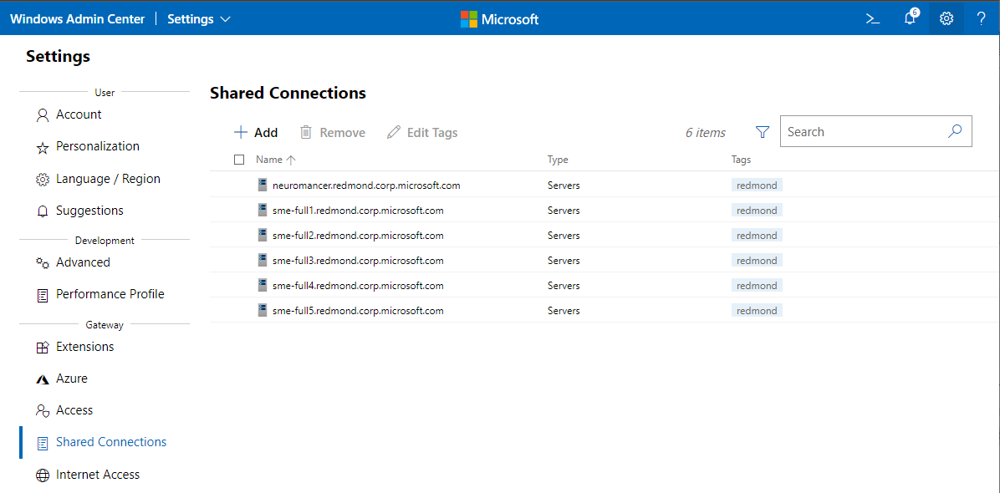
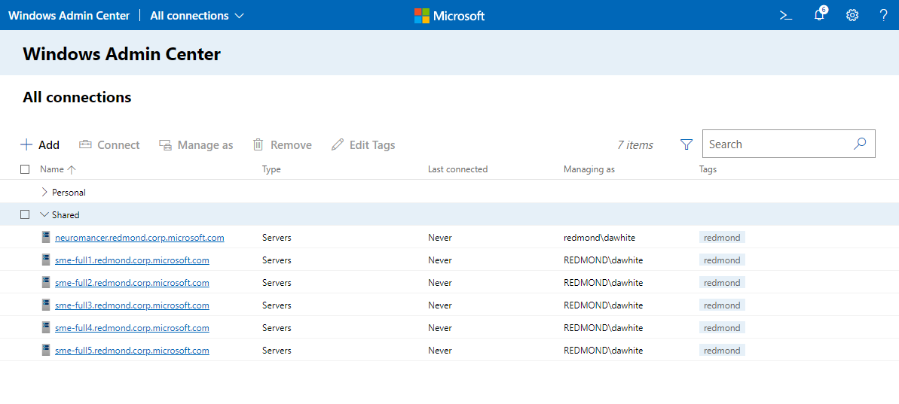

# Configure shared connections for all users of the Windows Admin Center gateway

> Applies To: Windows Admin Center Preview, Windows Admin Center

With the ability to configure shared connections, gateway administrators can configure the connections list once for all users of a given Windows Admin Center gateway. 

From the **Shared Connections** tab of Windows Admin Center gateway Settings, gateway administrators can add servers, clusters, and PC connections as you would from the all connections page, including the ability to tag connections. Any connections and tags added in the Shared Connections list will appear for all users of this Windows Admin Center gateway, from their all connections page.
    

When any Windows Admin Center user accesses the "All Connections" page after Shared Connections have been configured, they will see their connections grouped into two sections: Personal and Shared connections. The Personal group is a specific user's connection list and persists across that user's browser sessions. The Shared connections group is the same across all users, and cannot be modified from the All Connections page.
