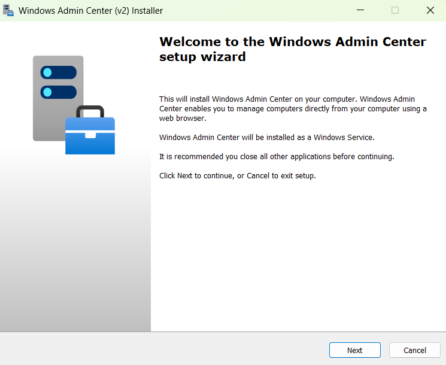
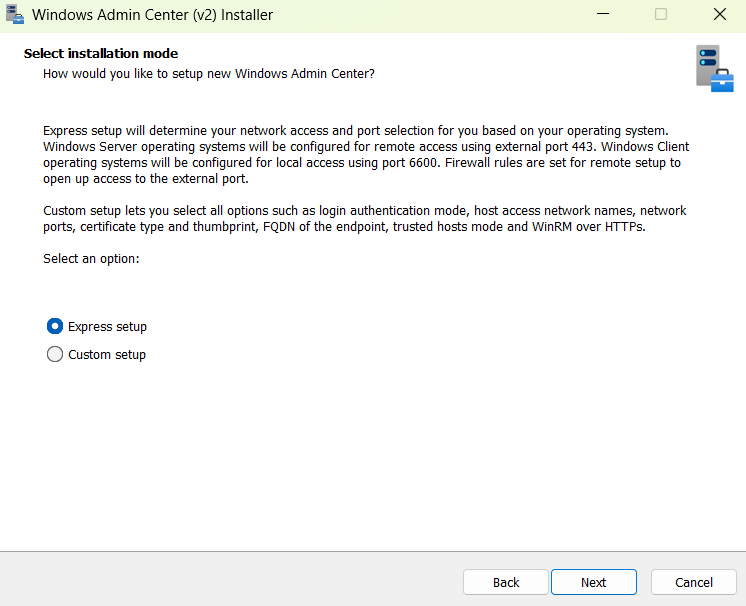
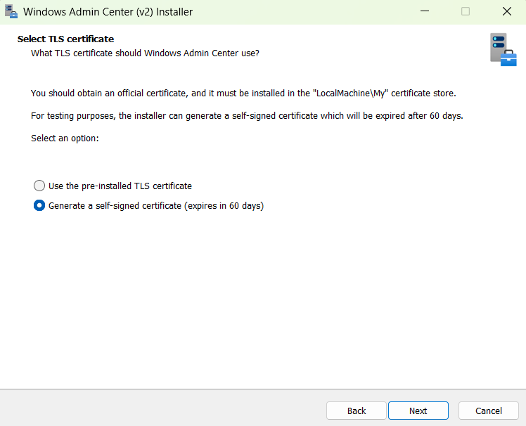
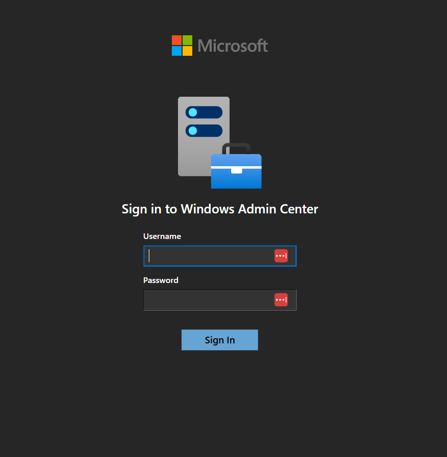

# Install Windows Admin Center

This article explains how to install Windows Admin Center on a Windows PC or a Windows Server remote server so that multiple users can use Windows Admin Center in a web browser.

> [!TIP]
> New to Windows Admin Center? Learn more about [Windows Admin Center](../overview.md) or [download now](https://www.microsoft.com/evalcenter/download-windows-admin-center).

## Determine your installation type

Review the [installation options](../plan/installation-options.md), which include the [supported operating systems](../plan/installation-options.md#installation-supported-operating-systems). To install Windows Admin Center on a virtual machine (VM) in Azure, see [Deploy Windows Admin Center in Azure](../azure/deploy-wac-in-azure.md).

## Download the Windows Admin Center installer

Download the Windows Admin Center installer from the [Windows Admin Center Evaluation Center](https://www.microsoft.com/evalcenter/download-windows-admin-center) to a location on the machine where you want to install Windows Admin Center.

## Prerequisites

- A Windows PC or server on which to install Windows Admin Center.
- Admin privileges or equivalent permissions on the machine on which you're installing Windows Admin Center.
- Optional: A TLS/SSL certificate for _Server Authentication (1.3.6.1.5.5.7.3.1)_. Use a self-signed certificate for testing, but always use a certificate from a trusted certificate authority for production environments. If you don't have a certificate, use the Windows Admin Center installer to generate a self-signed certificate. The certificate is valid for 60 days.

## Install Windows Admin Center

To install Windows Admin Center, follow the steps for the desktop experience or Windows Server Core.

### [Desktop experience](#tab/desktop-experience)

To install Windows Admin Center on your machine running the Windows Server desktop experience, follow these steps:

1. Sign in to the machine where you want to install Windows Admin Center.

1. Run the Windows Admin Center installer that you previously downloaded.

    

1. On the **Welcome to the Windows Admin Center setup wizard** page, select **Next**.

1. On the **License Terms and Privacy Statement** page, if you agree to the terms, select **I accept these terms and understand the privacy statement**. Then select **Next** to prepare your environment and start the installation process.

    

1. On the **Select installation mode** page, select either **Express setup** or **Custom setup**:

    - **Express setup**: Determines your network access and port selection based on your operating system. Express setup doesn't allow for configuration of extra features.
    - **Custom setup**: Allows you to configure network access, port numbers, Transport Layer Security (TLS) certificate type and thumbprint, fully qualified domain name of the endpoint, trusted hosts mode, and WinRM over HTTPS.

1. Select **Next**.

1. On the **Select TLS certificate** page, select the option that matches your needs, and then select **Next**.

   You must select which TLS certificate that Windows Admin Center should use. If you already have a certificate, it must be installed in the `LocalMachine\My` certificates store. If you install Windows Admin Center for testing purposes only, the installer can generate a self-signed certificate that expires after 60 days.

   

1. On the **Automatic updates** page, select your preferred update option. The recommended option to install updates automatically is selected by default. Then select **Next**.

1. On the **Send diagnostic data to Microsoft** page, select your preference, and then select **Next**.

1. Review **Ready to install**, and then select **Install** to start the installation process.

1. After the installation process finishes, select **Start Windows Admin Center** checkbox, and then select **Finish**.

1. Sign in as an administrator to start using Windows Admin Center.

   

### [Server Core](#tab/server-core)

To install Windows Admin Center on your machine running the Windows Server Core experience or by using Windows PowerShell, follow these steps:

1. Sign in to your machine. If you're on Server Core, from the `SConfig` menu, enter option **15**, and then select <kbd>Enter</kbd>
   to open a PowerShell session. If you're on the desktop experience, remote desktop into your VM and start PowerShell.

1. Download the Windows Admin Center installer, and copy it to your computer by using the following PowerShell command:

   ```powershell
   $parameters = @{
        Source = "https://aka.ms/WACdownload"
        Destination = ".\WindowsAdminCenter.exe"
   }
   Start-BitsTransfer @parameters
   ```

1. To install Windows Admin Center, run the following command:

   ```powershell
   Start-Process -FilePath '.\WindowsAdminCenter.exe' -ArgumentList '/VERYSILENT' -Wait
   ```

1. You might also need to start Windows Admin Center by using the following command:

   ```powershell
   Start-Service -Name WindowsAdminCenter
   ```

> [!TIP]
> You can use the following options for the `-ArgumentList` parameter:
>
> - /Silent
> - /VerySilent
> - /HTTPSPortNumber
> - /CertificateThumbprint
>
> To specify the HTTPS port number and certificate thumbprint on installation through PowerShell, run the following command:
>
> ```powershell
> .\WindowsAdminCenter2511.exe /HTTPSPortNumber=1234 /CertificateThumbprint=“1234abcd4567efgh”

---
