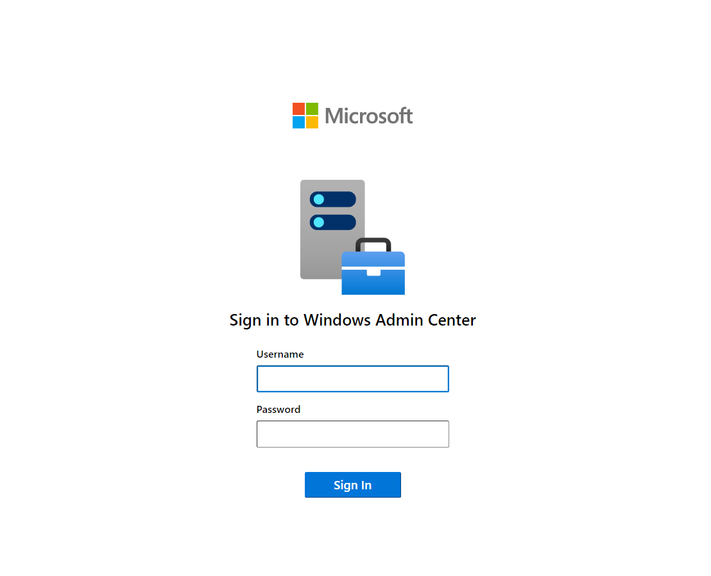

# Install Windows Admin Center

This article explains how to install Windows Admin Center on a Windows PC or a Windows Server remote server so multiple users can use Windows Admin Center in a web browser.

> [!TIP]
> New to Windows Admin Center?
> [Learn more about Windows Admin Center](../overview.md) or [download now](https://www.microsoft.com/evalcenter/download-windows-admin-center).

## Determine your installation type

Review the [installation options](../plan/installation-options.md), which include the [supported operating systems](../plan/installation-options.md#installation-supported-operating-systems). To install Windows Admin Center on a virtual machine in Azure, see [Deploy Windows Admin Center in Azure](../azure/deploy-wac-in-azure.md).

## Download the Windows Admin Center installer

Download the Windows Admin Center installer from the [Windows Admin Center Evaluation Center](https://www.microsoft.com/evalcenter/download-windows-admin-center) to a location on the machine where you want to install Windows Admin Center.

## Prerequisites

To install Windows Admin Center, you need the following prerequisites:

- A Windows PC or server to install Windows Admin Center on.

- Admin privileges or equivalent permissions on the machine you're installing Windows Admin Center on.

- Optional: An SSL certificate for _Server Authentication (1.3.6.1.5.5.7.3.1)_. Use a self-signed certificate for testing, but always use a certificate from a trusted certificate authority for production environments. If you don't have a certificate, use the Windows Admin Center installer to generate a self-signed certificate. The certificate is valid for 60 days.

## Install Windows Admin Center

To install Windows Admin Center, perform the following steps:

### [Desktop Experience](#tab/desktop-experience)

To install Windows Admin Center on your machine running the Windows Server Desktop Experience, follow these steps:

1. Sign in to the machine you want to install Windows Admin Center on.

1. Run the Windows Admin Center installer you previously downloaded.

    

1. On the **Welcome to the Windows Admin Center setup wizard** window, select **Next** to continue.

1. On the **License Terms and Privacy Statement** window, if you agree to the terms select **I accept these terms and understand the privacy statement**, then select **Next** to prepare your environment and start the installation process.

    

1. In the **Select installation mode** window, select either **Express setup**, or **Custom setup**.

    Express setup determines your network access and port selection based on your operating system. Express setup doesn't allow for configuration of extra features.

    Custom setup allows you to configure: network access, port numbers, TLS certificate type and thumbprint, fully qualified domain name of the endpoint, trusted hosts mode, and WinRM over HTTPS.

    Select **Next**.

1. In the **Select TLS certificate** window, select the option that matches your needs, then select **Next**.

   You must select which Transport Layer Security (TLS) certificate Windows Admin Center should use. If you already have a certificate, it must be installed in the `LocalMachine\My` certificates store. If you're installing Windows Admin Center for testing purposes only, the installer can generate a self-signed certificate that expires after 60 days.

   

1. In the **Automatic updates** window, select your preferred update option. The recommended option to install updates automatically is selected by default. Then select **Next**.

1. In the **Send diagnostic data to Microsoft** window, select your preference, then select **Next**.

1. Review the **Ready to install** window, and then select **Install** to start the installation process.

1. After the installation process finishes, check the box to **Start Windows Admin Center**, then select **Finish**.

1. Sign in as an administrator to start using Windows Admin Center.

   

You've now installed Windows Admin Center on your machine.

### [Server Core](#tab/server-core)

To install Windows Admin Center on your machine running the Windows Server Core experience or using PowerShell, follow these steps:

1. Sign-in to your machine. If you're on Server core, from the SConfig menu, enter option **15**, then press <kbd>Enter</kbd>
   to open a PowerShell session. If you're on the desktop experience, remote desktop into your VM and launch PowerShell.

1. Download the Windows Admin Center installer
   and copy it to your computer using the following PowerShell command:

   ```powershell
   $parameters = @{
        Source = "https://aka.ms/WACdownload"
        Destination = ".\WindowsAdminCenter.exe"
   }
   Start-BitsTransfer @parameters
   ```

1. To install Windows Admin Center, run the following command:

   ```powershell
   Start-Process -FilePath '.\WindowsAdminCenter.exe' -ArgumentList '/VERYSILENT' -Wait
   ```

1. You may also need to start the Windows Admin Center service using the following command:

   ```powershell
   Start-Service -Name WindowsAdminCenter
   ```

You've now installed Windows Admin Center on your machine.

---
