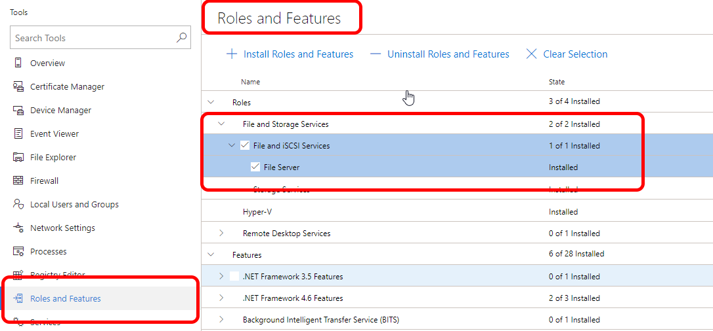

# Prepare your environment for Windows Admin Center

> Applies to: Windows Admin Center, Windows Admin Center Preview

There are some Server versions that need additional preparation before they are ready to manage with Windows Admin Center:

- [Windows Server 2012 and 2012 R2](#prepare-windows-server-2012-and-2012-r2)
- [Windows Server 2008 R2](#prepare-windows-server-2008-r2)
- [Microsoft Hyper-V Server 2016](#prepare-microsoft-hyper-v-server-2016)
- [Microsoft Hyper-V Server 2012 R2](#prepare-microsoft-hyper-v-server-2012-r2)

## Prepare Windows Server 2012 and 2012 R2

### Install WMF version 5.1 or higher

Windows Admin Center requires PowerShell features that are not included by default in Windows Server 2012 and 2012 R2. To manage Windows Server 2012 or 2012 R2 with Windows Admin Center, you will need to install WMF version 5.1 or higher on those servers.

Type `$PSVersiontable` in PowerShell to verify that WMF is installed,
and that the version is 5.1 or higher.

If it is not installed, you can [download and install WMF 5.1](https://docs.microsoft.com/powershell/wmf/5.1/install-configure).

## Prepare Windows Server 2008 R2

### Install WMF version 5.1 or higher

Windows Admin Center requires PowerShell features that are not included by default in Windows Server 2008 R2. To manage Windows Server 2008 R2 with Windows Admin Center, you will need to install WMF version 5.1 or higher on those servers. 

Ensure that [.NET Framework 4.5.2 or later](https://docs.microsoft.com/dotnet/framework/install/on-windows-7) is already installed on your computer.

Type `$PSVersiontable` in PowerShell to verify that WMF is installed,
and that the version is 5.1 or higher.

If it is not installed, you can [download and install WMF 5.1](https://docs.microsoft.com/powershell/wmf/5.1/install-configure).

Run `Enable-PSRemoting –force` in a PowerShell console to enable Powershell remote connection. 

### Enable Remote Desktop

To use Remote Desktop within Windows Admin Center, you will need to enable Remote Desktop on your Windows Server 2008 R2 server.

From **Server Manager**, go to **Configure Remote Desktop**. Enable Remote Desktop to "Allow connections from computers running any version of Remote Desktop."

## Prepare Microsoft Hyper-V Server 2016

To manage Microsoft Hyper-V Server 2016 with Windows Admin Center, there are some Server roles you'll need to enable before you can do so.

### To manage Microsoft Hyper-V Server 2016 with Windows Admin Center:

1. Enable Remote Management.
2. Enable File Server Role.
3. Enable Hyper-V Module for PowerShell.

### **Step 1:** Enable Remote Management

To enable remote management in Hyper-V Server:

1. Log into Hyper-V Server.
2. At the **Server Configuration** (SCONFIG) tool, type **4** to configure remote management.
3. Type **1** to enable Remote Management.
4. Type **4** to return to the main menu.

### **Step 2:** Enable File Server Role

To enable File Server Role for basic file sharing and remote management:

1. Click **Roles and Features** in the **Tools** menu.
2. In **Roles and Features**, find **File and Storage Services**, and check **File and iSCSI Services** and **File Server**:

### **Step 3:** Enable Hyper-V Module for PowerShell

To enable Hyper-V Module for PowerShell features:

1. Click **Roles and Features** in the **Tools** menu.
2. In **Roles and Features**, find **Remote Server Administration Tools** and check **Role Administration Tools** and **Hyper-V Module for PowerShell**:

Microsoft Hyper-V Server 2016 is now ready for management with Windows Admin Center.

## Prepare Microsoft Hyper-V Server 2012 R2

To manage Microsoft Hyper-V Server 2012 R2 with Windows Admin Center, there are some Server roles you'll need to enable before you can do so.  In addition, you will need to install WMF version 5.1 or higher.

### To manage Microsoft Hyper-V Server 2012 R2 with Windows Admin Center:

1. Install Windows Management Framework (WMF) version 5.1 or higher
2. Enable Remote Management
3. Enable File Server Role
4. Enable Hyper-V Module for PowerShell

### Step 1: Install Windows Management Framework 5.1

Windows Admin Center requires PowerShell features that are not included by default in Microsoft Hyper-V Server 2012 R2. To manage Microsoft Hyper-V Server 2012 R2 with Windows Admin Center, you will need to install WMF version 5.1 or higher.

Type `$PSVersiontable` in PowerShell to verify that WMF is installed,
and that the version is 5.1 or higher. 

If it is not installed, you can [download WMF 5.1](https://docs.microsoft.com/powershell/wmf/5.1/install-configure).

### Step 2: Enable Remote Management

To enable Hyper-V Server remote management:

1. Log into Hyper-V Server.
2. At the **Server Configuration** (SCONFIG) tool, type **4** to configure remote management.
3. Type **1** to enable remote management.
4. Type **4** to return to the main menu.

### Step 3: Enable File Server Role

To enable File Server Role for basic file sharing and remote management:

1. Click **Roles and Features** in the **Tools** menu.
2. In **Roles and Features**, find **File and Storage Services** and check **File and iSCSI Services** and **File Server**:

### Step 4: Enable Hyper-V Module for PowerShell

To enable Hyper-V Module for PowerShell features:

1. Click **Roles and Features** in the **Tools** menu.
2. In **Roles and Features**, find **Remote Server Administration Tools** and check **Role Administration Tools** and **Hyper-V Module for PowerShell**:

Microsoft Hyper-V Server 2012 R2 is now ready for management with Windows Admin Center.

> [!Tip]
> Ready to install Windows Admin Center? [Download now](https://docs.microsoft.com/windows-server/manage/windows-admin-center/understand/windows-admin-center#download-now)