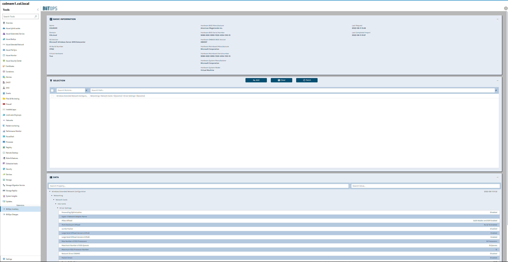

# BiitOps Changes Extension

BiitOps Changes for Windows Admin Center gives you insight into changes to hardware, software and configuration settings on your Windows Server physical/virtual machines. The BiitOps Changes extension enables you to quickly and cost-effectively determine changes which cause issues related to compliance, reliability or security. It will show precisely what is new, what has changed and what has been deleted in a single-pane-of-glass. It works on both servers and selected services on Microsoft Windows Server.

Learn more by visiting the [BiitOps product site](http://www.biitops.com/solutions/changes-for-wac/) or subscribe for a [free trial](http://www.biitops.com/solutions/register-changes-for-wac/).

