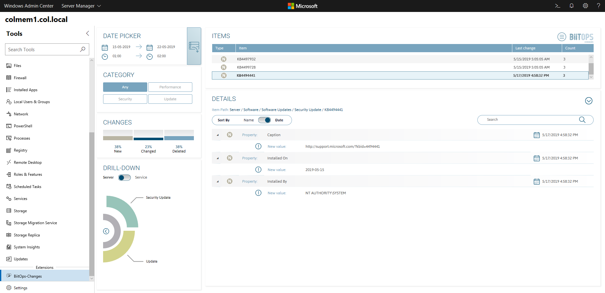

# BiitOps
BiitOps provides operational insights and data to help management and IT Operations make informed decisions.
 
BiitOps is a company striving to bring clarity into an IT world of ever-increasing complexity. Our advanced solution automatically collects data across all systems within the IT landscape, then uses this data to structure, visualize, and present information, providing insights and transparency. BiitOps helps customers gain knowledge, strengthen their IT operations, and support IT management track operational compliance.

### About BiitOps
- BiitOps is a software company that provides insights through data and has developed a software solution that works across even the most complex IT landscapes. 
- BiitOps DataEngine is the core of BiitOps’ product portfolio, and it collects, structures, and stores data, identifies changes, and presents data through a high-performant Rest API.
- BiitOps Insights translates data into knowledge through custom-made visualizations using standard business intelligence tools.
- BiitOps Integrations is a solution that integrates data from BiitOps DataEngine directly into third-party products and solutions. 

### About BiitOps Values
- BiitOps can help change IT management into a predict and prevent strategy rather than a wait-and-see approach, helping make informed decisions based on data rather than incidents.
- BiitOps provides overview, insights, and operational certainty:
    - Overview of servers, clients, services, updates, rights, system assets, and configurations
    - Insights into the current state, historic states, and operational compliance 
- BiitOps ensures that data needed for documentation and operational monitoring is kept current and ready for review by senior management and during IT audits. 
- BiitOps can help reduce the costs of running an under-resourced IT organization and ensure that business-critical decisions are made on an informed basis.

## BiitOps Inventory Extension
BiitOps Inventory for Windows Admin Center provides a fast, easy, and powerful way to find the information about a computer you need in any given situation without having to search through different Windows Admin Center extensions or even resort to using remote PowerShell. BiitOps DataEngine is the central repository for automatically updated configuration and asset information, and the Inventory extension delivers out-of-box high-value based on this data. This solution works with all versions of Windows servers and clients currently supported by Microsoft.

BiitOps Inventory extension requires a BiitOps DataEngine instance. Visit the [BiitOps website](https://biitops.com) to schedule a free demo.

## BiitOps Changes Extension

BiitOps Changes for Windows Admin Center gives you insight into changes to hardware, software and configuration settings on your Windows Server physical/virtual machines. The BiitOps Changes extension enables you to quickly and cost-effectively determine changes which cause issues related to compliance, reliability or security. It will show precisely what is new, what has changed and what has been deleted in a single-pane-of-glass. It works on both servers and selected services on Microsoft Windows Server.

Learn more by visiting the [BiitOps product site](https://biitops.com/solutions) or subscribe for a [free trial](https://biitops.com/solutions/biitops-changes).

