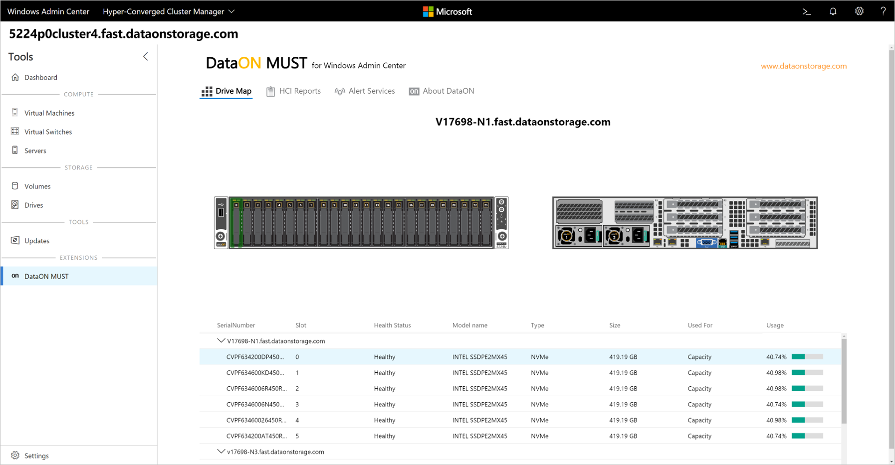
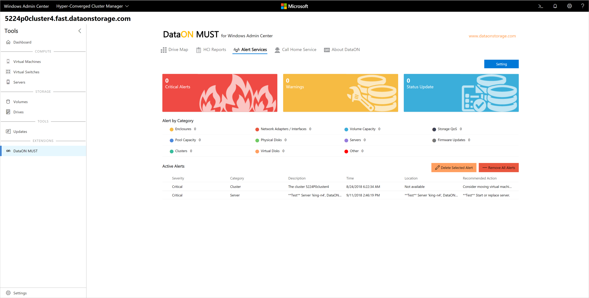

# DataON MUST Extension

## Integrated monitoring and management for Microsoft hyper-converged infrastructure

[DataON](http://www.dataonstorage.com/) is the industry-leading provider of hyper-converged infrastructure and storage systems optimized for Microsoft Windows Server environments. Exclusively focused on delivering Microsoft applications, virtualization, data protection, and hybrid cloud services, it has over 650 enterprise deployments and over 120PB of Storage Spaces Direct deployments.

[DataON’s MUST](http://www.dataonstorage.com/must) extension for Windows Admin Center is a prime example of the value that integrating two complementary products can deliver to customers, bringing monitoring and management and end-to-end insight into hardware and software together across an entire cluster in a unified experience.

> <cite>“We’ve taken our standalone MUST visibility, monitoring, and management tool and enabled it to work within Windows Admin Center. Customers will benefit from the expanded capabilities that MUST provides, and the combination of MUST and Windows Admin Center from a single console will provide the ultimate management experience for Windows Server-based infrastructure.”</cite>
>
> -- Howard Lo, Vice President of Sales and Marketing, DataON

The MUST extension extends the functionality of Windows Admin Center by providing features such as:
- **Historic Data Reporting** – Provides real-time and monthly dashboards of your system performance data including IOPS, latency, throughput on your cluster, storage pool, volume, and nodes.
- **Disk Mapping** – MUST displays the device types and components in each of the nodes, providing a clear disk map of your entire node. It shows the number of disks, disk type, location and slot of each drive, and disk health status.
- **System Alerts** – Leverages Windows Health Service faults to identify hardware failures, configuration issues, and resource saturation. It also provides a multi-level assessment of specific locations, fault descriptions, and recovery actions. You can also leverage third-party SNMP monitoring traps to alert you when you need disk or hardware replacements.
- **SAN-like Call Home Service** – Prompted by system alerts, administrators can have automated email alerts sent to key contacts.

*Disk mapping in the DataON MUST extension for Windows Admin Center*

> <cite>“It’s great that Windows Admin Center allows for extensions such as DataON MUST so I can use both tools within the same console, and I like how seamless that integration is. Windows Admin Center and DataON MUST together really does allow us to be more efficient and saves our team a ton of time. It allows us to achieve our administrator tasks a lot quicker than what we had before."</cite>
>
> -- Matt Roper, Facilitator of Technology Support Services, Cherokee County (GA) School District

*Alert Services in the DataON MUST extension for Windows Admin Center*

> <cite>“MUST has been very valuable and was a big selling point. To us, it demonstrated a commitment from DataON to support Microsoft hyper-converged infrastructure. The inclusion of MUST with their S2D appliance is what completes the solution with Storage Spaces Direct as a viable SAN replacement.” </cite>
>
> -- Benjamin Clements, President, Strategic Online Systems, Inc.