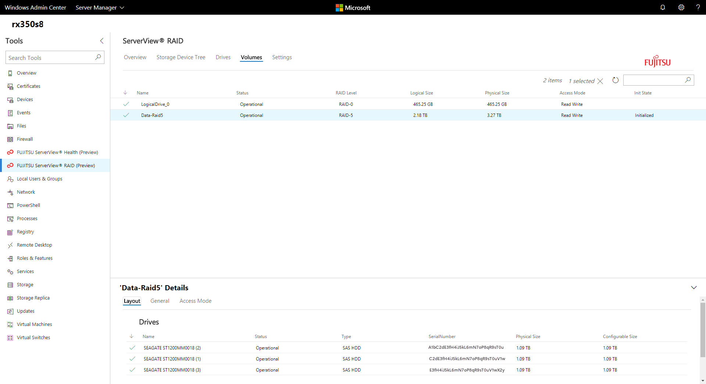

# Fujitsu ServerView Health and RAID extensions

## Bringing end-to-end visibility, from operating system to hardware, into Windows Admin Center

Fujitsu is a leading Japanese information and communication technology company and a manufacturer of [PRIMERGY](http://www.fujitsu.com/fts/products/computing/servers/primergy/) and [PRIMEQUEST](http://www.fujitsu.com/fts/products/computing/servers/mission-critical/) server products. The [Fujitsu ServerView management suite](http://www.fujitsu.com/fts/products/computing/servers/primergy/management/) provides a comprehensive toolset for server lifecycle management including a server-side agent that provides a CIM and PowerShell interface for hardware management.

Fujitsu saw an opportunity to easily integrate with Windows Admin Center as it provided CIM and PowerShell interfaces that could communicate with the server-side agents. The development team at Fujitsu was able to easily implement the CIM calls they were familiar with to the agent and visualize the information within Windows Admin Center using the available UI components.

Once the team became familiar with the Windows Admin Center SDK, adding UI to expose additional hardware information was often simply a few more lines of HTML code and they were quickly able to expand from a single tool to displaying a summary view of hardware component health, detailed views for system event logs, driver monitor, separate views for processor, memory, fans, power supplies, temperatures and voltages, and even an additional tool for RAID management. Using UI controls available in the SDK such as the tree, grid and detail pane controls enabled the team to quickly build UI and also achieve a visual and interaction design very similar to the rest of Windows Admin Center.

The partnership between Fujitsu and the Windows Admin Center team clearly shows the value of integration within Windows Admin Center, enabling customers to have end-to-end insight into server roles and services, to the operating system, and to hardware management.