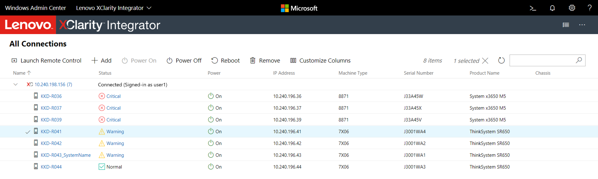
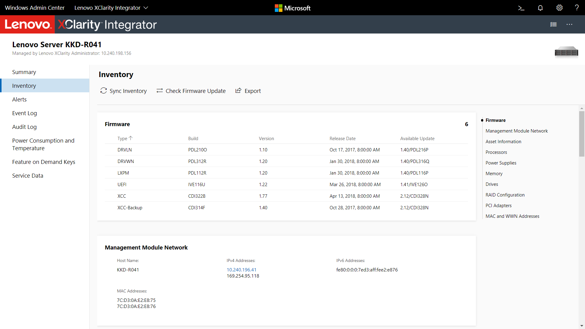
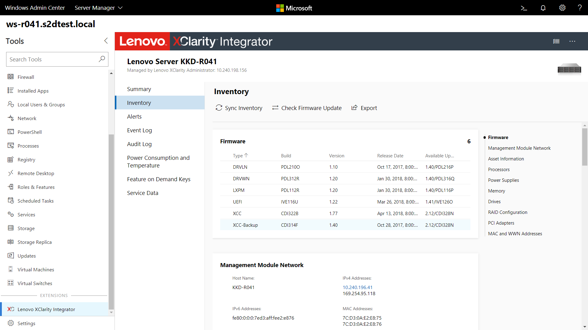
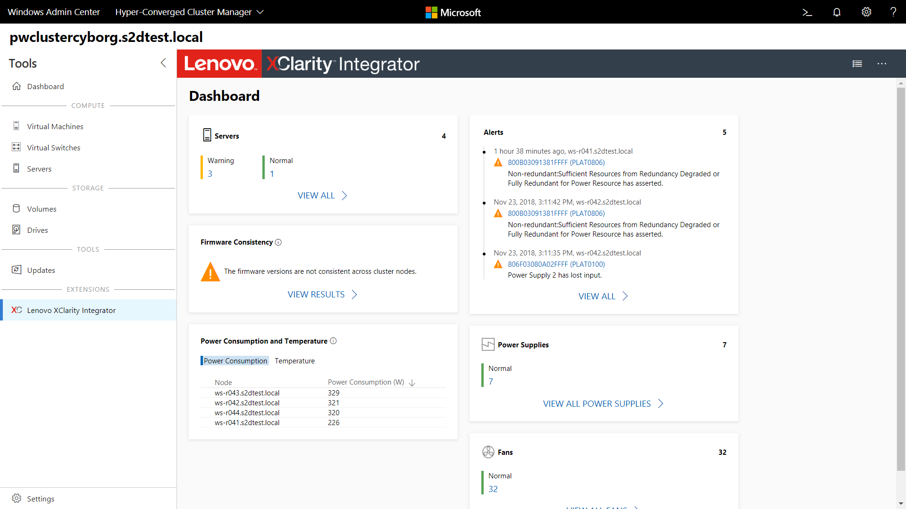
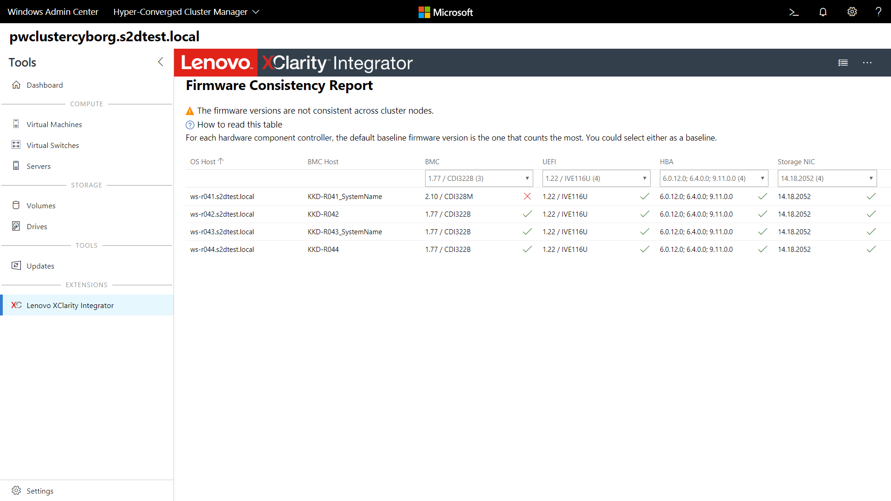

# Lenovo XClarity Integrator Extension

## Integrated hardware management everywhere!

The [Lenovo XClarity Integrator](https://www.lenovo.com/us/en/data-center/software/systems-management/XClarity-Integrator/p/WMD00000370) extension for Windows Admin Center provides administrators a seamless experience to manage Lenovo infrastructure directly from Windows Admin Center. The XClarity Integrator extension includes a standalone solution extension and also extends the existing Server Manager, Failover Cluster Manager, and Hyper-Converged Cluster Manager solutions in a single, unified UI to enable simple server management. 

The solution extension included in the XClarity Integrator extension allows connecting to a Lenovo XClarity Administrator, Lenovo rack or tower servers, or all the servers in an entire chassis at once. Once the servers are added, you can see the overall health status for all added nodes.

By selecting a server, you can view the server's hardware inventory, available firmware updates, alerts, events, logs, power consumption and temperature. You can also run operations such as Remote Control and power on/off.

The same tools are available as a tool extension when managing servers within Windows Admin Center as well, allowing you to seamlessly switch between managing your infrastructure software and hardware.

The tool extension for failover clusters and hyper-converged clusters provides a dashboard displaying overall cluster hardware health status, status alerts, firmware consistency status and report, power consumption and temperature, and fan and power supply health status.

Learn more about the Lenovo XClarity Integrator offerings for Windows Admin Center on the [Lenovo website](https://support.lenovo.com/us/en/solutions/ht507549).