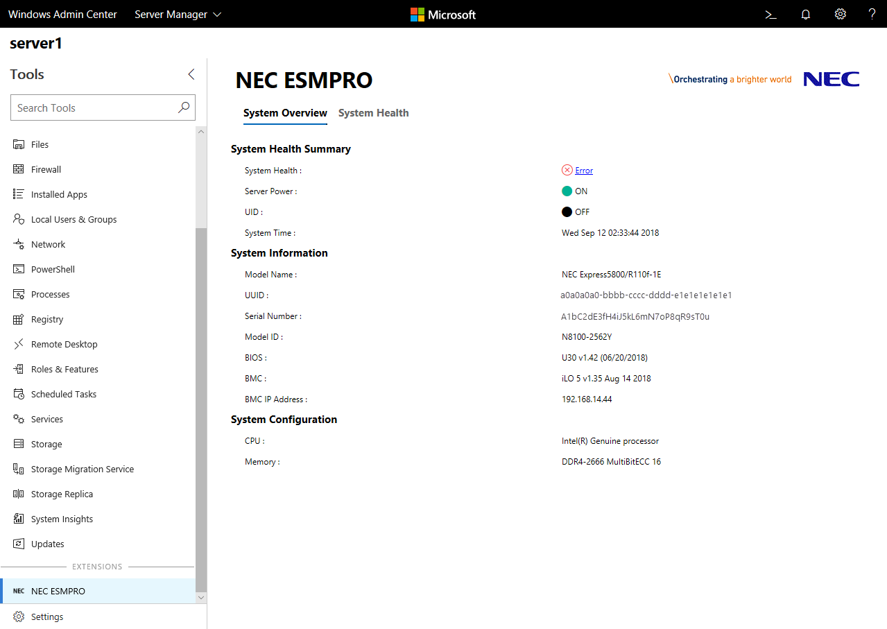
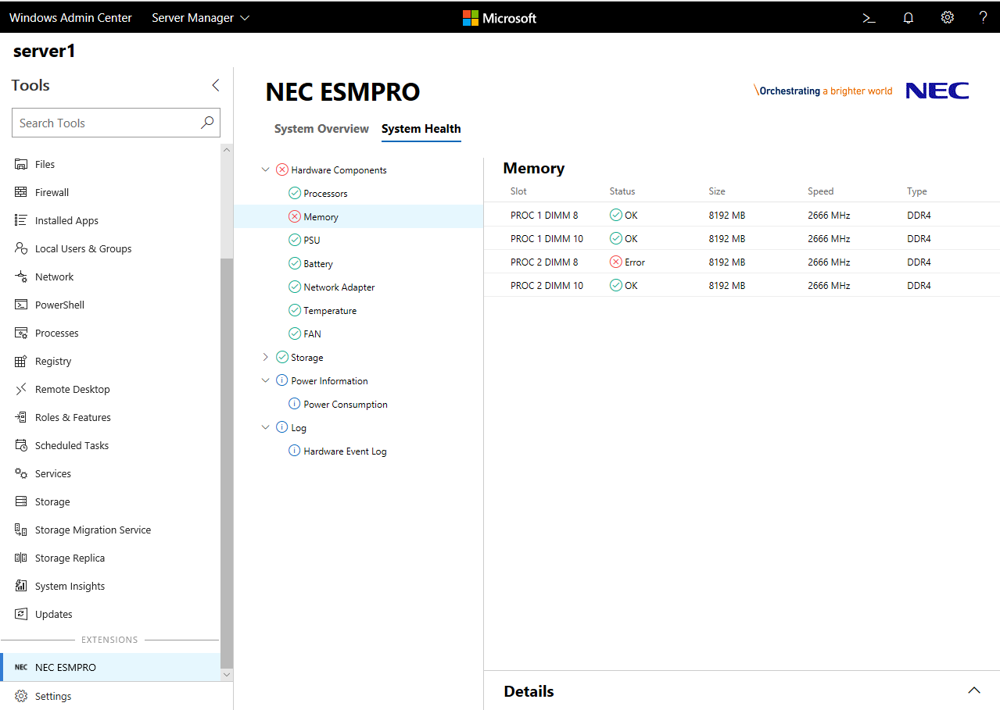

# NEC ESMPRO Extension

NEC provides products for businesses, ranging from terminals to network and computer equipment, software products and service platforms, as well as integrated platforms based on these products and services.

NEC ESMPRO is NEC's server management software to manage NEC Express5800 series servers, and the NEC ESMPRO extension for Windows Admin Center enables showing hardware and RAID information of NEC Express5800 series servers in Windows Admin Center.

The NEC ESMPRO extension requires installing the NEC ESMPRO Manager as it retrieves server hardware information through the NEC ESMPRO Manager.

The NEC ESMPRO extension has two tabs, the 'System Overview' tab and the 'System Health' tab. In the System Overview tab, you can easily view the system's basic information.

In the System Health tab, you can view the detailed information of individual hardware components, such as processors, memory, power supplies, network adapters, temperature and fan. The status and configuration for RAID systems, power consumption and hardware event logs are also available.

The NEC ESMPRO extension for Windows Admin Center brings new experiences of server management to server administrators with the collaboration of NEC's hardware technology and Microsoft's software technology.