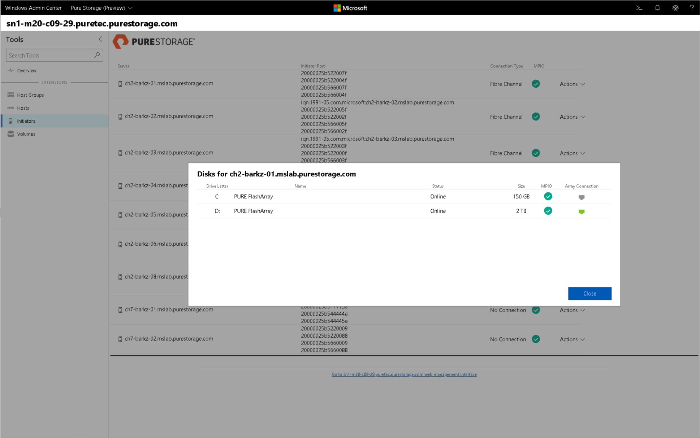

# Pure Storage Extension

## Providing End-to-End Array Management for Windows Admin Center 

[Pure Storage](https://www.purestorage.com/) provides enterprise, all-flash data storage solutions that deliver data-centric architecture to accelerate your business for a competitive advantage.  Pure is a Microsoft Gold Partner, certified for Microsoft Windows Server, and develops technical integrations for key Microsoft solutions such as Azure, Hyper-V, SQL Server, System Center, Windows PowerShell, and Windows SMB. Pure recently announced a tech preview of an extension supporting the latest release of Windows Admin Center that provides a single-pane view into Pure FlashArray products.  From this extension, users are empowered from one tool to conduct monitoring tasks, view real-time performance metrics, and manage storage volumes and initiators.

Early on, when Windows Admin Center was known as “Project Honolulu”, Pure saw the value of being able to provide customers and partners the ability to manage multiple Pure Storage FlashArrays from the single pane of glass that Windows Admin Center provides.

When Pure started researching the use case with “Project Honolulu” they immediately realized the potential for providing a unified management experience between Windows Admin Center and FlashArray. Pure closely collaborated with the Windows Admin Center engineering team, which helped define the implementation details for the features. Pure was also able to provide feedback at the early stages of Windows Admin Center and make contributions to the Microsoft team. 

> <cite>“We have integrated a feature set that mimics our FlashArray web interface to enable direct management from within Windows Admin Center. Our customers and partners will benefit from a single pane of glass versus needing to work with two different management tools. In addition to the single point of management benefits customers will be able to contextually manage Windows Servers that are connected to the FlashArray.”</cite>
>
> -- Barkz, Technical Director Microsoft Solutions & Integration, Pure Storage

The features that are included in the Pure Storage Solution Extension include:
- Connecting to multiple FlashArrays.
- Viewing the FlashArray details, including IOPs, bandwidth, latency, data reduction and space management. These are all the same details you get from the FlashArray Management GUI.
- View configured host groups that are used to enable shared volume access for Windows Server hosts and Clustered Shared Volumes (CSVs).
- View Hosts — All of the connectivity information is available including Host Names, iSCSI Qualified Name (IQNs) and World Wide Names (WWNs).
- Manage Volumes — This includes the ability to create and destroy volumes. Once a volume is destroyed it will be placed in the Destroyed items bucket and you will need to Eradicate from the main FlashArray Management GUI.
- Manage Initiators — This is one of the most interesting features providing context to the individual servers being managed by the Windows Admin Center deployment. You can view the connected disks (volumes) to individual Windows Servers, check if MultiPath-IO (MPIO) is installed/configured and creating/mounting new volumes.

A [demonstration video](https://youtu.be/IFAeCAd6V2g) has been created that shows all of the features that the Pure Storage Solution Extension provides. 

The below screenshot illustrates viewing what disks (volumes) are connected to a specific Windows Server host. In addition to viewing the connectivity detail, we check if Multipath-IO is configured.

In addition to viewing the disks, new volumes can be created and immediately mounted to the host without having to use Windows Disk Management tool.

Since releasing our Technical Preview, the customer feedback collected so far has been very positive and has also provided us insight into different features to add in future releases. 

Additional resources:
- [Pure Storage extension announcement blog post](https://blog.purestorage.com/tech-preview-of-the-pure-storage-extension-for-windows-admin-center/)
- [PureReport](https://itunes.apple.com/us/podcast/windows-admin-center-extension-from-pure-storage/id1392639991?i=1000424316130&mt=2) podcast
