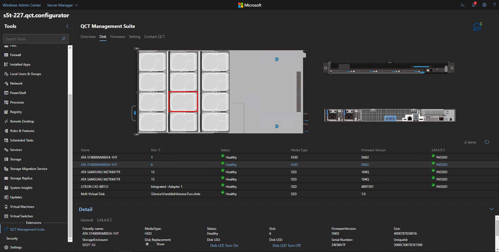
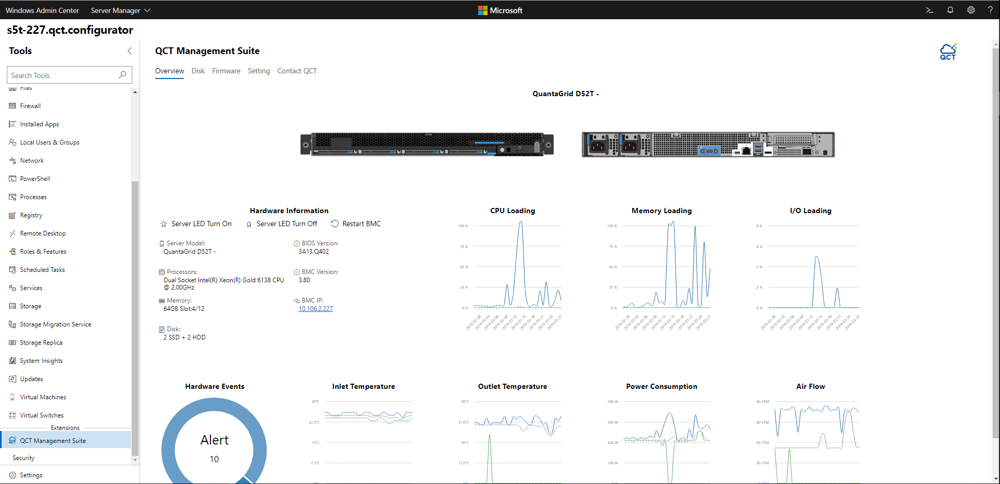
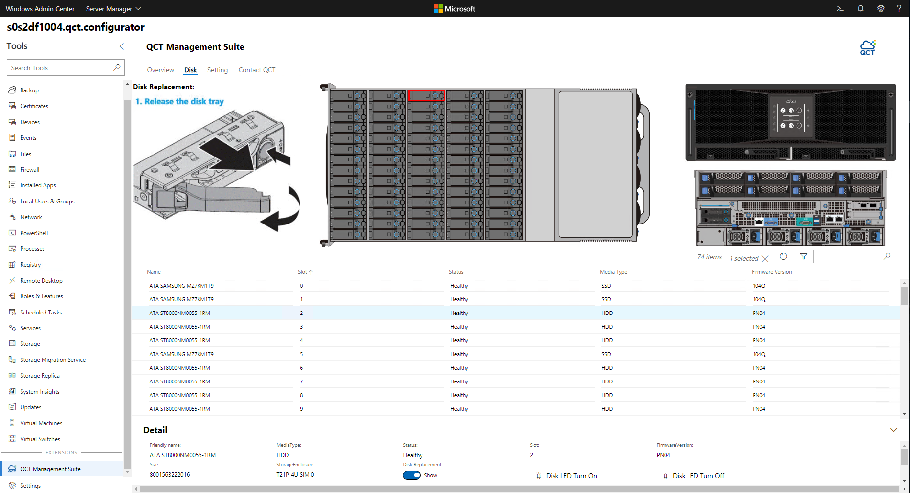
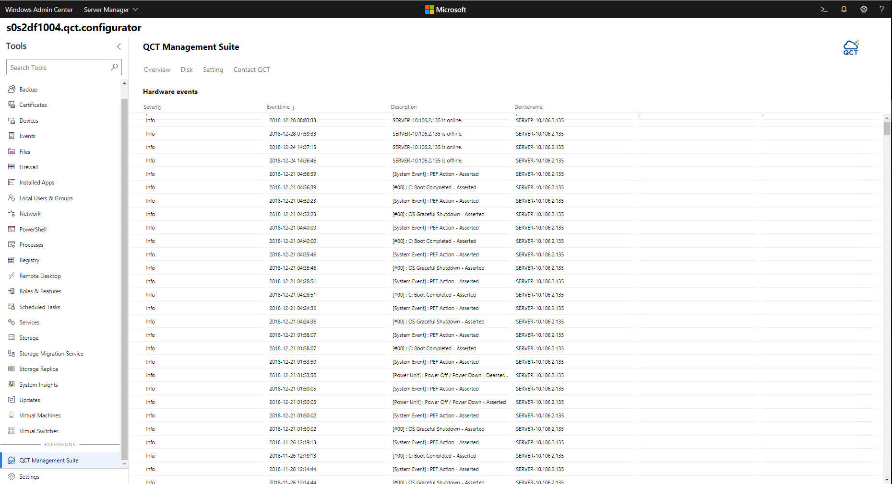
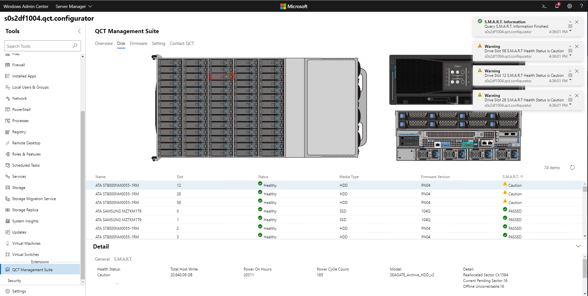

# QCT Management Suite Extension

## A simple path to server infrastructure management

The QCT Management Suite extension for Windows Admin Center provides a single pane of glass dashboard for monitoring system configurations and managing server health of [QCT Azure Stack HCI certified systems](https://go.qct.io/solutions/enterprise-private-cloud/qxstack-windows-server-cloud-ready-appliances/windows-server-software-defined-solution-wssd/) : [QuantaGrid D52BQ-2U](https://www.qct.io/product/index/Server/rackmount-server/2U-Rackmount-Server/QuantaGrid-D52BQ-2U), [QuantaGrid D52T-1ULH](https://www.qct.io/product/index/Storage/Storage-Server/1U-Storage-Server/QuantaGrid-D52T-1ULH) and [QuantaPlex T21P-4U](https://www.qct.io/product/index/Storage/Storage-Server/4U-Storage-Server/QuantaPlex-T21P-4U).

Driven by customer pain points around existing monitoring and management, QCT provides exclusive, complementary features and functions, which includes an overview of system event logs, monitoring drivers, and hardware component health to enhance the overall management experience.

The QCT Management Suite extends the functionality of Windows Admin Center with the key features below:
- **One-click exclusive hardware management** - An intuitive user interface displays hardware information, including model name, processor, memory and BIOS. IT administrators can restart the BMC with a simple one-click UI.

- **Disk mapping and LED identification for efficient service support** - QCT Management Suite wizard UI design displays the slot of each selected disk with an overview of disk profiles and LED light controls of selected disks for efficient replacement.

- Easy-to-use monitoring tool for hardware event log and health status.

- **Predictive disk management** - Evaluate the system condition with S.M.A.R.T information and unhealthy notifications which allow organizations to take action before total failure occurs.

Learn more about the QCT Management Suite for Windows Admin Center:
- [QCT Management Suite web page](https://go.qct.io/solutions/enterprise-private-cloud/qxstack-windows-server-cloud-ready-appliances/)
- [QCT Management Suite datasheet](https://go.qct.io/wp-content/uploads/2019/04/WAC-data-sheet_v04222019.pdf)