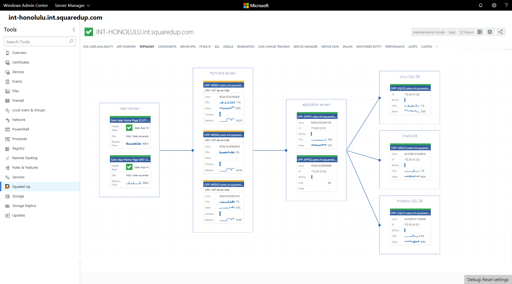
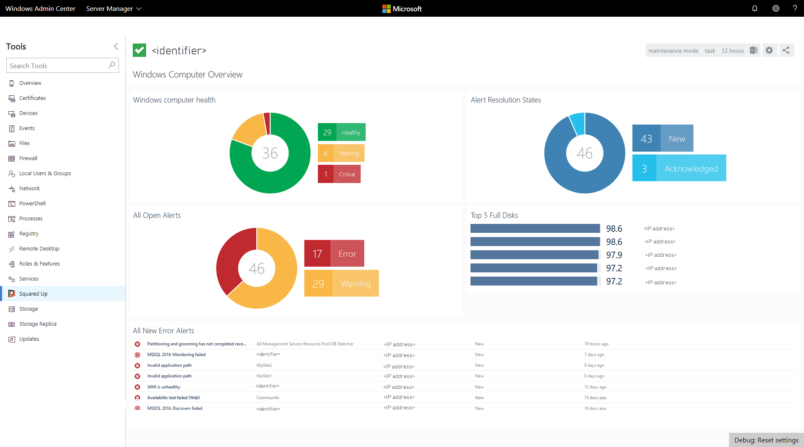

# Squared Up Extension

## Bringing SCOM-based monitoring, server dependency visibility and external data insights into Windows Admin Center

Squared Up was founded with the vision of using data visualization to help solve the challenges of enterprise IT complexity. Squared Up’s unique, lightweight, UI-only software builds on top of Microsoft’s powerful System Center Operations Manager platform, as well as integrating with additional data sources - from Microsoft’s own Azure Log Analytics, Application Insights and System Center Service Manager to third-party products like ServiceNow, Splunk and many more - to provide visibility into large-scale enterprise infrastructure and application estates, both on-premises and across hybrid cloud environments.

> <cite>“We’ve been heavily utilizing Windows Admin Center throughout its Technical Preview and it’s been a huge hit already, really helping solve challenges like our engineers getting easy access to our configuration labs, and we intend to make it our primary management console once it hits full release. We love the potential of the integration with Squared Up and the ability to surface all our data in a single place.”</cite>
>
> -- David Acevedo, I/S Specialist at NuStar Energy L.P.

Squared Up’s clients manage hundreds, often thousands, of Windows Servers and the diverse application portfolios delivered by them, and both Squared Up and Microsoft are on a mission to bring IT teams the best in fast, modern, web UI to provide the insights they need. As a result, the team at Squared Up immediately saw an exciting alignment with Windows Admin Center which brings those same values and principals to the next generation of Windows Server administration. In particular, the team believed that the long-term performance data, real-time server dependency insights and application context surfaced by Squared Up would perfectly complement the sleek, real-time data and server management capabilities provided by Windows Admin Center.

> <cite>“As an organization managing a large-scale server estate, the Squared Up / Windows Admin Center integration is the perfect marriage of our localized and centralized tooling and things like being able to throw a server straight into Maintenance Mode from within Windows Admin Center are great little wins for us”</cite>
>
> -– Kip Granson, Virtualization Systems Administrator at Purdue University

Armed with a clear vision of wanting to present that data seamlessly within Windows Admin Center, Squared Up worked with the early private preview version of the Windows Admin Center SDK and found it straightforward, well-documented and flexible.

Using the Windows Admin Center SDK, Squared Up was able to build an extension that dynamically embeds relevant Squared Up views within the Windows Admin Center experience. For example, within the context of a specific server or cluster, Squared Up views are automatically embedded to provided extended visibility. Views include historical trends of key performance and capacity metrics (such as CPU, memory and disk), hosting stack (cloud platform or datacenter virtualization), application components such as SQL databases and services, and even cloud-based log analytics and ITSM data.

Squared Up and Windows Admin Center share a modern web architecture and design ethos, which has enabled both a simple technical integration and a seamless user experience. With web-based administration increasingly becoming the norm, we believe this method of integration between different systems is the key to unlocking a modern, unified administration experience.

> <cite>“We see Windows Admin Center as the cutting-edge of modern Windows Server administration, so it’s been a great experience for us to work so closely with the team and the fact that they’re working with such speed, enthusiasm, flexibility and within such fundamentally modern development paradigms has made them a great fit with the way we, as a lean, agile, fast-paced software development company, work ourselves.”</cite>
>
> -- Richard Benwell, Product Architect at Squared Up

From this natural alignment, the development team at Squared Up was able to rapidly progress to a prototype integration displaying Squared Up natively within the Windows Admin Center experience and to get that into the hands of their own early-adopter, technical preview clients. From the customers’ reactions, it was immediately clear that the story was winner.

> <cite>“One of the key challenges of maintaining outstanding service across our environment of over 3,500 servers is unifying our diverse landscape of management and monitoring tools and so the integration between Squared Up and Windows Admin Center - which brings together so much data, from so many disparate sources, into a single console – is massive for us.”</cite>
>
> -- Martin Ehrnst, Technical Lead for Azure at Intility A/S

With that kind of enthusiasm from Squared Up clients already and with tons of great new features still to come to Windows Admin Center, Squared Up is hugely excited about the future of this integration and the awesome possibilities it opens up for their clients and their journey to a true single-pane-of-glass for their IT operations management.

The Squared Up / Windows Admin Center integration is currently in Beta; if you’d like access, please check out [Squared Up’s dedicated page](https://squaredup.com/product/honolulu/windows-admin-center-extension/?utm_source=microsoft-wac&utm_medium=public-relations&utm_campaign=honolulu) for more details. If your organization uses Microsoft System Center Operations Manager and you don’t yet have Squared Up (which is essential for the extension to work), then you can also get your hands on a fully-featured, 30 day free trial from the same location. 
