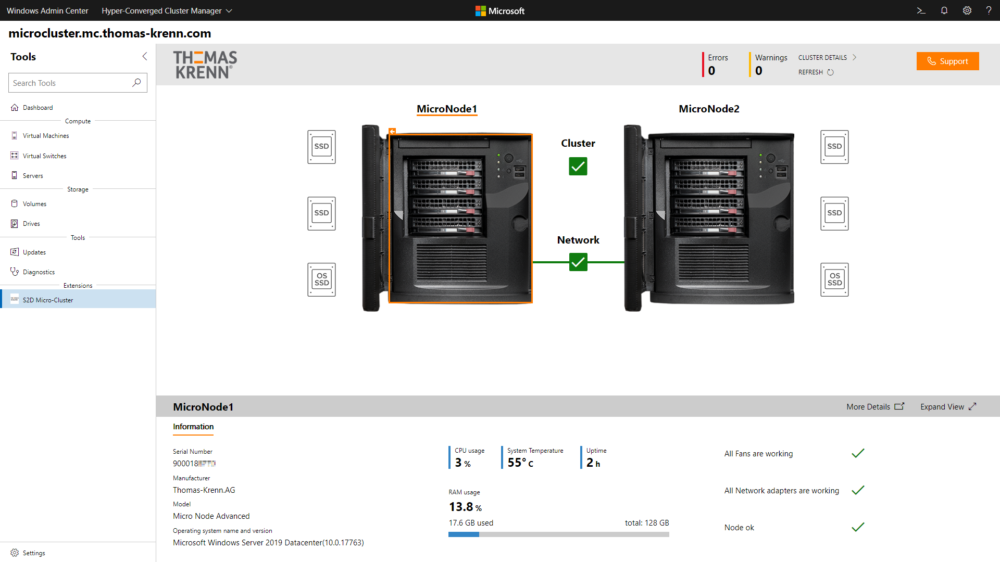
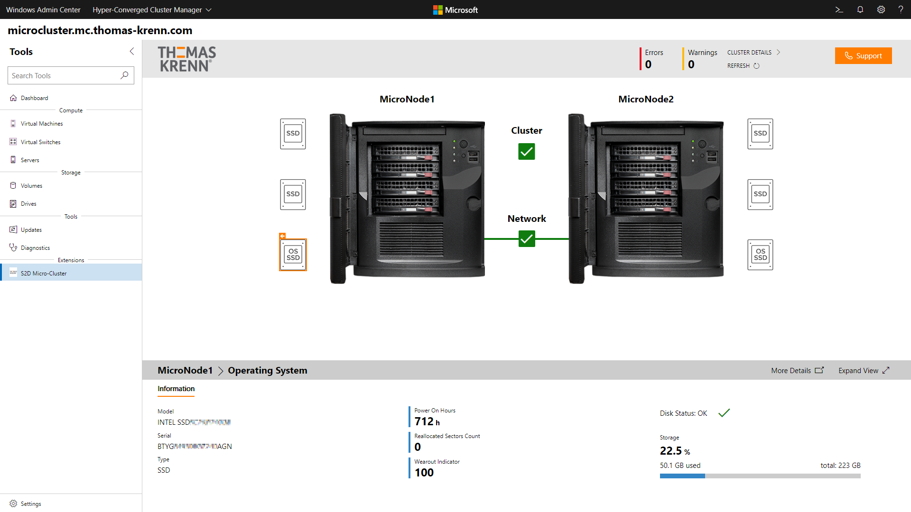
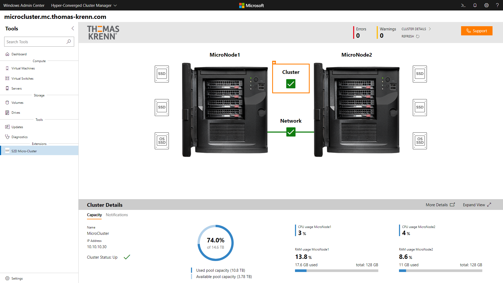
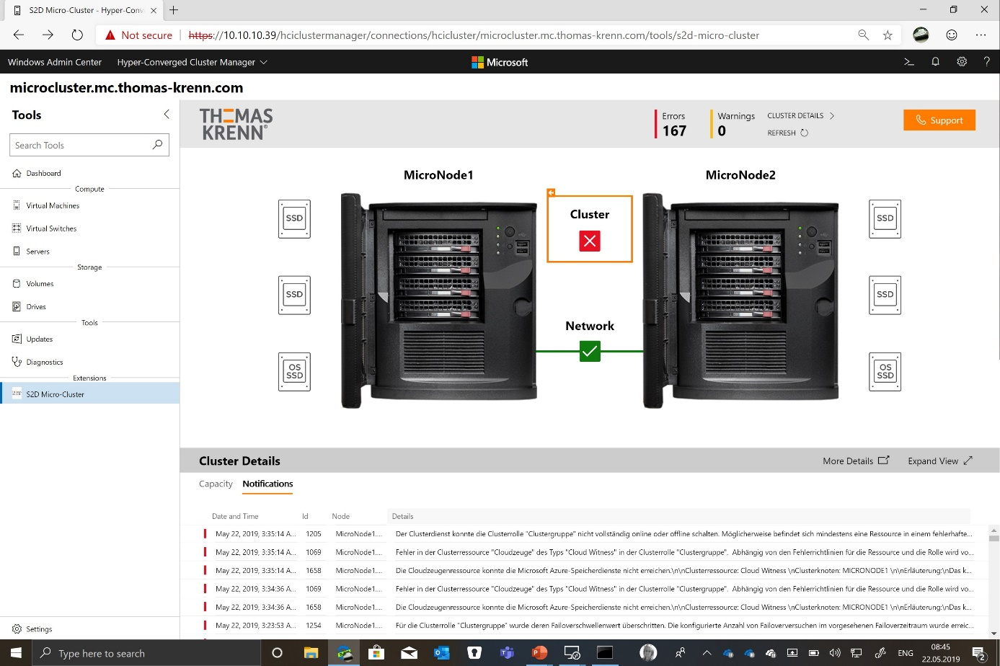
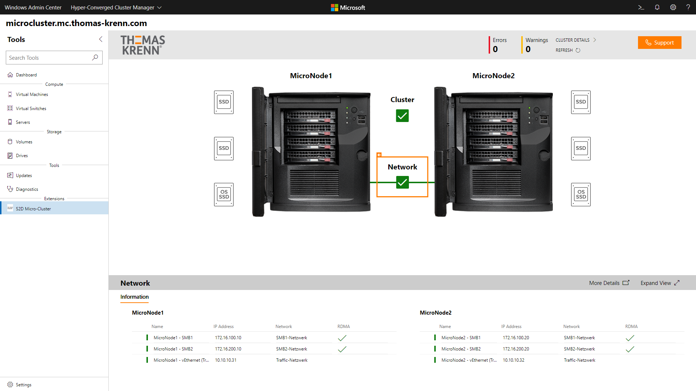
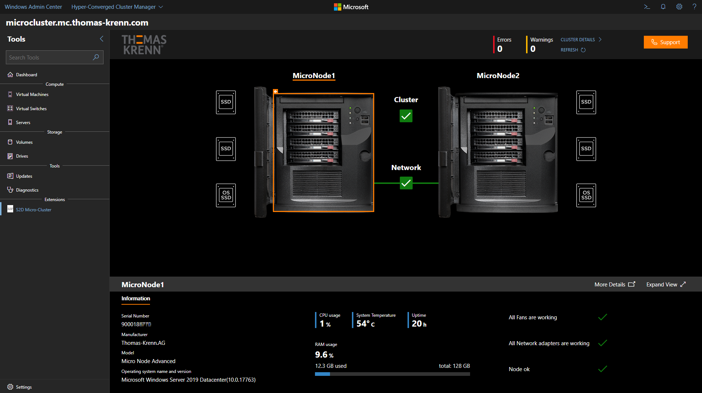

# Thomas-Krenn.AG Extension

## Intuitive server and storage health management

The Thomas Krenn.AG Windows Admin Center extension is designed specifically for the highly available, 2-node [S2D Micro-Cluster](https://www.thomas-krenn.com/en/products/application/software-defined-storage/s2d-micro-cluster.html) appliance. The user-friendly, graphical web interface visualizes a Micro-Cluster's health status through a simple dashboard and allows you to drill down on storage devices, network interfaces or the entire cluster to view more details.

The extension provides intuitive access to information typically needed for first-level service and support calls, such as serial numbers, software versions, storage utilization and more. It is designed to be useful to admins who have no prior experience with Windows Server hyper-converged infrastructure.

A few of the insights available are:
- General Information about the Micro-Nodes and the Micro-Cluster
- OS / boot device status
- Capacity HDD and caching SSD status
- Cluster events
- Network status and information

Use the dashboard to determine the cluster's health status and important system information such as serial numbers, model, OS version and utilization. Additionally, fan, NIC and overall node hardware health are displayed on the dashboard as well.

You can drill down into storage devices to view serial numbers, SMART-status, and capacity utilization. Boot devices also show wear out indicators, reallocated sectors and power on time, which are the best indicators of SSD health.

The cluster status icon expands to show a summary of the cluster's operational details.

After this Micro-Cluster's Azure cloud witness was unavailable for a whole night, one glance is enough to identify the problem. Clicking on “Notifications” immediately lists relevant events for quick remediation. Cluster events are localized and determined by the base OS language. The extension itself supports English and German.

Network information is readily available as well.

Based on customer feedback, we've also implemented “Dark Mode” available in Windows Admin Center v1904. This is soothing in dark datacenters and in poorly lighted cabinets and closets. It also makes Windows Admin Center more accessible by reducing glare for admins with certain visual impairments.

Thomas-Krenn immediately realized that usability and accessibility for untrained admins would be key to a great customer experience for hyper-converged infrastructure in the small and mid-sized business market. Thomas-Krenn's Micro-Cluster extension perfectly complements Windows Admin Center's native HCI management capabilities by including proprietary hardware information on the dashboard and re-grouping important cluster health information in a new, human-friendly interface.

During the development process it was decided to deploy Windows Admin Center 1904 in a high-availability configuration on the cluster itself, ensuring manageability even after node failures. The extension comes pre-installed, just as the entire OS.

The extension was built in parallel with Windows Admin Center 1904 being developed at Microsoft. Close cooperation and continuous feedback exposed issues on both sides that were jointly resolved before the product successfully launched in April 2019. Thomas-Krenn is incredibly proud to be one of the first to fully support and implement Windows Admin Center 1904's new features.
