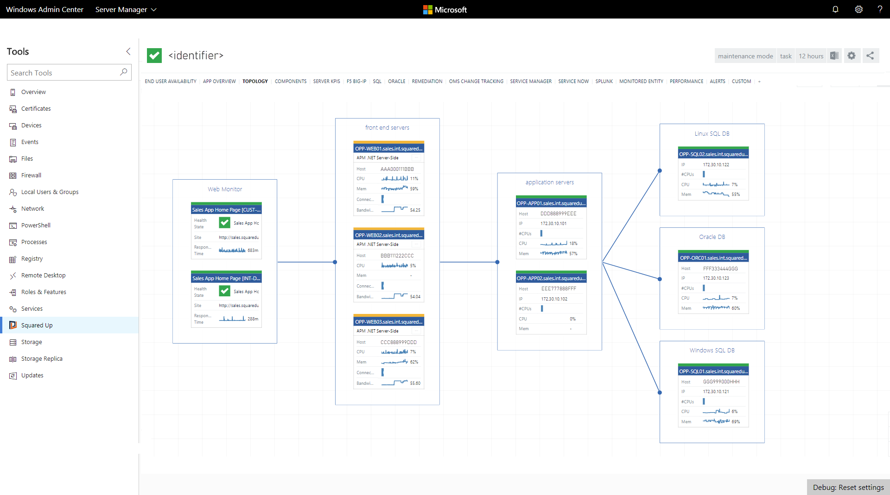

# Extensions for Windows Admin Center

>Applies To: Windows Server (Semi-Annual Channel), Windows Server 2016, Windows Server 2012 R2, Windows 10

Windows Admin Center is built as an extensible platform to enable partners and developers to leverage existing capabilities within Windows Admin Center, seamlessly integrate with other IT administration products and solutions, and provide additional value to customers. Each solution and tool in Windows Admin Center is built as an extension using the same extensibility features available to partners and developers, so you can build powerful tools just like the ones available in Windows Admin Center today.

Windows Admin Center extensions are built using modern web technologies including HTML5, CSS, Angular, TypeScript and jQuery, and can manage target servers via PowerShell or WMI. You can also manage target servers, services or devices over different protocols such as REST by building a Windows Admin Center gateway plugin.

## Why you should consider developing an extension for Windows Admin Center

Here’s the value you can bring to your product and customers by developing extensions for Windows Admin Center:

- **Integrate with Windows Admin Center tools:** Integrate your products and services with server and cluster management tools in Windows Admin Center and deliver unified and seamless, end-to-end monitoring, management, troubleshooting experiences to your customers.
- **Leverage platform security, identity and management capabilities:** Enable Azure Active Directory (AAD) support, Multi-Factor Authentication, Role-Based Access Control (RBAC), logging, auditing for your product and services by leveraging Windows Admin Center platform capabilities to meet the complex requirements of today’s IT organizations.
- **Develop using the latest web technologies:** Quickly build stunning user experiences using modern web technologies including HTML5, CSS, Angular, TypeScript and jQuery, and rich, powerful UI controls included in the Windows Admin Center SDK.
- **Extend product outreach:** Become a part of the new Windows Admin Center ecosystem with outreach to our quickly growing customer base and leverage the Windows Server 2019 launch momentum later this year.

## Start developing with the Windows Admin Center SDK (Preview)

The [Windows Admin Center SDK (Preview)](https://aka.ms/wacsdk) is available on GitHub, including an extension template for building your first “Hello World” extension, sample code for different types of extensions, examples for dozens of UI controls and UI styles to start building extensions today!
See the topics below to learn more about the SDK and get started:

- [Understand how extensions work](understand-extensions.md)
- [Develop an extension](developing-extensions.md)
- [Guides](guides.md)
- [Publish your extension](publish-extensions.md)

## Partner Spotlight

See the amazing value our partners have started to bring to the Windows Admin Center ecosystem and try these extensions out today. Learn more on [how to install extensions](../configure/using-extensions.md) from Windows Admin Center.

### DataON

DataON MUST is a browser-based solution for monitoring and managing DataON hyper-converged infrastructure running Windows Server. The [DataON MUST extension](http://www.dataonstorage.com/must/windows-admin-center/) provides unique value to customers such as historical data reporting, disk mapping, system alerts and call home service, complementing the Windows Admin Center server and hyper-converged infrastructure management capabilities, through a seamless, unified experience. [Learn more about DataON's MUST extension and their development experience](case-studies/dataon.md).

### Fujitsu

[Fujitsu’s ServerView Health and RAID Health extensions](https://aka.ms/wac-fujitsu-extension) for Windows Admin Center provide in-depth monitoring and management of critical hardware components such as processors, memory, power and storage subsystems for Fujitsu PRIMERGY servers. By utilizing the Windows Admin Center UX design patterns and UI controls, Fujitsu has brought us a huge step towards our vision of end-to-end insight into server roles and services, to operating system, and to hardware management through the Windows Admin Center platform. [Learn more about Fujitsu's extensions and their development experience](case-studies/fujitsu.md).

### Squared Up

Squared Up provides a best-in-class monitoring experience based on System Center Operations Manager and integrating with Azure Log Analytics, Application Insights and other monitoring solutions. The [Squared Up extension](https://squaredup.com/product/honolulu/windows-admin-center-extension/?utm_source=microsoft-docs&utm_medium=public-relations&utm_campaign=honolulu) brings historical performance data and live application topologies and dependencies into the context of server and cluster management that Windows Admin Center provides, and early customers have acclaimed the value of bringing immense data from many disparate sources into a single experience. [Learn more about Squared Up's extension and their development experience](case-studies/squared-up.md).

