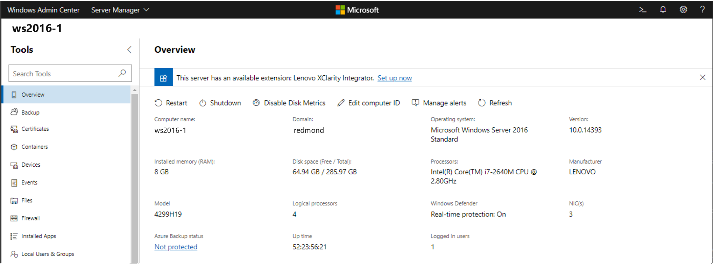

# Enabling the extension discovery banner

>Applies To: Windows Admin Center, Windows Admin Center Preview

A new feature available in Windows Admin Center Preview 1903 is the extension discovery banner. This feature allows an extension to declare the server hardware manufacturer and models it supports, and when a user connects to a server or cluster for which an extension is available, a notification banner will be displayed to easily install the extension. Extension developers will be able to get more visibility for their extensions and users will be able to easily discover more management capabilities for their servers.



## How the extension discovery banner works

When Windows Admin Center is launched, it will connect to the registered extension feeds and fetch the metadata for the available extension packages. Then when a user connects to a server or cluster in Windows Admin Center, we read the server hardware manufacturer and model to display in the Overview tool. If we find an extension that declares that it supports the current server's manufacturer and/or model, we'll display a banner to let the user know. Clicking on the "Set up now" link will take the user to Extension Manager where they can install the extension.

## How to implement the extension discovery banner

The "tags" metadata in the .nuspec file is used to declare which hardware manufacturer and/or models your extension supports. Tags are delimited by spaces and you can add either a manufacturer or model tag, or both to declare the supported manufacturer and/or models. The tag format is ``"[value type]_[value condition]"`` where [value type] is either "Manufacturer" or "Model" (case sensitive), and [value condition] is a [Javascript regular expression](https://developer.mozilla.org/en-US/docs/Web/JavaScript/Guide/Regular_Expressions) defining the manufacturer or model string, and [value type] and [value condition] are separated by an underscore. This string is then encoded using URI encoding and added to the .nuspec "tags" metadata string.

### Example

Let's say I've developed an extension that supports servers from a company named Contoso Inc., with model name R3xx and R4xx.

1. The tag for the manufacturer would be ``"Manufacturer_/Contoso Inc./"``. The tag for the models could be ``"Model_/^R[34][0-9]{2}$/"``. Depending on how strictly you want to define the matching condition, there will be different ways to define your regular expression. You can also separate the Manufacturer or Model tags into multiple tags, for example, the Model tag could also be ``"Model_/R3../ Model_/R4../"``.
2. You can test the regular expression with your web browser's DevTools Console. In Edge or Chrome, hit F12 to open the DevTools window, and in the Console tab, type the following and hit Enter:

   ```javascript
   var regex = /^R[34][0-9]{2}$/
   ```

   Then if you type and run the following, it will return 'true'.

   ```javascript
   regex.test('R300')
   ```

   And if you run the following, it will return 'false'.

   ```javascript
   regex.test('R500')
   ```

3. Once you've verified the regular expression, you can encode it in the DevTools Console as well, using the following Javascript method:

   ```javascript
   encodeURI(/^R[34][0-9]{2}$/)
   ```

   The final format of the tag string to add to your .nuspec file would be:

   ```
   <tags>Manufacturer_/Contoso%20Inc./ Model_/%5ER%5B34%5D%5B0-9%5D%7B2%7D$/</tags>
   ```

> [!Tip]
> We understand that a hardware manufacturer may have a very wide range of model names of which some may be supported while some are not. Keep in mind that this feature is meant to help with the **discovery** of your extension, but it does not have to be a perfectly up-to-date inventory of all your models. You can define your regular expression to be a simpler expression that matches a subset of your models. A user might not see the discovery banner if they first connect to a server model that doesn't match the condition, but sooner or later they will connect to another server that does and will discover and install the extension. You can also consider defining a simple regular expression that only matches your manufacturer name. In some cases, your extension may not actually support a specific model, but you can use the [dynamic tool display feature](./dynamic-tool-display.md) to define a custom PowerShell script to check model support and only show your extension when applicable, or provide limited functionality in your extension for models that don't support all capabilities.