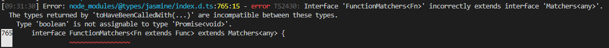

# Upgrade existing Windows Admin Center extensions to Angular 11

Windows Admin Center is upgrading to Angular 11.0! This upgrade brings in the latest in features, security, and performance, and we're excited to have it available for you. So far, the shell of Windows Admin Center has been upgraded and it is your turn to update your extensions. Follow the steps in this document to get your extension updated.

If you run into any issues during this process, reach out to your Microsoft contact and they'll assist you in routing the request.

## Preliminary steps
Before beginning the upgrade to Angular 11, you need to configure your developer environment with the latest Windows Admin Center shell and development tools. Complete the following steps before proceeding to the upgrade process:

1. Install the latest version of Windows Admin Center in dev mode (`msiexec /i WindowsAdminCenter<version>.msi DEV_MODE=1`) with the upgraded shell. Reach out to your Microsoft contact if this has not been provided to you.
2. **(Recommended)** Create a `features/ng11` branch in the repo.
3. **(Recommended)** Update `version.json` version to `(N+1).0.0`.
4. In a PowerShell console, make sure to switch to the respective Node version for your Angular version (for more information, see [Working with two branches of shell](#working-with-two-branches-of-shell) for more details). For Angular 11, run `nvm use 12.18.3`. Close the terminal for this change to take effect.
5. Clean up the `node_modules` folder to avoid npm conflicts.

## Automated upgrade process
Download and install the Windows Admin Center CLI tools by running `npm install -g @microsoft/windows-admin-center-sdk@experimental` if you have not already done so before proceeding through the following steps. 

1. At the root level of the repo, run `wac upgrade --audit=false --experimental`.
    - If working on an extension repository that is consumed by other extensions, include the `--library` flag as well.
    
    If the library flag was used, edit the `name` property in `src/package.json` to something unique to the extension.

2. **(Conditional)** If the extension repo has dependencies on any other extension package, you will have to manually pick the new angular version for that extension (e.g. `msft-sme-certificate-manager` has a dependency on `msft-sme-event-viewer`. The automated tools will **not** update `msft-sme-event-viewer` version, it has to be manually updated.)
Also be sure to specify the '/dist' folder level on any imports from extensions, any lower or higher-level imports won't work (e.g. `import { foobar } from '@msft-sme/event-viewer'` would need to be changed to `import { foobar } from '@msft-sme/event-viewer/dist'`.) 
3. Open `app-routing.module.ts` and change any appRoutes that have the format `./folder-name/file-name#ModuleClass` to `() => import('./folder-name/file-name').then(m => m.ModuleClass)`. If there are any other `routing.module.ts` files, they will also need to be updated in this way.
4. Remove `UpgradeAudit.txt` file. It's autogenerated for your reference but doesn't need to go in the repo.
5. Go through the following files and replace all instances of `@msft-sme` with `@microsoft/windows-admin-center-sdk`:
- `./angular.json`
- `./gulpfile.ts/common/e2e.ts`
- `./gulpfile.ts/common/resjson.ts`
- `./src/polyfills.ts`
- `./src/test.ts`
6. There will likely be unresolved errors as a result of the steps you've completed. Proceed to Build steps.

## Build steps
At this point in the upgrade process, your extension repo is ready to be built and the debugging process can begin. Proceed through the following steps:

1. Run `gulp build`.
2. Watch out for any linting and compilation errors.
3. Fix these errors and repeat steps 1-3 as necessary.
4. When all build errors are fixed, commit your changes and proceed to Run steps.

### Difficult to diagnose build errors
Some of the errors you may receive while debugging in the build step may be hard to diagnose. Here are two of the most common difficult to diagnose errors and how to mitigate them:

- **NG6002: Appears in the NgModule.imports of AppModule, but could not be resolved to an NgModule class**
  - This type of error occurs at build time, typically before the upgraded repository has been successfully built at least once. To resolve, run `ng serve --prod`, after which these errors should no longer appear when building.

- **Interface incorrectly extends another interface**
 
  - This error occurs during the inlineCompile step of "gulp build" and occurs as the result of a mismatch in versions between the `@types/jasmine` package downloaded and what the `@types/jasminewd2` package requires. This error can be resolved by removing the `@types/jasminewd2` package.

### Output bundle file names
When building your extension, you may run into issues as a result of the file names in your bundle. To avoid these issues, pay special attention to the following fields:

- **Output hashing must be enabled**. When output hashing is enabled, unique file names will be generated for every build of the extension. If this is not enabled, you may be unable to see the changes to your extension when viewing in the browser due to duplicate file names.
    - To enable from this field the command line, add the `--output-hashing` flag to an `ng build` command.
    - To enable this field from your repo directly, navigate to your angular.json file and look for the `outputHashing` field under production configurations.
- **Named chunks must be disabled**. When named chunks are enabled, each bundle file includes its original module file name. While that may seem useful, it often results in incredibly long file names that can result in errors in the Windows Admin Center extension feed. 
    - To disable this field from the command line, add the `--named-chunks` flag to an `ng build` command.
    - To disable this field from your repo directly, navigate to your angular.json file and look for the `namedChunks` field under production configurations. Set this field to false.

## Run steps
Now that you've fixed all of the build errors in your extension, you're ready to run your extension and fix any runtime issues. Follow the steps below to run your extension:

1. Sideload the extension with `gulp serve --port <port> --prod --aot`.
2. In the browser, look for any runtime issues with the extension, such as:
    - Extension page(s) not loading
    - Elements missing from the extension page(s)
    - Console errors
    - Anything else that looks off or behaves strange
3. Fix any runtime issues that you have discovered.
4. When the extension has been stabilized, commit your changes.

When you have finished these steps, proceed to Creating a main branch.

## Creating a main branch
After all linting, compilation, and runtime errors have been fixed, you're ready to finish upgrading your extension. To do this, we need to create a new branch in the extension repository. Follow these steps to finish upgrading your extension: 

1. Ensure that you are ready to complete the upgrade process and everything is working as expected in the feature branch.
2. Create a new branch named "main" in the repository.
3. Create a PR from the features/ng11 branch that merges into main.
4. When ready, complete the PR. 
5. Congratulations, you successfully upgraded an extension!

## Releasing your upgraded extension
Once your extension has been tested in Windows Admin Center desktop and service mode, send an email to [wacextensionrequest@microsoft.com](mailto:wacextensionrequest@microsoft.com?subject=Windows%20Admin%20Center%20Extension%20Package%20Review) to coordinate the release of your upgraded extension.

## Working with two branches of shell
Upgrading the Windows Admin Center shell has resulted in numerous environmental changes. One such change is the use of Node 12.18.3 from the previous 10.22.0 version. These versions are incompatible and you must toggle your global version to run build commands in each environment. 

To manage your versions of Node, we suggest using Node Version Manager:
https://github.com/coreybutler/nvm-windows

Follow the instructions to install nvm-windows on your machine.

Once installed, you can prepare your environment by running these commands:
```
nvm install 12.18.3
nvm use 12.18.3
npm i -g gulp-cli
npm i -g @angular/cli
npm i -g vsts-npm-auth
npm i -g typescript

nvm install 10.22.0
nvm use 10.22.0
npm i -g gulp-cli
npm i -g @angular/cli
npm i -g vsts-npm-auth
npm i -g typescript
```

This will set up your Node environment for development with both the new and old versions of Angular.

### Toggling Node version
The version of Node you are using can be toggled using PowerShell. 

The ```nvm list``` command can be used to list installed node versions. 

The ```nvm use <version>``` command can be used to quickly switch between node versions.

You can find a full index list of which Node, Angular, and Typescript versions go together here: [Node - Angular compatibility index](https://gist.github.com/LayZeeDK/c822cc812f75bb07b7c55d07ba2719b3).

> [!NOTE]
> All version numbers in this document are specific to the Windows Admin Center upgrade from Angular 7 to Angular 11.

Following the process above, you will lose all global node settings including your VSTS authentication. 

To restore VSTS authentication, run this command at the root of any repo:
``` vsts-npm-auth -config .npmrc ```

## Other considerations when upgrading extensions to Angular 11

- Sideloading of the shell and extensions should not be affected when working with two branches of shell.
- When using copyTarget, be aware of which shell branch you are in. Only use this command in the 2.0 branch if the extension you are working with is also upgraded to Angular 11.
- If the repo has been upgraded to Angular 11, then use the latest 2.x.0 version of shell libraries. Otherwise continue to use the latest 1.x.0 version.

You can tell if a repo is upgraded by looking at the package.json file.
