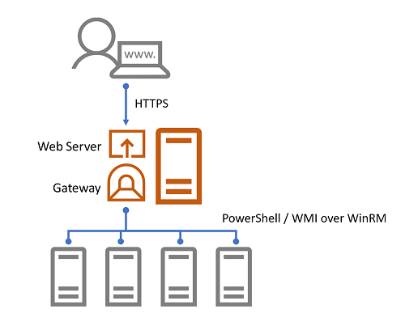
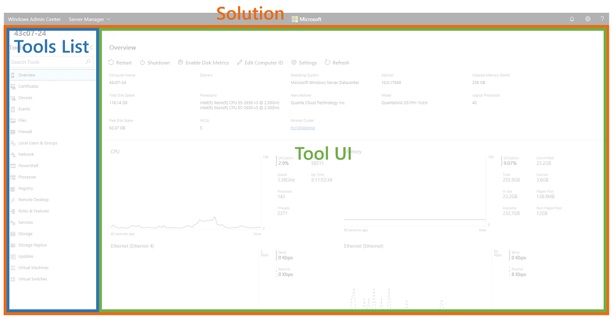
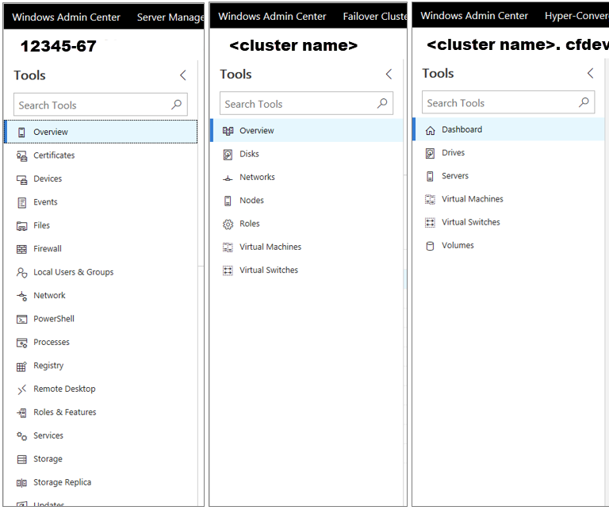

# Understanding Windows Admin Center Extensions

>Applies To: Windows Admin Center, Windows Admin Center Preview

In case you're not yet familiar with how Windows Admin Center works, let's start with the high-level architecture. Windows Admin Center is comprised of two main components:

- Lightweight **web service** that serves Windows Admin Center UI web pages to web browser requests.
- **Gateway component** that listens for REST API requests from the web pages and relays WMI calls or PowerShell scripts to be executed on a target server or cluster.

The Windows Admin Center UI web pages served by the web service has two main UI components from an extensibility perspective, solutions and tools, which are implemented as extensions, and, a third extension type called gateway plugins.

## Solution extensions

In the Windows Admin Center home screen, by default, you can add connections that are one of four types – Windows Server connections, Windows PC connections, failover cluster connections and hyper-converged cluster connections. Once a connection is added, the connection name and type will be displayed in the home screen. Clicking on the connection name will attempt to connect to the target server or cluster and then load the UI for the connection.

Each of these connection types map to a solution and solutions are defined through a type of extension called “solution” extensions. Solutions typically define a unique type of object you wish to manage through Windows Admin Center, such as servers, PCs or failover clusters. You could also define a new solution for connecting to and managing other devices such as network switches and Linux servers, or even services such as Remote Desktop Services.

## Tool extensions

When you click on a connection in the Windows Admin Center home screen and connect, the solution extension for the selected connection type will be loaded and you will then be presented with the solution UI including a list of tools in the left navigation pane. When you click on a tool, the tool UI is loaded and displayed in the right pane.

Each of these tools are defined through a second type of extension called “tool” extensions. When a tool is loaded, it can execute WMI calls or PowerShell scripts on a target server or cluster and display information in the UI or execute commands based on user input. A tool extension defines which solutions it should be displayed for, resulting in a different set of tools for each solution. If you are creating a new solution extension, you'll additionally need to write one or more tool extensions that provide functionality for the solution.

## Gateway plugins

The gateway service exposes REST APIs for the UI to call and relays commands and scripts to be executed on the target. The gateway service can be extended by gateway plugins that support different protocols. Windows Admin Center is pre-packaged with two gateway plugins, one for executing PowerShell scripts and the other for WMI commands. If you need to communicate with the target through a protocol other than PowerShell or WMI, such as REST, you can build a gateway plugin for this.

## Next steps

Depending on what capabilities you want to build in Windows Admin Center, [building a tool extension](develop-tool.md) for an existing server or cluster solution may be sufficient, and is the easiest first step into building extensions. However, if your feature is for managing a device, service or something completely new, rather than a server or cluster, you should consider [building a solution extension](develop-solution.md) with one or more tools. And finally, if you need to communicate with the target through a protocol other than WMI or PowerShell, you'll need to [build a gateway plugin](develop-gateway-plugin.md). [Continue reading on](developing-extensions.md) to learn how to set up your development environment and start writing your first extension.
