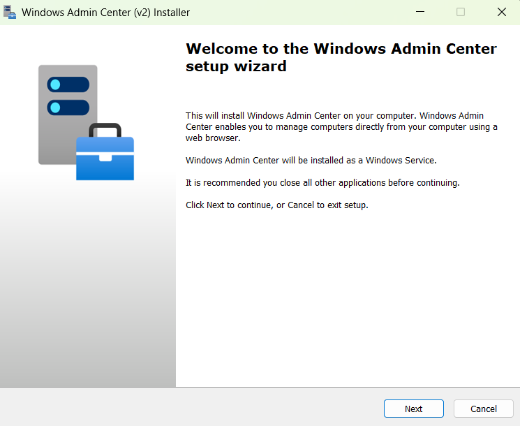
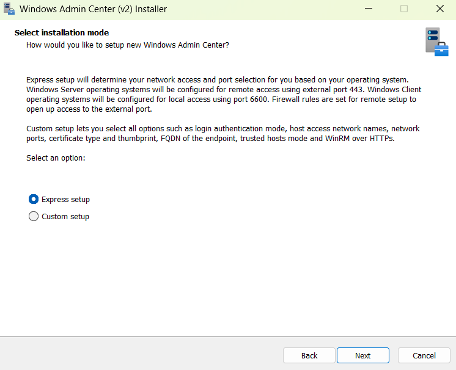
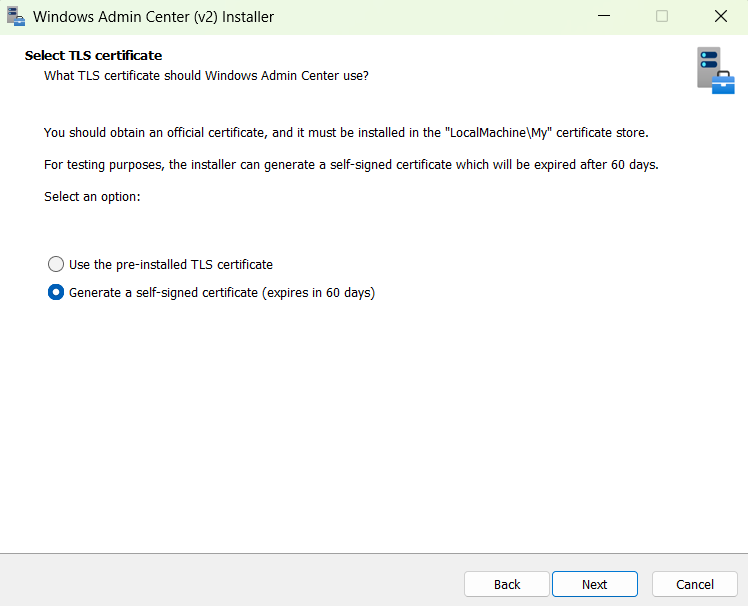

# Install Windows Admin Center Virtualization Mode

> [!IMPORTANT]
> Windows Admin Center Virtualization Mode is currently in PREVIEW.
> This information relates to a prerelease product that may be substantially modified before it's released. Microsoft makes no warranties, expressed or implied, with respect to the information provided here.

This article explains how to install Windows Admin Center Virtualization Mode on a Windows Server machine so multiple users can manage virtualization environments using a web browser.

> [!TIP]
> Want to learn about Windows Admin Center Virtualization Mode?
> [Learn more about Windows Admin Center Virtualization Mode](virtualization-mode-overview.md).

## Prerequisites

To install Windows Admin Center Virtualization Mode, you need the following prerequisites:

- A dedicated server with 4 virtual CPUs (or equivalent physical cores), at least 8GB of RAM, and 10GB of free disk space.

- Windows Admin Center Administration Mode and Windows Admin Center Virtualization mode must be installed on separate systems.

- Windows Server 2025 or later, Standard or Datacenter edition only.

- Your server must be domain-joined and have DNS resolution using Fully Qualified Domain Name (FQDN). Hyper-V hosts you plan to manage must also be on the same domain.

- Administrator privileges or equivalent permissions on the machine you're installing Windows Admin Center on.

- Download the Windows Admin Center Virtualization Mode preview installer from [Windows Insider Preview Downloads](https://aka.ms/WACDownloadvMode) to a location on the machine where you want to install Windows Admin Center.

- Download the [Microsoft Visual C++ Redistributable](/cpp/windows/latest-supported-vc-redist) to a location on the machine where you want to install Windows Admin Center. Alternatively, if your server has internet access, you can use `winget` from the Windows Terminal to download and install as shown in the next section.

## Preparing your environment

To prepare your environment for installing Windows Admin Center Virtualization Mode, complete the following steps:

1. Sign in to the machine where you want to install Windows Admin Center.

1. To install the Microsoft Visual C++ Redistributable, choose one of the following options:

   - Run the Microsoft Visual C++ Redistributable installer that you previously downloaded and follow the prompts to complete the installation.

   Or

   - Use the following `winget` command from the Windows Terminal to install it:

   ```powershell
   winget install Microsoft.VCRedist.2015+.x64 --Silent
   ```

## Install Virtualization Mode

To install Windows Admin Center Virtualization Mode, complete the following steps:


1. Run the Windows Admin Center installer you previously downloaded.

    

1. On the **Welcome to the Windows Admin Center setup wizard** window, select **Next** to continue.

1. On the **License Terms and Privacy Statement** window, if you agree to the terms, select **I accept these terms and understand the privacy statement**, then select **Next** to prepare your environment and start the installation process.

    

1. In the **Select installation mode** window, select either **Express setup** or **Custom setup**.

    Express setup determines your network access and port selection based on your operating system. Express setup doesn't allow for configuration of extra features.

    Custom setup allows you to configure: network access, port numbers, TLS certificate type and thumbprint, fully qualified domain name of the endpoint, trusted hosts mode, and WinRM over HTTPS.

    Select **Next**.

1. In the **Select TLS certificate** window, select **Generate a self-signed- certificate**, then select **Next**.

   Preinstalled certificates aren't available at this time. The installer generates a self-signed certificate that expires after 60 days.

    

1. In the **PostgreSQL Configuration** window, choose the **Username**, **Password**, and **Port** for the PostgreSQL database that Windows Admin Center uses to store virtualization data. Then select **Next**.

1. In the **Automatic updates** window, select your preferred update option. The recommended option to install updates automatically is selected by default. Then select **Next**.

1. In the **Send diagnostic data to Microsoft** window, select your preference, then select **Next**.

1. Review the **Ready to install** window, then select **Install** to start the installation process.

1. After the installation process finishes, check the box to **Start Windows Admin Center**, then select **Finish**.

1. Sign in as an administrator to start using Windows Admin Center.

    :::image type="content" source="media/install-virtualization-mode/sign-in.PNG" alt-text="Screenshot of the Windows Admin Center Virtualization Mode browser sign-in page with username and password fields.":::

You've now installed Windows Admin Center on your machine.

## Next steps

> [!div class="nextstepaction"]
> [Add resources in Windows Admin Center Virtualization Mode](add-virtualization-mode-resources.md)