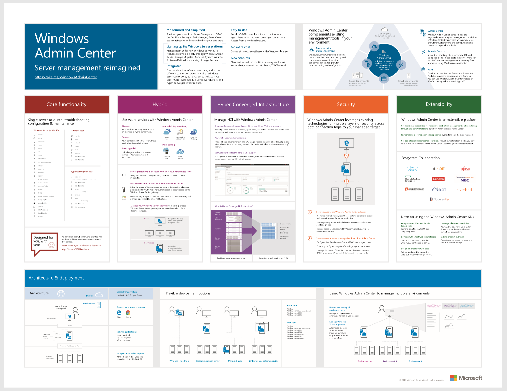

# Windows Admin Center

>Applies To: Windows Admin Center, Windows Admin Center Preview

**Windows Admin Center** (codenamed **Project Honolulu**) is an evolution of Windows Server in-box management tools; it’s a single pane of glass that consolidates all aspects of local and remote server management. As a locally deployed, browser-based management experience, an Internet connection and Azure aren’t required. Windows Admin Center gives you full control of all aspects of your deployment, including private networks that aren’t Internet-connected.

## Introduction

>[!VIDEO https://www.youtube.com/embed/PcQj6ZklmK0]

[Download the PDF](https://github.com/MicrosoftDocs/windowsserverdocs/raw/master/WindowsServerDocs/manage/windows-admin-center/media/WindowsAdminCenter1809Poster.pdf)

## Quick start

You can get Windows Admin Center up and running in your environment in minutes:

1. [Download](https://aka.ms/windowsadmincenter)
2. [Install](deploy/install.md)
3. [Get started](use/get-started.md)

## Contents at a glance

<table>
    <tr></tr>
    <tr>
        <td style="vertical-align: top;">
            <h3>Understand</h3>
            <ul>
            <li><a href="understand/what-is.md">What is Windows Admin Center?</a>
            <li><a href="understand/faq.md">FAQ</a>
            <li><a href="understand/case-studies.md">Case studies</a>
            <li><a href="understand/related-management.md">Related management products</a>
            <li><a href="understand/videos.md">Videos</a>
            </ul>
        </td>
        <td style="vertical-align: top;">
            <h3>Plan</h3>
            <ul>
            <li><a href="plan/installation-options.md">What type of installation is right for you?</a>
            <li><a href="plan/user-access-options.md">User access options</a>
             
            </ul>
        </td>
    </tr>
    <tr>
        <td style="vertical-align: top;">
            <h3>Deploy</h3>
            <ul>
            <li><a href="deploy/prepare-environment.md">Prepare your environment</a>
            <li><a href="deploy/install.md">Install Windows Admin Center</a>
            <li><a href="deploy/high-availability.md">Enable high availability</a>
         </ul>
        </td>
        <td style="vertical-align: top;">
            <h3>Configure</h3>
            <ul>
            <li><a href="configure/settings.md">Windows Admin Center settings</a>
            <li><a href="configure/user-access-control.md">User access control and permissions</a>
            <li><a href="configure/using-extensions.md">Extensions</a>
            </ul>
        </td>
    </tr>
    <tr>
        <td style="vertical-align: top;">
            <h3>Use</h3>
            <ul>
            <li><a href="use/get-started.md">Launch & add connections</a>
            <li><a href="use/manage-servers.md">Manage servers</a>
            <li><a href="use/manage-hyper-converged.md">Manage hyper-converged infrastructure</a>
            <li><a href="use/manage-failover-clusters.md">Manage failover clusters</a>
            <li><a href="use/manage-virtual-machines.md">Manage virtual machines</a>
            <li><a href="use/logging.md">Logging</a>
            </ul>
        </td>
        <td style="vertical-align: top;">
            <h3>Connect to Azure</h3>
            <ul>
            <li><a href="azure/index.md">Azure hybrid services</a></li>
            <li><a href="azure/azure-integration.md">Connect Windows 
Admin Center to Azure</a></li>
            <li><a href="azure/deploy-wac-in-azure.md">Deploy Windows Admin Center in Azure</a></li>
            <li><a href="azure/manage-azure-vms.md">Manage Azure VMs with Windows Admin Center</a></li>
            </ul>
        </td>
    </tr>
    <tr>
            <td style="vertical-align: top;">
            <h3>Support</h3>
            <ul>
            <li><a href="support/index.md">Support policy</a>
            <li><a href="support/troubleshooting.md">Common troubleshooting steps</a>
            <li><a href="support/known-issues.md">Known issues</a>
            </ul>
        </td>
            <td style="vertical-align: top;">
            <h3>Extend</h3>
            <ul>
            <li><a href="extend/extensibility-overview.md">Overview of extensions</a>
            <li><a href="extend/understand-extensions.md">Understanding extensions</a>
            <li><a href="extend/developing-extensions.md">Develop an extension</a>
            <li><a href="extend/publish-extensions.md">Guides</a>
            <li><a href="extend/publish-extensions.md">Publishing extensions</a>
            </ul>
        </td>
    </tr>

</table>

## Release history

Learn about our latest released features:

- Version [1904](https://aka.ms/wac1904) is the most recent GA release that introduces the Azure Hybrid Services tool, and brings features that were previously in preview to the GA channel.
- Version [1903](https://aka.ms/wac1903) brings email notifications from Azure Monitor, the ability to add Server or PC connections from Active Directory, and new tools to manage Active Directory, DHCP, and DNS.
- Version [1902](https://aka.ms/wac1902) added a shared connection list & improvements to software defined network (SDN) management, including new SDN tools to manage ACLs, gateway connections, and logical networks.
- Version [1812](https://aka.ms/wac1812) added dark theme (in preview), power configuration settings, BMC info, and PowerShell support to manage [extensions](./configure/using-extensions.md#manage-extensions-with-powershell) and [connections](./use/get-started.md#use-powershell-to-import-or-export-your-connections-with-tags).
- Version [1809.5](https://aka.ms/wac1809.5) is a GA cumulative update that includes various quality and functional improvements and bug fixes throughout the platform and a few new features in the hyper-converged infrastructure management solution.
- Version [1809](https://cloudblogs.microsoft.com/windowsserver/2018/09/20/windows-admin-center-1809-and-sdk-now-generally-available/) was a GA release that brought features that were previously in preview to the GA channel.
- Version [1808](https://aka.ms/WACPreview1808-InsiderBlog) added Installed Apps tool, lots of under the hood improvements, and major updates to the preview SDK.
- Version [1807](https://aka.ms/WACPreview1807-InsiderBlog) added a streamlined Azure connect experience, improvements to VM inventory page, file sharing functionality, Azure update management integration, and more. 
- Version [1806](https://aka.ms/WACPreview1806-InsiderBlog) added show PowerShell script, SDN management, 2008 R2 connections, SDN, scheduled tasks, and many other improvements.
- Version 1804.25 - Maintenance update to support users installing Windows Admin Center in completely offline environments.
- Version [1804](https://cloudblogs.microsoft.com/windowsserver/2018/04/12/announcing-windows-admin-center-our-reimagined-management-experience/) - Project Honolulu becomes Windows Admin Center and adds security features and role-based access control. Our first GA release.
- Version [1803](https://blogs.windows.com/windowsexperience/2018/03/13/announcing-project-honolulu-technical-preview-1803-and-rsat-insider-preview-for-windows-10) added support for Azure AD access control, detailed logging, resizable content, and a bunch of tool improvements.
- Version [1802](https://blogs.windows.com/windowsexperience/2018/02/13/announcing-windows-server-insider-preview-build-17093-project-honolulu-technical-preview-1802) added support for accessibility, localization, high-availability deployments, tagging, Hyper-V host settings, and gateway authentication.
- Version [1712](https://blogs.windows.com/windowsexperience/2017/12/19/announcing-project-honolulu-technical-preview-1712-build-05002) added more virtual machine features and performance improvements throughout the tools.
- Version [1711](https://cloudblogs.microsoft.com/windowsserver/2017/12/01/1711-update-to-project-honolulu-technical-preview-is-now-available/) added highly anticipated tools (Remote Desktop and PowerShell) along with other improvements.
- Version [1709](https://cloudblogs.microsoft.com/windowsserver/2017/09/22/project-honolulu-technical-preview-is-now-available-for-download/) launched as our first public preview release.

## Stay updated

<a target="_blank" class="mscom-link twitter-follow-link" title="Follow us on Twitter" aria-label="Follow us on Twitter" data-info="Twitter" href="https://twitter.com/servermgmt"><picture><source srcset="//img-prod-cms-rt-microsoft-com.akamaized.net/cms/api/am/imageFileData/REOolR" media="(min-width:0)"></picture></a>
 | 
<a target="_blank" class="mscom-link blogs-follow-link" title="Read our Blogs" aria-label="Visit our Blogs" data-info="Blogs" href="https://blogs.technet.microsoft.com/servermanagement/"><picture><source srcset="//img-prod-cms-rt-microsoft-com.akamaized.net/cms/api/am/imageFileData/REOtyw" media="(min-width:0)"></picture></a>
