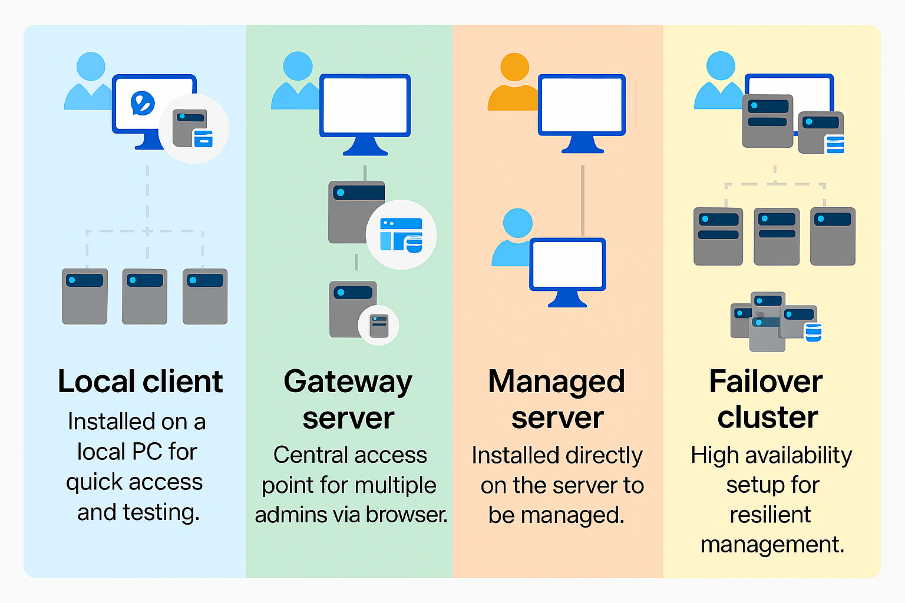

# What type of installation is right for you?

This topic describes the different installation options for Windows Admin Center, including installing on a Windows 10 PC or a Windows server for use by multiple admins. To install Windows Admin Center on a VM in Azure, see [Deploy Windows Admin Center in Azure](../azure/deploy-wac-in-azure.md).

## Installation: Types

| Local client                                | Gateway server                                  | Managed server                               | Failover cluster                           |
|---------------------------------------------|-------------------------------------------------|----------------------------------------------|--------------------------------------------|
| [Install](../deploy/install.md) on a local Windows 10 client that has connectivity to the managed servers.  Great for quick start, testing, ad-hoc or small scale scenarios. |[Install](../deploy/install.md) on a designated gateway server and access from any client browser with connectivity to the gateway server.  Great for large-scale scenarios. | [Install](../deploy/install.md) directly on a managed server for the purpose of managing itself or a cluster in which it's a member node.  Great for distributed scenarios. | [Deploy](#high-availability) in a failover cluster to enable high availability of the gateway service. Great for production environments to ensure resiliency of your management service. |

## Installation: Supported operating systems

You can **install** Windows Admin Center on the following Windows operating systems:

| **Platform**                       | **Installation mode** |
| -----------------------------------| --------------------- |
| Windows 10                         | Local client |
| Windows Server Semi-Annual Channel | Gateway sever, managed server, failover cluster |
| Windows Server 2016                | Gateway sever, managed server, failover cluster |
| Windows Server 2019                | Gateway sever, managed server, failover cluster |

To operating Windows Admin Center:

- **In local client scenario:** Launch the Windows Admin Center gateway from the Start menu and connect to it from a client web browser by accessing `https://localhost:6516`.
- **In other scenarios:** Connect to the Windows Admin Center gateway on a different machine from a client browser via its URL, e.g., `https://servername.contoso.com`

> [!WARNING]
> Installing Windows Admin Center on a Domain controller is not supported. [Read more about domain controller security best practices](https://docs.microsoft.com/windows-server/identity/ad-ds/plan/security-best-practices/securing-domain-controllers-against-attack).

## Installation: Supported web browsers

Microsoft Edge (including [Microsoft Edge insider](https://microsoftedgeinsider.com)) and Google Chrome are tested and supported on Windows 10. Other web browsers—including Internet Explorer and Firefox—are not currently part of our test matrix and are therefore not *officially* supported. These browsers may have problems running Windows Admin Center. For example, Firefox has it’s own certificate store, so you must import the `Windows Admin Center Client` certificate into Firefox to use Windows Admin Center on Windows 10. For more details, see [browser-specific known issues](../support/known-issues.md#browser-specific-issues).

## Management target: Supported operating systems

You can **manage** the following Windows operating systems using Windows Admin Center:

| Version | Manage *node* via *Server Manager* | Manage via *Cluster Manager* |
| ------------------------- |--------------- | ----- |
| Windows 10 | Yes (via Computer Management) | N/A |
| Windows Server Semi-Annual Channel | Yes | Yes |
| Windows Server 2019 | Yes | Yes |
| Windows Server 2016 | Yes | Yes, with [latest cumulative update](../use/manage-hyper-converged.md#prepare-your-windows-server-2016-cluster-for-windows-admin-center) |
| Microsoft Hyper-V Server 2016 | Yes | Yes |
| Windows Server 2012 R2 | Yes | Yes |
| Microsoft Hyper-V Server 2012 R2 | Yes | Yes |
| Windows Server 2012 | Yes | Yes |
| Windows Server 2008 R2 | Yes, limited functionality | N/A |

> [!NOTE]
> Windows Admin Center requires PowerShell features that are not included in Windows Server 2008 R2, 2012, and 2012 R2. If you will manage these with Windows Admin Center, you will need to install Windows Management Framework (WMF) version 5.1 or higher on those servers.
> 
> Type `$PSVersiontable` in PowerShell to verify that WMF is installed,
> and that the version is 5.1 or higher. 
> 
> If WMF is not installed, you can [download WMF 5.1](https://www.microsoft.com/download/details.aspx?id=54616).

## High availability

You can enable high availability of the gateway service by deploying Windows Admin Center in a active-passive model on a failover cluster. If one of the nodes in the cluster fails, Windows Admin Center gracefully fails over to another node, letting you continue managing the servers in your environment seamlessly.

[Learn how to deploy Windows Admin Center with high availability.](../deploy/high-availability.md)

> [!Tip]
> Ready to install Windows Admin Center? [Download now](https://aka.ms/windowsadmincenter)
