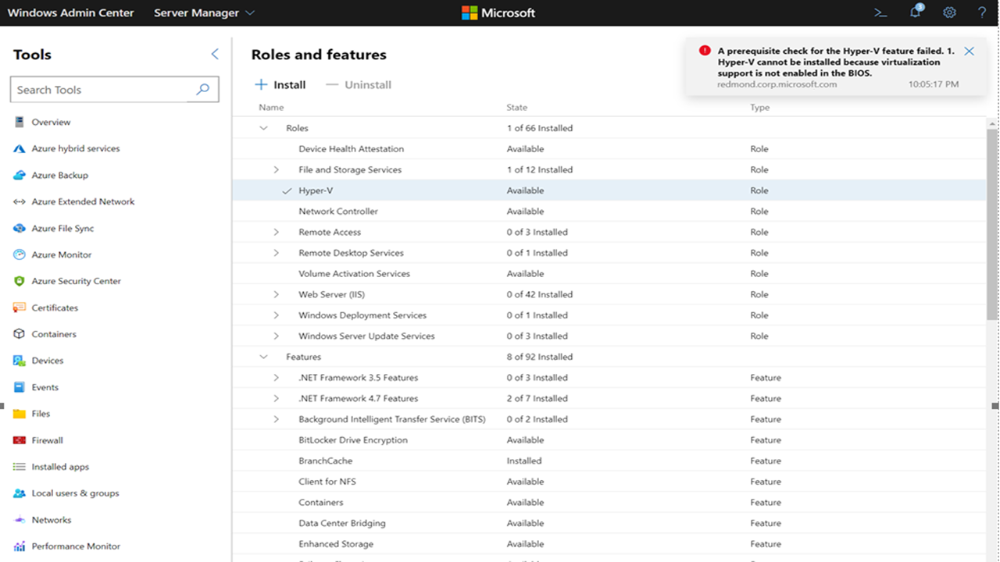

# Windows Admin Center known issues

>Applies to: Windows Admin Center, Windows Admin Center Preview

If you encounter an issue not described on this page, [let us know](https://aka.ms/WACfeedback).

## Installer

- When installing Windows Admin Center using your own certificate, be mindful that if you copy the thumbprint from the certificate manager MMC tool, [it will contain an invalid character at the beginning.](https://support.microsoft.com/help/2023835/certificate-thumbprint-displayed-in-mmc-certificate-snap-in-has-extra) As a workaround, type the first character of the thumbprint, and copy/paste the rest.

- Using port below 1024 isn't supported. In service mode, you may optionally configure port 80 to redirect to your specified port.

## General
> [!NOTE]
> Self-signed certificiates accessed on "https://localhost:[port]" may cause Windows Admin Center to be blocked on both Microsoft Edge and Google Chrome browsers. When this happens, you may see an error explaining that your connection is not private. Update your Windows Admin Center installation to the latest version to fix this issue.

- Using certain versions of extensions with older versions of Windows Admin Center may result in icons not displaying properly. To fix this issue, please upgrade to the latest build of Windows Admin Center. 

- Manually modifying URLs to include the names of different machines while using Windows Admin Center, without going through the connection experience in the UI, may result in improper loading of extensions, especially those which are compatible with specific hardware. The manual modification of URLs for navigation in Windows Admin Center isn't recommended.

- If you have Windows Admin Center installed as a gateway on **Windows Server 2016** under heavy use, the service may crash with an error in the event log that contains ```Faulting application name: sme.exe``` and ```Faulting module name: WsmSvc.dll```. This is due to a bug that has been fixed in Windows Server 2019. The patch for Windows Server 2016 was included the February 2019 cumulative update, [KB4480977](https://www.catalog.update.microsoft.com/Search.aspx?q=4480977).

- If you have Windows Admin Center installed as a gateway and your connection list appears to be corrupted, perform the following steps:

   > [!WARNING]
   >This will delete the connection list and settings for all Windows Admin Center users on the gateway.

  1. Uninstall Windows Admin Center
  2. Delete the **Server Management Experience** folder under **C:\Windows\ServiceProfiles\NetworkService\AppData\Roaming\Microsoft**
  3. Reinstall Windows Admin Center

- If you leave the tool open and idle for a long period of time, you may get several **Error: The runspace state is not valid for this operation** errors. If this occurs, refresh your browser. If you encounter this, [send us feedback](https://aka.ms/WACfeedback).

- There may be minor variance between version numbers of OSS running in Windows Admin Center modules, and what is listed within the third Party Software Notice.

- Windows Admin Center tool APIs may be accessed and used through other methods while a session of Windows Admin Center is active and a user has access to that session. The actions taken using these APIs will only affect the gateway machine (the machine Windows Admin Center is installed on). This won't affect machines managed remotely without authentication through the Windows Admin Center gateway.

### Extension Manager

- When you update Windows Admin Center, you must reinstall your extensions.
- If you add an extension feed that is inaccessible, there's no warning. [14412861]

## Partner extension issues

- Dell's EMC OpenManage Integration extension utilizes APIs provided by Windows Admin Center to push files onto target nodes. This API (for example, NodeExtensionInstall) only works when the user is a gateway administrator and doesn't support non-admin use.

## Browser Specific Issues

### Microsoft Edge

- If you have Windows Admin Center deployed as a service and you're using Microsoft Edge as your browser, connecting your gateway to Azure may fail after spawning a new browser window. Try to work around this issue by adding https://login.microsoftonline.com, https://login.live.com, and the URL of your gateway as trusted sites and allowed sites for pop-up blocker settings on your client-side browser. For more guidance on fixing this in the [troubleshooting guide](troubleshooting.md#azure-features-dont-work-properly-in-microsoft-edge). [17990376]

### Google Chrome

- Prior to version 70 (released late October 2018) Chrome had a [bug](https://bugs.chromium.org/p/chromium/issues/detail?id=423609) regarding the WebSockets protocol and NTLM authentication. This effects the following tools: Events, PowerShell, Remote Desktop.

- Chrome may pop up multiple credential prompts, especially during the add connection experience in a **workgroup** (non-domain) environment.

- If you have Windows Admin Center deployed as a service, popups from the gateway URL need to be enabled for any Azure integration functionality to work.

### Mozilla Firefox

Windows Admin Center isn't tested with Mozilla Firefox, but most functionality should work.

- Windows 10 Installation: Mozilla Firefox has its own certificate store, so you must import the ```Windows Admin Center Client``` certificate into Firefox to use Windows Admin Center on Windows 10.

## WebSocket compatibility when using a proxy service

Remote Desktop, PowerShell, Packet Monitoring, and Events modules in Windows Admin Center use the WebSocket protocol, which is often not supported when using a proxy service.

## Support for Windows Server versions before 2016 (2012 R2, 2012, 2008 R2)

> [!NOTE]
> Windows Admin Center requires PowerShell features that are not included in Windows Server 2012 R2, 2012, or 2008 R2. If you'll manage Windows Server these with Windows Admin Center, you'll need to install WMF version 5.1 or higher on those servers.

Type `$PSVersiontable` in PowerShell to verify that WMF is installed,
and that the version is 5.1 or higher.

If it'sn't installed, you can [download and install WMF 5.1](https://www.microsoft.com/download/details.aspx?id=54616).

## Role Based Access Control (RBAC)

- RBAC deployment won't succeed on machines that are configured to use Windows Defender Application Control (WDAC, formerly known as Code Integrity.) [16568455]

- To use RBAC in a cluster, you must deploy the configuration to each member node individually.

- When RBAC is deployed, you may get unauthorized errors that are incorrectly attributed to the RBAC configuration. [16369238]

## Server Manager solution

### Certificates

- can't import .PFX Encrypted Certificate in to current user store. [11818622]

### Events

- Events are affected by [websocket compatibility when using a proxy service.](#websocket-compatibility-when-using-a-proxy-service)

- You may get an error that references “packet size” when exporting large log files.

  - To resolve this, use the following command in an elevated command prompt on the gateway machine: ```winrm set winrm/config @{MaxEnvelopeSizekb="8192"}```

### Files

- Uploading or downloading large files not yet supported. (\~100mb limit) [12524234]

### PowerShell

- PowerShell is affected by [websocket compatibility when using a proxy service](#websocket-compatibility-when-using-a-proxy-service)

- Pasting with a single right-click as in the desktop PowerShell console doesn't work. Instead you'll get the browser's context menu, where you can select paste. Ctrl-V works as well.

- Ctrl-C to copy doesn't work, it will always send the Ctrl-C break command to the console. Copy from the right-click context menu works.

- When you make the Windows Admin Center window smaller, the terminal content will reflow, but when you make it larger again, the content may not return to its previous state. If things get jumbled, you can try Clear-Host, or disconnect and reconnect using the button above the terminal.

### Registry Editor

- Search functionality not implemented. [13820009]

### Remote Desktop

- When Windows Admin Center is deployed as a service, the Remote Desktop tool may fail to load after updating the Windows Admin Center service to a new version. To work around this issue, clear your browser cache.   [23824194]

- The Remote Desktop tool may fail to connect when managing Windows Server 2012. [20258278]

- When using the Remote Desktop to connect to a machine that isn't Domain joined, you must enter your account in the ```MACHINENAME\USERNAME``` format.

- Some configurations can block Windows Admin Center's remote desktop client with group policy. If you encounter this, enable ```Allow users to connect remotely by using Remote Desktop Services``` under ```Computer Configuration/Policies/Administrative Templates/Windows Components/Remote Desktop Services/Remote Desktop Session Host/Connections```

- Remote Desktop is affected by [websocket compatibility.](#websocket-compatibility-when-using-a-proxy-service)

- The Remote Desktop tool doesn't currently support any text, image, or file copy/paste between the local desktop and the remote session.

- To do any copy/paste within the remote session, you can copy as normal (right-click + copy or Ctrl+C), but paste requires right-click + paste (Ctrl+V doesn't work)

- You can't send the following key commands to the remote session
  - Alt+Tab
  - Function keys
  - Windows Key
  - PrtScn

### Roles and Features

- When selecting roles or features with unavailable sources for install, they are skipped. [12946914]

- If you choose not to automatically reboot after role installation, we won't ask again. [13098852]

- If you do choose to automatically reboot, the reboot will occur before the status gets updated to 100%. [13098852]

### Storage

- Down-level: DVD/CD/Floppy drives don't appear as volumes on down-level.

- Down-level: Some properties in Volumes and Disks are not available down-level so they appear unknown or blank in details panel.

- Down-level: When creating a new volume, ReFS only supports an allocation unit size of 64K on Windows 2012 and 2012 R2 machines. If a ReFS volume is created with a smaller allocation unit size on down-level targets, file system formatting will fail. The new volume won't be usable. The resolution is to delete the volume and use 64K allocation unit size.

### Updates

- After installing updates, install status may be cached and require a browser refresh.

- You may encounter the error: "Keyset doesn't exist" when attempting to set up Azure Update management. In this case, try the following remediation steps on the managed node -
    1. Stop ‘Cryptographic Services' service.
    2. Change folder options to show hidden files (if required).
    3. Got to “%allusersprofile%\Microsoft\Crypto\RSA\S-1-5-18” folder and delete all its contents.
    4. Restart ‘Cryptographic Services' service.
    5. Repeat setting up Update Management with Windows Admin Center

### Virtual Machines

- When managing the virtual machines on a Windows Server 2012 host, the in-browser VMConnect tool will fail to connect to the VM. Downloading the .rdp file to connect to the VM should still work. [20258278]

- Azure Site Recovery – If Azure Site Recovery is set up on the host outside of Windows Admin Center, you'll be unable to protect a VM from within Windows Admin Center [18972276]

- Advanced features available in Hyper-V Manager such as Virtual SAN Manager, Move VM, Export VM, VM Replication are currently not supported.

### Virtual Switches

- Switch Embedded Teaming (SET): When adding NICs to a team, they must be on the same subnet.

## Computer Management Solution

The Computer Management solution contains a subset of the tools from the Server Manager solution, so the same known issues apply, and the following Computer Management solution-specific issues:

- If you use a Microsoft Account ([MSA](https://account.microsoft.com/account/)) or if you use Microsoft Entra ID to log on to your Windows 10 machine, you must use "manage-as" to provide credentials for a local administrator account. [16568455]

- When you try to manage the localhost, you'll be prompted to elevate the gateway process. If you click **no** in the User Account Control popup that follows, you must cancel the connection attempt and start over.

- Windows 10 doesn't have WinRM/PowerShell remoting on by default.

  - To enable management of the Windows 10 Client, you must issue the command ```Enable-PSRemoting``` from an elevated PowerShell prompt.

  - You may also need to update your firewall to allow connections from outside the local subnet with ```Set-NetFirewallRule -Name WINRM-HTTP-In-TCP -RemoteAddress Any```. For more restrictive networks scenarios, see how to [enable PSRemoting](/powershell/module/microsoft.powershell.core/enable-psremoting?view=powershell-5.1&preserve-view=true).

## Cluster Deployment

### Step 1.2
Mixed workgroup machines are currently not supported when adding servers. All machines used for clustering need to belong to same workgroup. If they don't, the next button will be disabled, and the following error will appear: "can't create a cluster with servers in different Active Directory domains. Verify the server names are correct. Move all the servers into the same domain and try again."

### Step 1.4
Hyper-V needs to be installed on virtual machines running the Azure Stack HCI OS. Trying to enable the Hyper-V feature for these virtual machines will fail with the error below:



To install Hyper-V on virtual machines running the Azure Stack HCI OS, run the following command:

```PowerShell
Enable-WindowsOptionalFeature -Online -FeatureName 'Microsoft-Hyper-V'
```

### Step 1.7
Sometimes servers take longer than expected to restart after updates are installed. The Windows Admin Center cluster deployment wizard will check the server restart state periodically to know if the server was restarted successfully. However, if the user restarts the server outside of the wizard manually, then the wizard doesn't have a way to capture the server state in an appropriate way.

If you would like to restart the server manually, exit the current wizard session. After you have restarted the server, you may restart the wizard.

### Stage 4 Storage
In stage 4, an error can occur if a user has deleted a cluster and hasn't cleared the storage pools from the cluster. That means the storage pools that are on the system are locked by the old cluster object and only the user can manually clear them. 

To clear the configuration, the user needs to run:

1. On all nodes run: ```Clear-ClusterNode```
2. Remove all previous storage pools, you can then run: 
    ```PowerShell
    get-storagepool
    get-storagepool -IsPrimordial 0 | remove-storagepool
    ```
  > [!Note]
  > If the storage pools are set as readonly which can sometimes happen if the cluster is improperly destroyed, then the user needs to first make sure the storage pools are changed to editable before removing. Run the following before the commands above: ```
  Get-StoragePool <PoolName> | Set-StoragePool -IsReadOnly $false```

To avoid this scenario in the first place, the user will need to run the following: 

1. Remove virtual disk:
    ```PowerShell
    get-virtualdisk | Remove-VirtualDisk
    ```
2. Remove storage pools:
    ```PowerShell
    get-storagepool
    get-storagepool -IsPrimordial 0 | remove-storagepool
    ```
3. Remove cluster resources:
    ```PowerShell
    Get-ClusterResource | ? ResourceType -eq "virtual machine" | Remove-ClusterResource
    Get-ClusterResource | ? ResourceType -like "*virtual machine*" | Remove-ClusterResource
    ```
4. Cleaning up:
    ```PowerShell
    Remove-Cluster -CleanupAD
    ```
5. On all nodes run: 
    ```PowerShell
    Clear-ClusterNode
    ```

### Stretch cluster creation
it's recommended to use servers that are domain-joined when creating a stretch cluster. there's a network segmentation issue when trying to use workgroup machines for stretch cluster deployment due to WinRM limitations.

### Undo and start over
When using same machines repeatedly for cluster deployment, cleanup of previous cluster entities is important to get a successful cluster deployment in the same set of machines. See the page on [deploying hyper-converged infrastructure](../use/deploy-hyperconverged-infrastructure.md#undo-and-start-over) for instructions on how to clean up your cluster.

### CredSSP in cluster creation
The Windows Admin Center cluster deployment wizard uses CredSSP in several places. You run into the error message **There was an error during the validation. Review error and try again** (this occurs most frequently in the Validate cluster step):

:::image type="content" source="../media/cluster-create-credssp-error.jpg" alt-text="Screenshot of cluster create CredSSP error.":::

You can use the following steps to troubleshoot:

1. Disable CredSSP settings on all nodes and the Windows Admin Center gateway machine. Run the first command on your gateway machine and the second command on all of the nodes in your cluster:
   
   ```PowerShell
   Disable-WsmanCredSSP -Role Client
   ```
   
   ```PowerShell
   Disable-WsmanCredSSP -Role Server
   ```

2. Repair the trust on all nodes. Run the following command on all nodes:
   
   ```PowerShell
   Test-ComputerSecureChannel -Verbose -Repair -Credential <account name>
   ```

3. Reset group policy propagated data by running the following command on all nodes:
   
   ```Command Line
   gpupdate /force
   ```

4. Reboot each node. After reboot, test the connectivity between your gateway machine and target nodes, and your connectivity between nodes, using the following command:
   
   ```PowerShell
   Enter-PSSession -computername <node fqdn>
   ```
   
## CredSSP

- The **Updates** tool will sometimes throw the CredSSP error **You can't use Cluster-Aware updating tool without enabling CredSSP and providing explicit credentials**:

    :::image type="content" source="../media/updates-tool-credssp-error.png" alt-text="Screenshot of Updates tool using Cluster-Aware Updating with Cred S S P error.":::

    This error was widely seen when new clusters are created and then you try to access the **Updates** tool for these clusters in Windows Admin Center. This issue is fixed in Windows Admin Center v2110. [36734941]

- The CredSSP session endpoint permission issue is a common CredSSP error that can be seen when Windows Admin Center runs on Windows client machines. This issue is widely seen when the user who is using Windows Admin Center isn't the same user who installed Windows Admin Center on the client machine.

    To mitigate this problem, we have introduced the Windows Admin Center CredSSP administrators' group. The user facing this problem should be added to this group and then relogin to the desktop computer running Windows Admin Center. Below is an image of what the error notification was before (left) and after (right) the modification:

    :::image type="content" source="../media/notification-credssp-error.png" alt-text="A side by side comparison of the error notification for Cred S S P.":::

### Nested Virtualization
When validating Azure Stack HCI OS cluster deployment on virtual machines, nested virtualization needs to be turned on before roles/features are enabled using the below PowerShell command:

```PowerShell
Set-VMProcessor -VMName <VMName> -ExposeVirtualizationExtensions $true
```

  > [!Note]
  > For virtual switch teaming to be successful in a virtual machine environment, the following command needs to be run in PowerShell on the host soon after the virtual machines are created: Get-VM | %{ set-VMNetworkAdapter -VMName $_.Name -MacAddressSpoofing On -AllowTeaming on }

If you're a deploying a cluster using the Azure Stack HCI OS, there's an extra requirement. The VM boot virtual hard drive must be preinstalled with Hyper-V features. To do this, run the following command before creating the virtual machines:

```PowerShell
Install-WindowsFeature –VHD <Path to the VHD> -Name Hyper-V, RSAT-Hyper-V-Tools, Hyper-V-PowerShell
```

### Support for RDMA
The cluster deployment wizard in Windows Admin Center version 2007 doesn't provide support for RDMA configuration.

## Failover Cluster Manager solution

- When managing a cluster, (either Hyper-Converged or traditional) you may encounter a **shell was not found** error. If this happens either reload your browser, or navigate away to another tool and back. [13882442]

- An issue can occur when managing a down-level (Windows Server 2012 or 2012 R2) cluster that hasn't been configured completely. The fix for this issue is to ensure that the Windows feature **RSAT-Clustering-PowerShell** has been installed and enabled on **each member node** of the cluster. To do this with PowerShell, enter the command `Install-WindowsFeature -Name RSAT-Clustering-PowerShell` on all the cluster nodes. [12524664]

- The Cluster may need to be added with the entire FQDN to be discovered correctly.

- When connecting to a cluster using Windows Admin Center installed as a gateway, and providing explicit username/password to authenticate, you must select **Use these credentials for all connections** so that the credentials are available to query the member nodes.

## Hyper-Converged Cluster Manager solution

- Some commands such as **Drives - Update firmware**, **Servers - Remove** and **Volumes - Open** are disabled and currently not supported.

## Azure services

### Azure login and gateway registration
When attempting to register your Windows Admin Center gateway in the Azure China or Azure US Gov cloud domains in version 2211, you may be redirected to the Azure Global sign-in experience. To work around this issue, please use an earlier version of Windows Admin Center.    
   
In the 2009 release, you may run into issues logging into Azure or registering your Windows Admin Center gateway with Azure. The guidance below should help you mitigate these issues: 

* Before using any Azure capabilities within Windows Admin Center, including gateway registration, make sure you're signed into your Azure account in a different tab or window. We suggest signing in through the [Azure portal](https://portal.azure.com/).  

* If you successfully sign into Azure during gateway registration but don't see visual confirmation on the **Azure** page of your Windows Admin Center settings, try navigating to a different page in settings before navigating back to the **Azure** page. 

* The Azure sign-in pop-up may appear more frequently in this build and may require administrators to grant Windows Admin Center permissions more frequently. 

* If you have already given admin approval for Windows Admin Center in the Azure portal and you're still seeing an error message saying “Need admin approval”, try signing into Azure using one of the banners around Windows Admin Center instead of in the **Settings** page. 
   
* If your proxy is mis-configured, then you may get the error message "Error: Value can't be null. Parameter name: httpClientFactory." Ensure that your proxy is configured correctly by going to **Settings** page. 

### Azure File Sync permissions

Azure File Sync requires permissions in Azure that Windows Admin Center did not provide prior to version 1910. If you registered your Windows Admin Center gateway with Azure using a version earlier than Windows Admin Center version 1910, you will need to update your Microsoft Entra application to get the correct permissions to use Azure File Sync in the latest version of Windows Admin Center. The additional permission allows Azure File Sync to perform automatic configuration of storage account access as described in this article: [Ensure Azure File Sync has access to the storage account](/azure/storage/files/storage-sync-files-troubleshoot?tabs=portal1%2cazure-portal#tabpanel_CeZOj-G++Q-5_azure-portal).

To update your Microsoft Entra app, you can do one of two things
1. Go to **Settings** > **Azure** > **Unregister**, and then register Windows Admin Center with Azure again, making sure you choose to create a new Microsoft Entra application.
2. Go to your Microsoft Entra application and manually add the permission needed to your existing Microsoft Entra app registered with Windows Admin Center. To do this, go to **Settings** > **Azure** > **View in Azure**. From the **App Registration** blade in Azure, go to **API permissions**, select **Add a permission**. Scroll down to select **Azure Active Directory Graph**, select **Delegated permissions**, expand **Directory**, and select **Directory.AccessAsUser.All**. Click **Add permissions** to save the updates to the app.

### Options for setting up Azure management services

Azure management services including Azure Monitor, Azure Update Management, and Azure Security Center, use the same agent for an on-premises server: the Microsoft Monitoring Agent. Azure Update Management has a more limited set of supported regions and requires the Log Analytics workspace to be linked to an Azure Automation account. Because of this limitation, if you wish to set up multiple services in Windows Admin Center, you must set up Azure Update Management first, and then either Azure Security Center or Azure Monitor. If you've configured any Azure management services that use the Microsoft Monitoring Agent, and then try to set up Azure Update Management using Windows Admin Center, Windows Admin Center will only allow you to configure Azure Update Management if the existing resources linked to the Microsoft Monitoring Agent support Azure Update Management. If not, you have two options:

1. Go to the Control Panel > Microsoft Monitoring Agent to [disconnect your server from the existing Azure management solutions](/azure/azure-monitor/platform/log-faq#q-how-do-i-stop-an-agent-from-communicating-with-log-analytics) (like Azure Monitor or Azure Security Center). Then set up Azure Update Management in Windows Admin Center. After that, you can go back to set up your other Azure management solutions through Windows Admin Center without issues.
2. You can [manually set up the Azure resources needed for Azure Update Management](/azure/automation/update-management/overview) and then [manually update the Microsoft Monitoring Agent](/azure/azure-monitor/platform/agent-manage#adding-or-removing-a-workspace) (outside of Windows Admin Center) to add the new workspace corresponding to the Update Management solution you wish to use.
