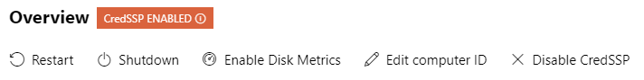

# Windows Admin Center Frequently Asked Questions

> Applies to: Windows Admin Center, Windows Admin Center Preview

Here are answers to the most commonly asked questions about Windows Admin Center.

## What is Windows Admin Center?

Windows Admin Center is a lightweight, browser-based GUI platform and toolset for IT Admins to manage Windows Server and Windows 10. It's the evolution of familiar in-box administrative tools, such as Server Manager and Microsoft Management Console (MMC) into a modernized, simplified, integrated, and secure experience.

## Can I use Windows Admin Center in production environments?

Yes. Windows Admin Center is generally available and ready for broad usage and production deployments. The current platform capabilities and core tools meet Microsoft's standard release criteria and our quality bar for usability, reliability, performance, accessibility, security, and adoption.

[!INCLUDE [support-policy](../includes/support-policy.md)]

## How much does it cost to use Windows Admin Center?

Windows Admin Center has no additional cost beyond Windows. You can use Windows Admin Center (available as a separate download) with valid licenses of Windows Server or Windows 10 at no additional cost - it's licensed under a Windows Supplemental EULA.

## What versions of Windows Server can I manage with Windows Admin Center?

Windows Admin Center is optimized for Windows Server 2019 to enable key themes in the Windows Server 2019 release: hybrid cloud scenarios and hyper-converged infrastructure management in particular. Although Windows Admin Center will work best with Windows Server 2019, it supports managing a variety of versions that customers already use: Windows Server 2012 and newer are fully supported. There is also limited functionality for managing Windows Server 2008 R2.

## Is Windows Admin Center a complete replacement for all traditional in-box and RSAT tools?

No. Although Windows Admin Center can manage many common scenarios, it doesn't completely replace all traditional Microsoft Management Console (MMC) tools. For a detailed look at what tools are included with Windows Admin Center, read more about [managing servers](../use/manage-servers.md) in our documentation. Windows Admin Center has the following key capabilities in its Server Manager solution:

* Displaying resources and resource utilization
* Certificate Management
* Managing Devices
* Event Viewer
* File Explorer
* Firewall Management
* Managing Installed Apps
* Configuring Local Users and Groups
* Network Settings
* Viewing/Ending Processes and Creating Process Dumps
* Registry Editing
* Managing Scheduled tasks
* Managing Windows Services
* Enabling/Disabling Roles and Features
* Managing Hyper-V VMs and Virtual Switches
* Managing Storage
* Managing Storage Replica
* Managing Windows Updates
* PowerShell console
* Remote Desktop connection

Windows Admin Center also provides these solutions:

* Computer Management – Provides a subset of the Server Manager features for managing Windows 10 client PCs
* Failover Cluster Manager – Provides support for ongoing management of failover clusters and cluster resources
* Hyper-Converged Cluster Manager – Provides an all-new experience tailored for Storage Spaces Direct and Hyper-V. It features the Dashboard and emphasizes charts and alerts for monitoring.

Windows Admin Center is complementary to and does not replace RSAT (Remote Server Administration Tools) since roles such as Active Directory, DHCP, DNS, IIS do not yet have equivalent management capabilities surfaced in Windows Admin Center.

## Can Windows Admin Center be used to manage the free Microsoft Hyper-V Server?

Yes. Windows Admin Center can be used to manage Microsoft Hyper-V Server 2016 and Microsoft Hyper-V Server 2012 R2.

## Can I deploy Windows Admin Center on a Windows 10 computer?

Yes, Windows Admin Center can be installed on Windows 10 (version 1709 or later), running in desktop mode.  Windows Admin Center can also be installed on a server with Windows Server 2016 or greater in gateway mode, and then accessed via a web browser from a Windows 10 computer. [Learn more about installation options](../plan/installation-options.md).

## I've heard that Windows Admin Center uses PowerShell under the hood, can I see the actual scripts that it uses?

Yes! the [Showscript feature](../use/get-started.md#view-powershell-scripts-used-in-windows-admin-center) was added in Windows Admin Center Preview 1806, and is now included in the GA channel.

## Are there any plans for Windows Admin Center to manage Windows Server 2008 R2 or earlier?

Windows Admin Center now supports **limited** functionality to manage Windows Server 2008 R2. Windows Admin Center relies on PowerShell capabilities and platform technologies that don't exist in Windows Server 2008 R2 and earlier, making full support infeasible. Windows Server 2008/2008 R2 are approaching end of support in January 2020 so Microsoft recommends customers [move to Azure or upgrade to the latest version of Windows Server](https://www.microsoft.com/cloud-platform/windows-server-2008).

## Are there any plans for Windows Admin Center to manage Linux connections?

We are investigating due to customer demand, but there is currently no locked plan to deliver, and support may consist only of a console connection over SSH.

## Which web browsers are supported by Windows Admin Center?

The latest versions of Microsoft Edge (Windows 10, version 1709 or later), Google Chrome, and [Microsoft Edge Insider](https://microsoftedgeinsider.com) are tested and supported on Windows 10. [View browser specific known issues](../support/known-issues.md#browser-specific-issues). Other modern web browsers or other platforms are not currently part of our test matrix and are therefore not *officially* supported.

## How does Windows Admin Center handle security?

Traffic from the browser to the Windows Admin Center gateway uses HTTPS. Traffic from the gateway to managed servers is standard PowerShell and WMI over WinRM. We support LAPS (Local Administrator Password Solution), resource-based constrained delegation, gateway access control using AD or Azure AD, and role-based access control for managing target servers.

## Does Windows Admin Center use CredSSP?

Yes, in a few cases Windows Admin Center requires CredSSP. This is required to pass your credentials for authentication to machines beyond the specific server you are targeting for management. For example, if you are managing virtual machines on **server B**, but want to store the vhdx files for those virtual machines on a file share hosted by **server C**, Windows Admin Center must use CredSSP to authenticate with **server C** to access the file share.

Windows Admin Center handles the configuration of CredSSP automatically after prompting for consent from you. Before configuring CredSSP, Windows Admin Center will check to make sure that the system has the recent CredSSP [updates](https://support.microsoft.com/help/4093492/credssp-updates-for-cve-2018-0886-march-13-2018). While CredSSP is enabled, there will be a badge on the Server Overview, and an option to disable it -

CredSSP is currently used in the following areas:

- Using disaggregated SMB storage in the virtual machines tool (the example above.)
- Using the Updates tool in either the Failover or Hyper-Converged cluster management solutions, which performs [Cluster-Aware Updating](https://docs.microsoft.com/windows-server/failover-clustering/cluster-aware-updating) 

## Are there any cloud dependencies?

Windows Admin Center does not require internet access and does not require Microsoft Azure. Windows Admin Center manages Windows Server and Windows instances anywhere: on physical systems, or in virtual machines on any hypervisor, or running in any cloud. Although integration with various Azure services will be added over time, these will be optional value-added features and not a requirement to use Windows Admin Center.

## Are there any other dependencies or prerequisites?

Windows Admin Center can be installed on Windows 10 Fall Anniversary Update (1709) or newer, or Windows Server 2016 or newer. To manage Windows Server 2008 R2, 2012, or 2012 R2, installation of Windows Management Framework 5.1 is required on those servers. There are no other dependencies. IIS is not required, agents are not required, SQL Server is not required.

## What about extensibility and 3rd-party support?

Windows Admin Center has an SDK available so that anyone can write their own extension. As a platform, growing our ecosystem and enabling partner extensibility has been a key priority since the beginning. [Read more about the Windows Admin Center SDK](../extend/extensibility-overview.md).

## Can I manage Hyper-Converged Infrastructure with Windows Admin Center?

Yes. Windows Admin Center supports the management of hyper-converged clusters running Windows Server 2016 or Windows Server 2019. The hyper-converged cluster manager solution in Windows Admin Center was previously in preview but is now **generally available**, with some new functionality in preview. For more information, [read more about managing hyper-converged infrastructure](../use/manage-hyper-converged.md).

## Does Windows Admin Center require System Center?

No. Windows Admin Center is complementary to System Center, but System Center is not required. [Read more about Windows Admin Center and System Center](related-management.md#system-center).

## Can Windows Admin Center replace System Center Virtual Machine Manager (SCVMM)?

Windows Admin Center and SCVMM are complementary; Windows Admin Center is intended to replace the traditional Microsoft Management Console (MMC) snap ins and the server admin experience.  Windows Admin Center is not intended to replace the monitoring aspects of SCVMM. [Read more about Windows Admin Center and System Center](related-management.md#system-center).

## What is Windows Admin Center Preview, which version is right for me?

There are two versions of Windows Admin Center available for download:

### Windows Admin Center

* For IT admins who are not able to update frequently or who want more validation time for the releases they use in production, this version is for you. Our current generally available (GA) release is Windows Admin Center 1910.
* [!INCLUDE [support-policy](../includes/support-policy.md)]
* To get the latest release, [download here](https://aka.ms/WACDownload).

### Windows Admin Center Preview

* For IT admins who want the latest and greatest features on a regular cadence, this version is for you. Our intent is to provide subsequent update releases every month or so. The core platform continues to be production-ready and the license provides production use rights. However, note that you will see the introduction of new tools and capabilities which are clearly marked as PREVIEW and are suitable for evaluation and testing.
* To get the latest Insider Preview release, registered Insiders may download Windows Admin Center Preview directly from the [Windows Server Insider Preview download page](https://www.microsoft.com/software-download/windowsinsiderpreviewserver), under the Additional Downloads dropdown. If you have not yet registered as an Insider, see [Getting Started with Windows Server](https://insider.windows.com/en-us/for-business-getting-started-server/) on the Windows Insiders for Business portal.

## Why was "Windows Admin Center" chosen as the final name for "Project Honolulu"?

Windows Admin Center is the official product name for "Project Honolulu" and reinforces our vision of an integrated experience for IT admins across a breadth of core administrative and management scenarios. It also highlights our customer-focus on IT admin user needs as central to how we invest and what we deliver.

## Where can I learn more about Windows Admin Center, or get more details on the topics above?

Our [launch page](https://aka.ms/WindowsAdminCenter) is the best starting point and has links to our newly categorized documentation content, download location, how to provide feedback, reference information, and other resources.

## What is the version history of Windows Admin Center?

[View the version history here.](../support/release-history.md)

## I'm having an issue with Windows Admin Center, where can I get help?

See our [troubleshooting guide](../use/troubleshooting.md) and our list of [known issues](../use/known-issues.md).
