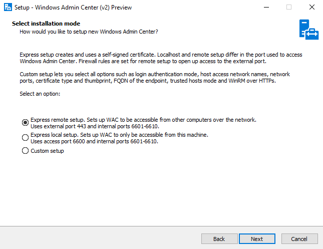

# What is the Windows Admin Center modernized gateway (preview)?

>Applies to: Windows Admin Center, Windows Admin Center Preview

In December 2023, the Windows Admin Center modernized gateway was released to public preview through the [Windows Server Insider program](/windows-insider/business/server-get-started). This release is in addition to the latest generally available release of Windows Admin Center, version 2311. 

The modernized gateway is a significant backend upgrade of the Windows Admin Center product. The Windows Admin Center backend hosts the authorization structure, PowerShell services, and gateway plug-ins and plays a critical role in every Windows Admin Center experience. 

## What's new
### Upgrade from .NET 4.6.2 to .NET Core
The biggest upgrade in this release is the backend upgrade from .NET framework 4.6.2 to [.NET Core](/dotnet/core/whats-new/dotnet-6). This upgrade brings enhanced performance, security, and improved cryptography. It also includes support for HTTP/2, reducing latency and enhancing the responsiveness of Windows Admin Center.

### Updated installer
While modernizing our gateway, we also made the installer more flexible by providing increased customization options including network access settings, selecting trusted hosts, providing a fully qualified domain name (FQDN) for your gateway machine, and more. For more details about the installer, read on to the [Installing the modernized gateway](#installing-the-modernized-gateway) section.  

### Multi-process, micro-service based architecture
The modernized gateway also uses microservice architecture. Prior to this upgrade, Windows Admin Center performed all tasks in a single  process. With this new model, we start one process for Windows Admin Center on application startup that serves as a process manager. As you use Windows Admin Center, more subprocesses are spun up to perform specific tasks. 

Additionally, gateway plug-ins that are compatible with the modernized gateway will also run their own collection of subprocesses under the Windows Admin Center service manager to perform their functions. 

Changing from a monolithic service to a microservice model helps the modernized gateway be more flexible, scalable, and resilient.

### Kestrel HTTP web server
Previously, Windows Admin Center utilized [Katana](/aspnet/aspnet/overview/owin-and-katana) components, including a web server, on the backend. With the modernized gateway, we’ve shifted to an ASP.NET Core Kestrel web server.

[Kestrel](/aspnet/core/fundamentals/servers/kestrel) is the recommended web server for ASP.NET Core applications. Additionally, Kestrel supports the HTTP/2 web protocol, where previously we had only supported HTTP1.1 with the Katana components. The upgrade from HTTP1.1 to HTTP/2 brings reduced latency to our application and increased responsiveness through enhanced features like multiplexing and server push.

### How this effects extensions
Gateway plug-in extensions are most impacted by the changes to our modernized gateway. Windows Admin Center gateway plug-ins enable API communication from the UI of your tool or solution to a target node. Windows Admin Center hosts a gateway service that relays commands and scripts from gateway plug-ins to be executed on target nodes. The gateway service can be extended to include custom gateway plug-ins that support protocols other than the default ones (PowerShell and WMI). 

Because gateway plug-ins communicate with Windows Admin Center’s backend to enable API communication, gateway plug-in code can include components written with the .NET framework version 4.6.2, which won't function with .NET Core. This code needs to be updated to use the .NET Core framework. 

Additionally, we've modified the way plug-ins work with our modernized gateway. Instead of developing a C# class that implements the `IPlugIn` interface from the `Microsoft.ManagementExperience.FeatureInterfaces` namespace to extend the gateway plug-in, extensions will now be written in the form of [ASP.NET MVC controllers](/aspnet/mvc/overview/older-versions-1/controllers-and-routing/aspnet-mvc-controllers-overview-cs). These controllers have increased flexibility compared to the simple C# class and extensive documentation.

[View our developer documentation](../extend/develop-gateway-plugin.md) to learn more about gateway plug-in development in Windows Admin Center.

## Installing the modernized gateway
With our modernized gateway, we’ve made changes to our installer to offer more flexibility to the user. 

When running the installer, you're presented with three different installation modes: express localhost setup, express remote setup, and custom setup. 



If you would like to configuration options for internal and external network ports, endpoint FQDN, WinRM over HTTPS, and more, continue to the [Custom setup](#custom-setup) section. If you're okay with the defaults, continue to the [Express setup options](#express-setup-options) section.

### Express setup options
Two of the three installation modes for the modernized gateway are express modes—express localhost setup and express remote setup. Express localhost setup can also be referred to as local client setup. For all other [installation types](../plan/installation-options.md#installation-types), use express remote setup. Both express setup options don't allow for the configuration of the following features:
- Sign-in authentication mode
- Host access network names
- Internal and external network ports
- Certificate type and thumbprint
- Endpoint FQDN
- Trusted hosts mode
- WinRM over HTTPS

If you would like to configure any of these features, use the [Custom setup](#custom-setup) option instead. 

If you select the express localhost setup option, WAC will be accessible through port 6600 and will use internal ports 6601-6610. 

If you select the express remote setup option, WAC will be accessible through port 443 and will use internal ports 6601-6610.

### Custom setup
Selecting custom setup allows you to configure all Windows Admin Center setup options, including:
- **Network access** – This page allows you to select how you'll be using Windows Admin Center. You can choose to restrict WAC access to other users by selecting localhost access only or allow remote access through machine name of FQDN.
- **Port numbers** – This page allows you to select the ports that will be reserved for Windows Admin Center. WAC uses one external port for its primary processes. Other processes use internal ports. There are two internal processes by default, but extensions can define their own services that will require port access. By default, the internal range is 10 ports. 
- **Select TLS certificate** – This page allows you to select Self-Signed certificates or an official TLS certificate that Windows Admin Center should use. Self-Signed certificates include Self-signed CA root certificates and TLS certificates that work with the latest Edge/Chrome browser.
- **Fully qualified domain name** – This page allows you to provide a fully qualified domain name for network access. This name must match the name on the TLS certificate.
- Trusted hosts – This page allows you to select which type of remote hosts you’d like to manage. You can choose to manage only trusted domain computers or allow access to non-domain joined machines. 
- **WinRM over HTTPS** - This page allows you to select whether to use HTTPS for WinRM communication. WinRM communicates over HTTP by default. 

### Troubleshooting installation
If your installation failed, or Windows Admin Center fails to open after install, try uninstalling and reinstalling. This issue can also happen if you have an older version of a modernized gateway build installed, and you're trying to update to a newer version. To uninstall, follow the instructions in the [Uninstalling the modernized gateway](#uninstalling-the-modernized-gateway) section.

## Extension support
The extension feed for the modernized gateway isn't configured. Extensions not included in the Windows Admin Center installer, including external partner extensions, aren't available unless you add an extension feed. 

The following extensions are available upon install of the modernized gateway build:
- Apps & features
- Azure Backup
- Azure File Sync
- Azure hybrid center
- Azure Kubernetes Service
- Certificates
- Cluster Creation
- Cluster Manager
- Developer Guide
- Devices
- Events
- Failover cluster tools
- Files & file sharing
- Firewall
- Local users & groups
- Network Controller tools and SDN Virtual networks
- Networks
- Packet monitoring
- Performance Monitor
- PowerShell
- Processes
- Registry
- Remote Desktop
- Roles & features
- Scheduled tasks
- SDN Gateway connections
- SDN Infrastructure
- SDN Logical networks
- SDN Network security groups
- Security
- Server Manager and Computer Management
- Services
- Storage
- Storage Migration Service
- Storage Replica
- System Insights
- Updates
- Virtual machines and switches

There are some extensions that won't function even when they're added as part of a new extension feed. For more information, see [Known issues](#known-issues).

## Uninstalling the modernized gateway
If you have to uninstall the Windows Admin Center modernized gateway, perform one of the following actions:
- In the **Apps & Features** page of your gateway machine settings, select **Windows Admin Center (v2) Preview** from the program list and then select uninstall.
- Navigate to the folder where the Windows Admin Center modernized gateway is installed (default directory is `C:\ProgramData\Microsoft\Windows\Start Menu\Programs\Windows Admin Center (v2)`) and select **Uninstall Windows Admin Center (v2)**
- Run `C:\Program Files\WindowsAdminCenter\unins000.exe`

Running the installer again doesn't provide an uninstall option at this time. To ensure your installation was removed successfully, check if a WindowsAdminCenter folder exists in `C:\ProgramData` or `C:\Program Files`. If it doesn't exist in either location, your application is successfully uninstalled.

During the uninstallation process, everything put on the machine during installation is removed, apart from the Windows Admin Center modernized gateway .exe installer file. If you have another build of Windows Admin Center also installed at the time of your modernized gateway uninstallation, no files or properties of the other build are touched during the uninstallation process. There are no interdependencies between the two installations.

## Known issues
There are the following known issues in the modernized gateway build of Windows Admin Center.

If you encounter an issue not described on this page, [let us know](https://aka.ms/WACfeedback). To help us address the issue, specify that the issue was occurring in the modernized gateway build.

### PowerShell
The account for the PowerShell session in this tool always defaults to the user signed into the Windows Admin Center gateway, even if different management credentials were specified when remoting to a connection.

### Extensions not supported
Even with an added extension feed, the following extensions currently don't work with the modernized gateway:
- Dell OpenManage
- Lenovo XClarity Integrator
- Fujitsu ServerView RAID
- Fujitsu Software Infrastructure Manager (ISM)
- Fujitsu ServerView Health
- Pure Storage FlashArray

## Frequently asked questions
Find answers to the frequently asked questions about using the Windows Admin Center modernized gateway.

### Can you install a Windows Admin Center modernized gateway build when you already have an existing build of Windows Admin Center installed?
Yes, you can install a modernized gateway build of Windows Admin Center side-by-side with a legacy gateway build as long as you don't choose the same ports for both installations.

### Can I change the ports my Windows Admin Center modernized gateway installation is using after install?
Yes, In the Program Files for Windows Admin Center, we’ve included a PowerShell module called `Microsoft.WindowsAdminCenter.Configuration.psm1`. This module allows you to modify your WAC configuration after installation and can be found in the **PowerShellModules** folder of your installation (`C:\Program Files\WindowsAdminCenter\PowerShellModules\` by default).

To change the ports your Windows Admin Center instance is using, run the following command:
```powershell
Set-WACHttpsPort -Wacport <port> -ServicePortRangeStart <port> -ServicePortRangeEnd <port>
```

### Can I change configuration settings other than port settings after install?
Yes, you can use the PowerShell module `Microsoft.WindowsAdminCenter.Configuration.psm1` to change your configuration settings. It can be found in the **PowerShellModules** folder of your installation.

### Why aren't all of these changes in the 2311 release?
To ensure the best quality experience, we require customer and developer feedback before these changes are made generally available. 

### Are all the features from the 2311 release available in this build?
Yes. [Read more about the 2311 release of Windows Admin Center.](https://aka.ms/wac2311)

## Next steps
- Download and install the modernized gateway build of Windows Admin Center from the [Windows Server Insider Program](https://www.microsoft.com/en-us/software-download/windowsinsiderpreviewserver)
- [Get started with Windows Admin Center](../use/get-started.md)