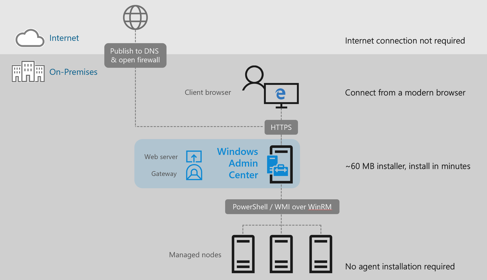

# What is Windows Admin Center?

> Applies to: Windows Admin Center, Windows Admin Center Preview

Windows Admin Center is a new, locally-deployed, browser-based management tool set that lets you manage your Windows Servers with no Azure or cloud dependency. Windows Admin Center gives you full control over all aspects of your server infrastructure and is particularly useful for managing servers on private networks that are not connected to the Internet.

Windows Admin Center is the modern evolution of "in-box" management tools, like Server Manager and MMC. It complements System Center - it's not a replacement.

## How does Windows Admin Center work?

Windows Admin Center runs in a web browser and manages Windows Server 2019, Windows Server 2016, Windows Server 2012 R2, Windows Server 2012, Windows Server 2008 R2, Windows 10, and more through the **Windows Admin Center gateway** installed on Windows Server or Windows 10. The gateway manages servers by using Remote PowerShell and WMI over WinRM. The gateway is included with Windows Admin Center in a single lightweight .msi package that you can [download](https://aka.ms/windowsadmincenter).

The Windows Admin Center gateway, when published to DNS and given access through corresponding corporate firewalls, lets you securely connect to, and manage, your servers from anywhere with Microsoft Edge or Google Chrome.

## Learn how Windows Admin Center improves your management environment

### **Familiar functionality**

Windows Admin Center is the evolution of long-standing, well known management platforms like Microsoft Management Console (MMC), built from the ground up for the way systems are built and managed today. Windows Admin Center contains many of the familiar tools you currently use to manage Windows Servers and clients.

### **Easy to install and use**

[Install](../deploy/install.md) on a Windows 10 computer, and start managing in minutes, or install on a Windows 2016 server acting as a gateway to enable your entire organization to manage computers from their web browser.

### **Complements existing solutions**

Windows Admin Center works with solutions like System Center and Azure management and security, adding to their capabilities to perform detailed, single-machine management tasks.

### **Manage from anywhere**

Publish your Windows Admin Center gateway server to the public Internet, then you can connect to and manage servers your from anywhere, all in a secure manner.

### **Enhanced security for your management platform**

Windows Admin Center has many enhancements that make your management platform [more secure](../plan/user-access-options.md). Role-based access control lets you fine-tune which administrators have access to which management features. Gateway authentication options include local groups, local domain-based Active Directory, and cloud-based Azure Active Directory.  Also, [gain insight](../use/logging.md) into management actions performed in your environment.

### **Azure integration**

Windows Admin Center has many points of [integration with Azure services](../plan/azure-integration-options.md), including Azure Active Directory, Azure Backup, Azure Site Recovery, and more.

### **Manage hyper-converged clusters**

Windows Admin Center offers the best experience for [managing hyper-converged clusters](../use/manage-hyper-converged.md) - including virtualized compute, storage, and networking components.

### **Extensibility**

Windows Admin Center was built with extensibility in mind from the beginning, with the ability for Microsoft and 3rd party developers to build tools and solutions beyond the current  offerings. Microsoft offers an [SDK](../extend/extensibility-overview.md) that enables developers to build their own tools for Windows Admin Center.

> [!Tip]
> Ready to install Windows Admin Center? [Download now](https://aka.ms/windowsadmincenter)
