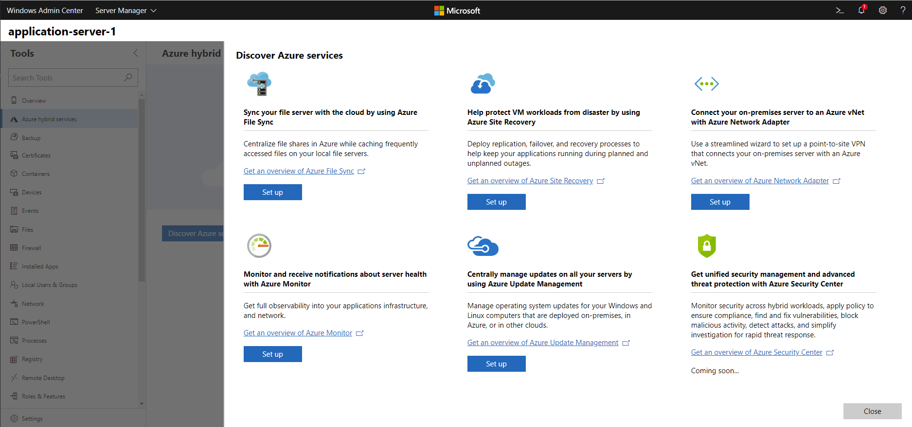

# Configure Azure hybrid services from within Windows Admin Center

>Applies To: Windows Admin Center, Windows Admin Center Preview

[Learn more about Azure integration with Windows Admin Center.](../plan/azure-integration-options.md)

Windows Admin Center streamlines the process of setting up various Azure services, making it easier to leverage the power of Azure from your own environment. To automate setup, you must first [register your Windows Admin Center gateway to Azure](../configure/azure-integration.md).

## Azure hybrid services tool

The Azure hybrid services tool in Windows Admin Center consolidates all the integrated Azure services into a centralized hub where you can easily discover all the available Azure services that bring value to your on-premises or hybrid environment. 

If you connect to a server with Azure services already enabled, the Azure hybrid services tool serves as a single pane of glass to see all enabled services on that server. You can easily get to the relevant tool within Windows Admin Center, launch out to the Azure portal for deeper management of those Azure services, or read more with documentation at your fingertips. 

From the Azure hybrid services tool, you can:
- Backup your Windows Server from Windows Admin Center with [Azure Backup](azure-backup.md)
- Protect your Hyper-V Virtual Machines from Windows Admin Center with [Azure Site Recovery](azure-site-recovery.md)
- Sync your file server with the cloud using [Azure File Sync](azure-file-sync.md)
- Manage operating system updates for all your Windows servers, both on-premises or in the cloud, with [Azure Update Management](azure-update-management.md)
- Monitor servers, both on-premises or in the cloud, and configure alerts with [Azure Monitor](azure-monitor.md)
- Connect your on-premises servers to an Azure Virtual Network with [Azure Network Adapter](https://aka.ms/WACNetworkAdapter)

> [!NOTE] 
> If you're having issues using Azure-related features in Microsoft Edge, please refer to the [related troubleshooting topic](troubleshooting.md#azlogin).