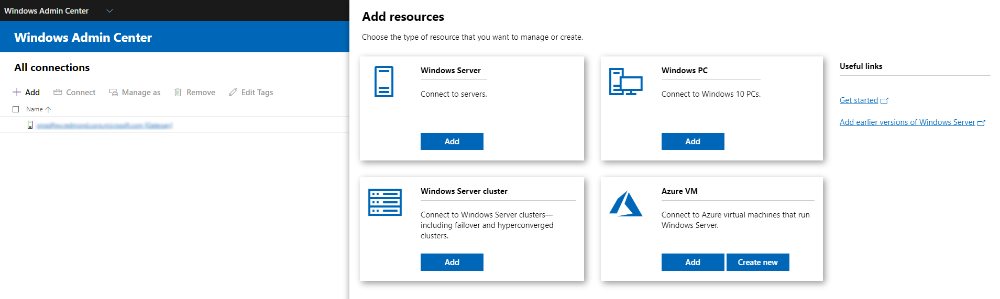

# Get Started with Windows Admin Center

>Applies To: Windows Admin Center, Windows Admin Center Preview

> [!Tip]
> New to Windows Admin Center?
> [Learn more about Windows Admin Center](../overview.md) or [Download now](https://aka.ms/windowsadmincenter).

## Windows Admin Center installed on Windows 10

> [!IMPORTANT]
> You must be a member of the local administrator's group to use Windows Admin Center on Windows 10

### Selecting a client certificate

The first time you open Windows Admin Center on Windows 10, make sure to select the *Windows Admin Center Client* certificate (otherwise you'll get an HTTP 403 error saying "can't get to this page").

In Microsoft Edge, when you are prompted with this dialog:
 
1. Click **More choices**

    

2. Select the certificate labeled **Windows Admin Center Client** and click **OK**

    

3. Make sure **Always Allow Access** is selected and click **Allow**

    

## Connecting to managed nodes and clusters

After you have completed the installation of Windows Admin Center, you can add servers or clusters to manage from the main overview page.

 **Add a single server or a cluster as a managed node**

1. Click **+ Add** under **All Connections**.

   

2. Choose to add a server, cluster, Windows PC, or an Azure VM:
    
   

3. Type the name of the server or cluster to manage and click **Submit**. The server or cluster will be added to your connection list on the overview page.

   

   **-- OR --**

**Bulk import multiple servers**

 1. On the **Add Server Connection** page, choose the **Import Servers** tab.

    

 2. Click **Browse** and select a text file that contains a comma, or new line separated, list of FQDNs for the servers you want to add.

> [!Note]
> The .csv file created by [exporting your connections with PowerShell](#use-powershell-to-import-or-export-your-connections-with-tags) contains additional information beyond the server names and is not compatible with this import method.

  **-- OR --**

**Add servers by searching Active Directory**

 1. On the **Add Server Connection** page, choose the **Search Active Directory** tab.

    

 2. Enter your search criteria and click **Search**. Wildcards (*) are supported.

 3. After the search completes - select one or more of the results, optionally add tags, and click **Add**.

## Authenticate with the managed node ##

Windows Admin Center supports several mechanisms for authenticating with a managed node. Single sign-on is the default.

**Single Sign-on**

You can use your current Windows credentials to authenticate with the managed node. This is the default, and Windows Admin Center attempts the sign-on when you add a server. 

**Single sign-on when deployed as a Service on Windows Server**

If you have installed Windows Admin Center on Windows Server, additional configuration is required for single sign-on.  [Configure your environment for delegation](../configure/user-access-control.md)

**-- OR --**

**Use *Manage As* to Specify credentials**

Under **All Connections**, select a server from the list and choose **Manage As** to specify the credentials that you will use to authenticate to the managed node:

If Windows Admin Center is running in service mode on Windows Server, but you do not have Kerberos delegation configured, you must re-enter your Windows credentials:

You may apply the credentials to all connections, which will cache them for that
specific browser session. If you reload your browser, you must re-enter your
**Manage As** credentials.

**Local Administrator Password Solution (LAPS)**

If your environment uses [LAPS](https://technet.microsoft.com/mt227395.aspx), and you have Windows Admin Center installed on your Windows 10 PC, you can use LAPS credentials to authenticate with the managed node. **If you use this scenario, please** [provide feedback](https://aka.ms/WACFeedback).

## Using tags to organize your connections

You can use tags to identify and filter related servers in your connection list.  This allows you to see a subset of your servers in the connection list.  This is especially useful if you have many connections.

### Edit tags

* Select a server or multiple servers in the All Connections list
* Under **All Connections**, click **Edit Tags**

The **Edit Connection Tags** pane allows you to modify, add, or remove tags from your selected connection(s):

* To add a new tag to your selected connection(s), select **Add tag** and enter the tag name you would like to use.

* To tag the selected connections with an existing tag name, check the box next to the tag name you wish to apply.

* To remove a tag from all selected connections, uncheck the box next to the tag you wish to remove.

* If a tag is applied to a subset of the selected connections, the check box is shown in an intermediate state. You can click the box to check it and apply the tag to all selected connections, or click again to uncheck it and remove the tag from all selected connections.

### Filter connections by tag

Once tags have been added to one or more server connections, you can view the tags on the connection list, and filter the connection list by tags.

* To filter by a tag, select the filter icon next to the search box.

* You can select "or", "and", or "not" to modify the filter behavior of the selected tags.

## Use PowerShell to import or export your connections (with tags)

[!INCLUDE [ps-connections](../includes/ps-connections.md)]

## View PowerShell scripts used in Windows Admin Center

Once you've connected to a server, cluster, or PC, you can look at the PowerShell scripts that power the UI actions available in Windows Admin Center. From within a tool, click the PowerShell icon in the top application bar. Select a command of interest from the dropdown to navigate to the corresponding PowerShell script.

