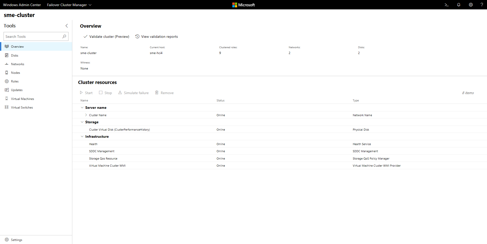

# Manage Failover Clusters with Windows Admin Center

>Applies To: Windows Admin Center, Windows Admin Center Preview

> [!Tip]
> New to Windows Admin Center?
> [Learn more about Windows Admin Center](../understand/windows-admin-center.md) or [Download now](https://aka.ms/windowsadmincenter).

## Managing failover clusters
[Failover clustering](https://docs.microsoft.com/windows-server/failover-clustering/failover-clustering-overview) is a Windows Server feature that enables you to group multiple servers together into a fault-tolerant cluster to increase availability and scalability of applications and services such as Scale-Out File Server, Hyper-V and Microsoft SQL Server.

While you can manage failover cluster nodes as individual servers by adding them as [Server connections](manage-servers.md) in Windows Admin Center, you can also add them as Failover clusters to view and manage cluster resources, storage, network, nodes, roles, virtual machines and virtual switches.

## Adding a failover cluster to Windows Admin Center
To add a cluster to Windows Admin Center:

1. Click **+ Add** under All Connections.
2. Choose to add a **Failover Connection**.
3. Type the name of the cluster and, if prompted, the credentials to use.
4. You will have the option to add the cluster nodes as individual server connections in Windows Admin Center.
5. Click **Submit** to finish.

The cluster will be added to your connection list on the Overview page. Click it to connect to the cluster.

> [!NOTE]
> You can also manage hyper-converged clustered by adding the cluster as a [Hyper-Converged Cluster connection](manage-hyper-converged.md) in Windows Admin Center.

## Tools

The following tools are available for failover cluster connections:

| Tool | Description |
| ---- | ----------- |
| Overview | View failover cluster details and manage cluster resources |
| Disks | View cluster shared disks and volumes |
| Networks | View networks in the cluster |
| Nodes | View and manage cluster nodes |
| Roles | Manage cluster roles or create an empty role |
| Updates | Manage Cluster-Aware Updates (requires [CredSSP](../understand/faq.md#does-windows-admin-center-use-credssp)) |
| [Virtual Machines](manage-virtual-machines.md) | View and manage virtual machines |
| Virtual Switches | View and manage virtual switches |

## More Coming

Failover cluster management in Windows Admin Center is actively under development and new features will be added in the near future. You can view the status and vote for features in UserVoice:

|Feature Request|
|-------|
| [Show more clustered disk info](https://windowsserver.uservoice.com/forums/295071-management-tools/suggestions/31740424--cluster-more-disk-info-in-failover-cluster-manag) |
| [Support additional cluster actions](https://windowsserver.uservoice.com/forums/295071-management-tools/suggestions/33558076--fcm-full-csv-management-cycle-in-one-place) |
| [Support converged clusters running Hyper-V and Scale-Out File Server on different clusters](https://windowsserver.uservoice.com/forums/295071-management-tools/suggestions/31729741--cluster-support-for-converged-architecture) |
| [View CSV block cache](https://windowsserver.uservoice.com/forums/295071-management-tools/suggestions/31669477--cluster-csv-block-cache) |
| [See all or propose new feature](https://windowsserver.uservoice.com/forums/295071/filters/top?category_id=319162&query=%5Bcluster%5D) |