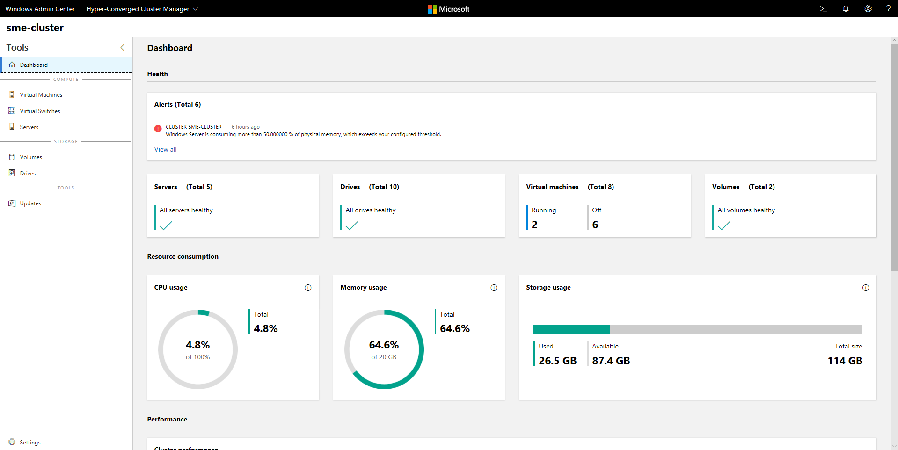
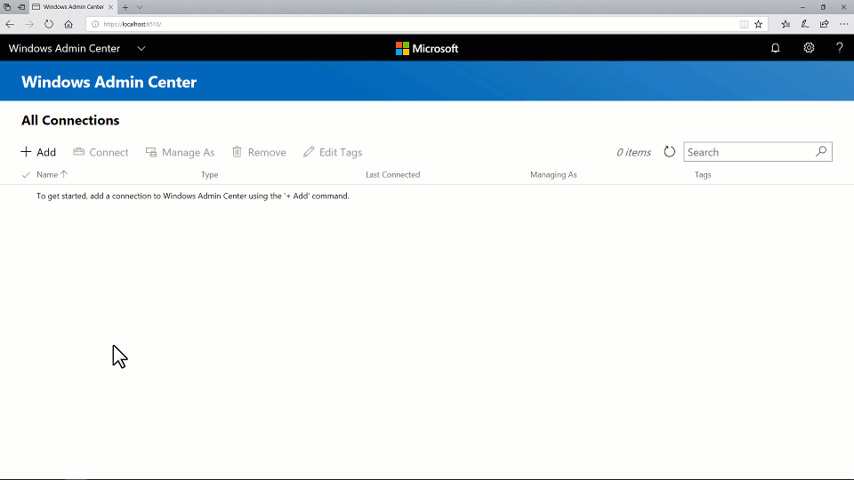
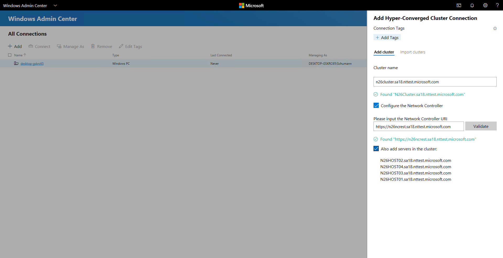
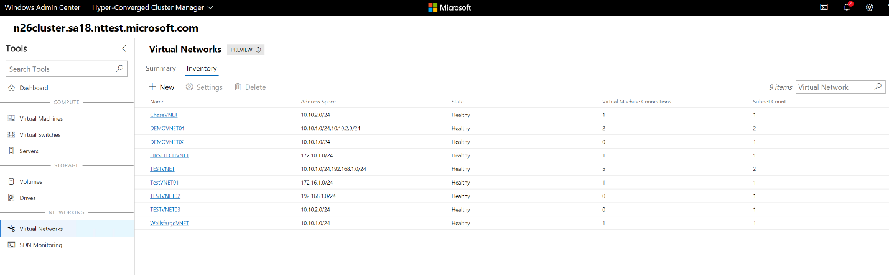
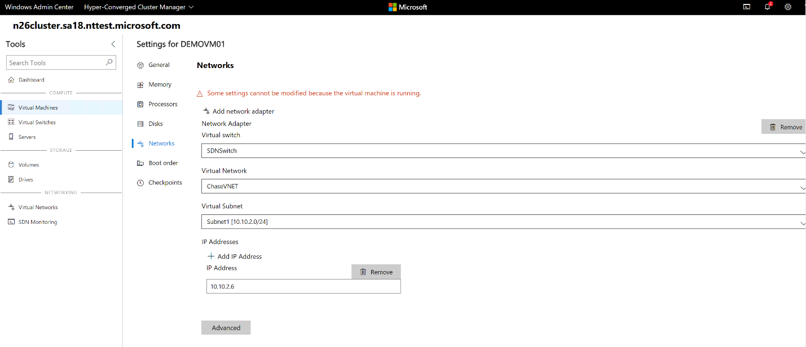
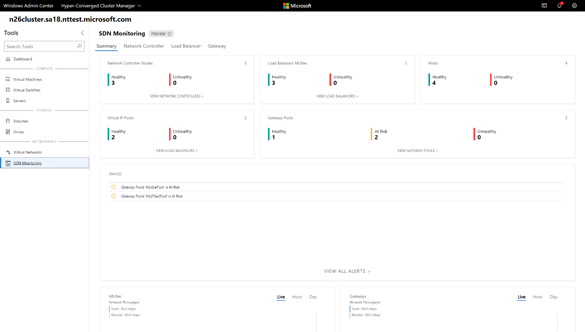

# Manage Hyper-Converged Infrastructure with Windows Admin Center

>Applies To: Windows Admin Center, Windows Admin Center Preview

## What is Hyper-Converged Infrastructure

Hyper-Converged Infrastructure consolidates software-defined compute, storage, and networking into one cluster to provide high-performance, cost-effective, and easily scalable virtualization. This capability was introduced in Windows Server 2016 with [Storage Spaces Direct](https://docs.microsoft.com/windows-server/storage/storage-spaces/storage-spaces-direct-overview), [Software Defined Networking](https://docs.microsoft.com/windows-server/networking/sdn/software-defined-networking) and [Hyper-V](https://docs.microsoft.com/windows-server/virtualization/hyper-v/hyper-v-on-windows-server).

> [!Tip]
> Looking to acquire Hyper-Converged Infrastructure? Microsoft recommends these [Windows Server Software-Defined](https://microsoft.com/wssd) solutions from our partners. They are designed, assembled, and validated against our reference architecture to ensure compatibility and reliability, so you get up and running quickly.

> [!IMPORTANT]
> Some of the features described in this article are only available in Windows Admin Center Preview. [How do I get this version?](http://aka.ms/windowsadmincenter)

## What is Windows Admin Center

[Windows Admin Center](../understand/windows-admin-center.md) is the next-generation management tool for Windows Server, the successor to traditional "in-box" tools like Server Manager. It's free and can be installed and used without an Internet connection. You can use Windows Admin Center to manage and monitor Hyper-Converged Infrastructure running Windows Server 2016 or Windows Server 2019.



## Key features

Highlights of Windows Admin Center for Hyper-Converged Infrastructure include:

- **Unified single-pane-of-glass for compute, storage, and soon networking.** View your virtual machines, host servers, volumes, drives, and more within one purpose-built, consistent, interconnected experience.
- **Create and manage Storage Spaces and Hyper-V virtual machines.** Radically simple workflows to create, open, resize, and delete volumes; and create, start, connect to, and move virtual machines; and much more.
- **Powerful cluster-wide monitoring.** The dashboard graphs memory and CPU usage, storage capacity, IOPS, throughput, and latency in real-time, across every server in the cluster, with clear alerts when something's not right.
- **Software Defined Networking (SDN) support.** Manage and monitor virtual networks, subnets, connect virtual machines to virtual networks, and monitor SDN infrastructure.

Windows Admin Center for Hyper-Converged Infrastructure is being actively developed by Microsoft. It receives frequent updates that improve existing features and add new features.

## Before you start

To manage your cluster as Hyper-Converged Infrastructure in Windows Admin Center, it needs to be running Windows Server 2016 or Windows Server 2019, and have Hyper-V and Storage Spaces Direct enabled. Optionally, it can also have Software Defined Networking enabled and managed through Windows Admin Center.

> [!Tip]
> Windows Admin Center also offers a general-purpose management experience for any cluster supporting any workload, available for Windows Server 2012 and later. If this sounds like a better fit, when you add your cluster to Windows Admin Center, select [**Failover Cluster**](manage-failover-clusters.md) instead of **Hyper-Converged Cluster**.

### Prepare your Windows Server 2016 cluster for Windows Admin Center

Windows Admin Center for Hyper-Converged Infrastructure depends on management APIs added after Windows Server 2016 was released. Before you can manage your Windows Server 2016 cluster with Windows Admin Center, you’ll need to perform these two steps:

1. Verify that every server in the cluster has installed the [2018-05 Cumulative Update for Windows Server 2016 (KB4103723)](https://support.microsoft.com/help/4103723/windows-10-update-kb4103723) or later. To download and install this update, go to **Settings** > **Update & Security** > **Windows Update** and select **Check online for updates from Microsoft Update**.
2. Run the following PowerShell cmdlet as Administrator on the cluster:

```powershell
    Add-ClusterResourceType -Name "SDDC Management" -dll "$env:SystemRoot\Cluster\sddcres.dll" -DisplayName "SDDC Management"
```

> [!Tip]
> You only need to run the cmdlet once, on any server in the cluster. You can run it locally in Windows PowerShell or use Credential Security Service Provider (CredSSP) to run it remotely. Depending on your configuration, you may not be able to run this cmdlet from within Windows Admin Center.

### Prepare your Windows Server 2019 cluster for Windows Admin Center

If your cluster runs Windows Server 2019, the steps above are not necessary. Just add the cluster to Windows Admin Center as described in the next section and you're good to go!

### Configure Software Defined Networking (Optional) ###

You can configure your Hyper-Converged Infrastructure running Windows Server 2016 or 2019 to use Software Defined Networking (SDN) with the following steps:

1. Prepare the VHD of the OS which is the same OS you installed on the hyper-converged infrastructure hosts. This VHD will be used for all NC/SLB/GW VMs.
2. Download all the folder and files under SDN Express from [https://github.com/Microsoft/SDN/tree/master/SDNExpress](https://github.com/Microsoft/SDN/tree/master/SDNExpress).
3. Prepare a different VM using the deployment console. This VM should be able to access the SDN hosts. Also, the VM should be have the RSAT Hyper-V tool installed.
4. Copy everything you downloaded for SDN Express to the deployment console VM. And share this **SDNExpress** folder. Make sure every host can access the **SDNExpress** shared folder, as defined in the configuration file line 8:
   ```
    \\$env:Computername\SDNExpress
   ```
5. Copy the VHD of the OS to the **images** folder under the **SDNExpress** folder on the deployment console VM.
6. Modify the SDN Express configuration with your environment setup. Finish the following two steps after you modify the SDN Express configuration based on your environment information.
7. Run PowerShell with Admin privilege to deploy SDN:

```powershell
    .\SDNExpress.ps1 -ConfigurationDataFile .\your_fabricconfig.PSD1 -verbose 
```

The deployment will take around 30 – 45 minutes.

## Get started

Once your Hyper-Converged Infrastructure is deployed, you can manage it using Windows Admin Center.

### Install Windows Admin Center

If you haven’t already, download and install Windows Admin Center. The fastest way to get up and running is to install it on your Windows 10 computer and manage your servers remotely. This takes less than five minutes. [Download now](https://aka.ms/windowsadmincenter) or [learn more about other installation options](../deploy/install.md).

### Add Hyper-Converged Cluster

To add your cluster to Windows Admin Center:

1. Click **+ Add** under All Connections.
2. Choose to add a **Hyper-Converged Cluster Connection**.
3. Type the name of the cluster and, if prompted, the credentials to use.
4. Click **Add** to finish.

The cluster will be added to your connections list. Click it to launch the Dashboard.



### Add SDN-enabled Hyper-Converged Cluster (Windows Admin Center Preview)

The latest Windows Admin Center Preview supports Software Defined Networking management for Hyper-Converged Infrastructure. By adding a Network Controller REST URI to your Hyper-Converged cluster connection, you can use Hyper-converged Cluster Manager to manage your SDN resources and monitor SDN infrastructure.

1. Click **+ Add** under All Connections.
2. Choose to add a **Hyper-Converged Cluster Connection**.
3. Type the name of the cluster and, if prompted, the credentials to use.
4. Check **Configure the Network Controller** to continue.
5. Enter the **Network Controller URI** and click **Validate**.
6. Click **Add** to finish.

The cluster will be added to your connections list. Click it to launch the Dashboard.



> [!Important]
> SDN environments with Kerberos authentication for Northbound communication are currently not supported.

## Frequently asked questions

### Are there differences between managing Windows Server 2016 and Windows Server 2019?

Yes. Windows Admin Center for Hyper-Converged Infrastructure receives frequent updates that improve the experience for both Windows Server 2016 and Windows Server 2019. However, certain new features are only available for Windows Server 2019 – for example, the toggle switch for deduplication and compression.

### Can I use Windows Admin Center to manage Storage Spaces Direct for other use cases (not hyper-converged), such as converged Scale-Out File Server (SoFS) or Microsoft SQL Server?

Windows Admin Center for Hyper-Converged Infrastructure does not provide management or monitoring options specifically for other use cases of Storage Spaces Direct – for example, it can’t create file shares. However, the Dashboard and core features, such as creating volumes or replacing drives, work for any Storage Spaces Direct cluster.

### What's the difference between a Failover Cluster and a Hyper-Converged Cluster?

In general, the term "hyper-converged" refers to running Hyper-V and Storage Spaces Direct on the same clustered servers to virtualize compute and storage resources. In the context of Windows Admin Center, when you click **+ Add** from the connections list, you can choose between adding a **Failover Cluster connection** or a **Hyper-Converged Cluster connection**:

- The **Failover Cluster connection** is the successor to the Failover Cluster Manager desktop app. It provides a familiar, general-purpose management experience for any cluster supporting any workload, including Microsoft SQL Server. It is available for Windows Server 2012 and later.

- The **Hyper-Converged Cluster connection** is an all-new experience tailored for Storage Spaces Direct and Hyper-V. It features the Dashboard and emphasizes charts and alerts for monitoring. It is available for Windows Server 2016 and Windows Server 2019.

### Why do I need the latest cumulative update for Windows Server 2016?

Windows Admin Center for Hyper-Converged Infrastructure depends on management APIs developed since Windows Server 2016 was released. These APIs are added in the [2018-05 Cumulative Update for Windows Server 2016 (KB4103723)](https://support.microsoft.com/help/4103723/windows-10-update-kb4103723), available as of May 8, 2018.

### How much does it cost to use Windows Admin Center?

Windows Admin Center has no additional cost beyond Windows.

You can use Windows Admin Center (available as a separate download) with valid licenses of Windows Server or Windows 10 at no additional cost - it's licensed under a Windows Supplemental EULA.

### Does Windows Admin Center require System Center?

No.

### Does it require an Internet connection?

No.

Although Windows Admin Center offers powerful and convenient integration with the Microsoft Azure cloud, the core management and monitoring experience for Hyper-Converged Infrastructure is completely on-premises. It can be installed and used without an Internet connection.

## Things to try

If you’re just getting started, here are some quick tutorials to help you learn how Windows Admin Center for Hyper-Converged Infrastructure is organized and works. Please exercise good judgement and be careful with production environments. These videos were recorded with Windows Admin Center version 1804 and an Insider Preview build of Windows Server 2019.

### Manage Storage Spaces Direct volumes

<ul>
               <li>(0:37) <a href="https://youtu.be/o66etKq70N8">How to create a three-way mirror volume</a></li>
               <li>(1:17) <a href="https://youtu.be/R72QHudqWpE">How to create a mirror-accelerated parity volume</a></li>
               <li>(1:02) <a href="https://youtu.be/j59z7ulohs4">How to open a volume and add files</a></li>
               <li>(0:51) <a href="https://youtu.be/PRibTacyKko">How to turn on deduplication and compression</a></li>
               <li>(0:47) <a href="https://youtu.be/hqyBzipBoTI">How to expand a volume</a></li>
               <li>(0:26) <a href="https://youtu.be/DbjF8r2F6Jo">How to delete a volume</a></li>
</ul>

<table>
    <tr style="border: 0;">
        <td style="padding: 5px; border: 0;">
            <strong>Create volume, three-way mirror</strong>
            <iframe width="375" height="210" src="https://www.youtube-nocookie.com/embed/o66etKq70N8" frameborder="0" allow="autoplay; encrypted-media" allowfullscreen="allowfullscreen"></iframe>
        </td>
        <td style="padding: 5px; border: 0;">
            <strong>Create volume, mirror-accelerated parity</strong>
            <iframe width="375" height="210" src="https://www.youtube-nocookie.com/embed/R72QHudqWpE" frameborder="0" allow="autoplay; encrypted-media" allowfullscreen="allowfullscreen"></iframe>
        </td>
    </tr>
    <tr style="border: 0;">
        <td style="padding: 5px; border: 0;">
            <strong>Open volume and add files</strong>
            <iframe width="375" height="210" src="https://www.youtube-nocookie.com/embed/j59z7ulohs4" frameborder="0" allow="autoplay; encrypted-media" allowfullscreen="allowfullscreen"></iframe>
        </td>
        <td style="padding: 5px; border: 0;">
            <strong>Turn on deduplication and compression</strong>
            <iframe width="375" height="210" src="https://www.youtube-nocookie.com/embed/PRibTacyKko" frameborder="0" allow="autoplay; encrypted-media" allowfullscreen="allowfullscreen"></iframe>
        </td>
    </tr>
    <tr style="border: 0;">
        <td style="padding: 5px; border: 0;">
            <strong>Expand volume</strong>
            <iframe width="375" height="210" src="https://www.youtube-nocookie.com/embed/hqyBzipBoTI" frameborder="0" allow="autoplay; encrypted-media" allowfullscreen="allowfullscreen"></iframe>
        </td>
        <td style="padding: 5px; border: 0;">
            <strong>Delete volume</strong>
            <iframe width="375" height="210" src="https://www.youtube-nocookie.com/embed/DbjF8r2F6Jo" frameborder="0" allow="autoplay; encrypted-media" allowfullscreen="allowfullscreen"></iframe>
        </td>
    </tr>
</table>

### Create a new virtual machine

1. Click the **Virtual Machines** tool from the left side navigation pane.
2. At the top of the Virtual Machines tool, choose the **Inventory** tab, then click **New** to create a new virtual machine.
3. Enter the virtual machine name and choose between generation 1 and 2 virtual machines.
4. Uou can then choose which host to initially create the virtual machine on or use the recommended host.
5. Choose a path for the virtual machine files. Choose a volume from the dropdown list or click **Browse** to choose a folder using the folder picker. The virtual machine configuration files and virtual hard disk file will be saved in a single folder under the `\Hyper-V\[virtual machine name]` path of the selected volume or path.
6. Choose the number of virtual processors, whether you want nested virtualization enabled, configure memory settings, network adapters, virtual hard disks and choose whether you want to install an operating system from an .iso image file or from the network.
7. Click **Create** to create the virtual machine.
8. Once the virtual machine is created and appears in the virtual machine list, you can start the virtual machine.
9. Once the virtual machine is started, you can connect to the virtual machine's console via VMConnect to install the operating system. Select the virtual machine from the list, click **More** > **Connect** to download the .rdp file. Open the .rdp file in the Remote Desktop Connection app. Since this is connecting to the virtual machine's console, you will need to enter the Hyper-V host's admin credentials.

[Learn more about virtual machine management with Windows Admin Center](manage-virtual-machines.md).

### Pause and safely restart a server

1. From the **Dashboard**, select **Servers** from the navigation on the left side or by clicking the **VIEW SERVERS >**  link on the tile in the lower right corner of the Dashboard.
2. At the top, switch from **Summary** to the **Inventory** tab.
3. Select a server by clicking its name to open the **Server** detail page.
4. Click **Pause server for maintenance**. If it’s safe to proceed, this will move virtual machines to other servers in the cluster. The server will have status Draining while this happens. If you want, you can watch the virtual machines move on the **Virtual machines > Inventory** page, where their host server is shown clearly in the grid. When all virtual machines have moved, the server status will be **Paused**.
5. Click **Manage server** to access all the per-server management tools in Windows Admin Center.
6. Click **Restart**, then **Yes**. You’ll be kicked back to the connections list.
7. Back on the **Dashboard**, the server is colored red while it’s down.
8. Once it’s back up, navigate again the **Server** page and click **Resume server from maintenance** to set the server status back to simply Up. In time, virtual machines will move back – no user action is required.

### Replace a failed drive

1. When a drive fails, an alert appears in the upper left **Alerts** area of the **Dashboard**.
2. You can also select **Drives** from the navigation on the left side or click the **VIEW DRIVES >** link on the tile in the lower right corner to browse drives and see their status for yourself. In the **Inventory** tab, the grid supports sorting, grouping, and keyword search.
3. From the **Dashboard**, click the alert to see details, like the drive’s physical location.
4. To learn more, click the **Go to drive** shortcut to the **Drive** detail page.
5. If your hardware supports it, you can click **Turn light on/off** to control the drive’s indicator light.
6. Storage Spaces Direct automatically retires and evacuates failed drives. When this has happened, the drive status is Retired, and its storage capacity bar is empty.
7. Remove the failed drive and insert its replacement.
8. In **Drives > Inventory**, the new drive will appear. In time, the alert will clear, volumes will repair back to OK status, and storage will rebalance onto the new drive – no user action is required.

### Manage virtual networks (SDN-enabled HCI clusters using Windows Admin Center Preview)

1. Select **Virtual Networks** from the navigation on the left side.
2. Click **New** to create a new virtual network and subnets, or choose an existing virtual network and click **Settings** to modify its configuration.
3. Click an existing virtual network to view VM connections to the virtual network subnets and access control lists applied to virtual network subnets.



### Connect a virtual machine to a virtual network (SDN-enabled HCI clusters using Windows Admin Center Preview)

1. Select **Virtual Machines** from the navigation on the left side.
2. Choose an existing virtual machine > Click **Settings** > Open the **Networks** tab in **Settings**.
3. Configure the **Virtual Network** and **Virtual Subnet** fields to connect the virtual machine to a virtual network.

You can also configure the virtual network when creating a virtual machine.



### Monitor Software Defined Networking infrastructure (SDN-enabled HCI clusters using Windows Admin Center Preview)

1. Select **SDN Monitoring** from the navigation on the left side.
2. View detailed information about the health of Network Controller, Software Load Balancer, Virtual Gateway and monitor your Virtual Gateway Pool, Public and Private IP Pool usage and SDN host status.



## Feedback

It’s all about your feedback! The most important benefit of frequent updates is to hear what’s working and what needs to be improved. Here are some ways to let us know what you’re thinking:

- [Submit and vote for feature requests on UserVoice](https://windowsserver.uservoice.com/forums/295071/category/319162?query=%5Bhci%5D)
- [Join the Windows Admin Center forum on Microsoft Tech Community](https://techcommunity.microsoft.com/t5/Windows-Server-Management/bd-p/WindowsServerManagement)
- Tweet to `@servermgmt`

### See also

- [Windows Admin Center](../understand/windows-admin-center.md)
- [Storage Spaces Direct](https://docs.microsoft.com/windows-server/storage/storage-spaces/storage-spaces-direct-overview)
- [Hyper-V](https://docs.microsoft.com/windows-server/virtualization/hyper-v/hyper-v-on-windows-server)
- [Software Defined Networking](https://docs.microsoft.com/windows-server/networking/sdn/software-defined-networking)
