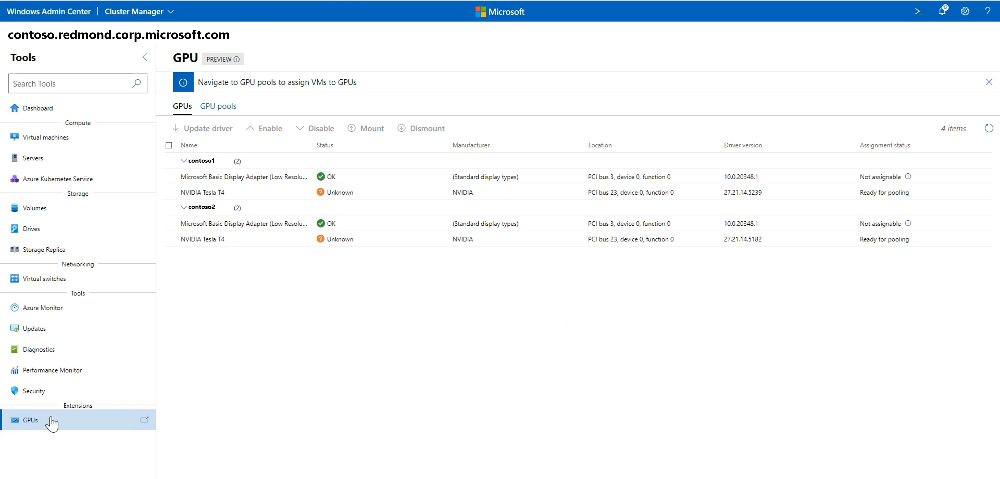
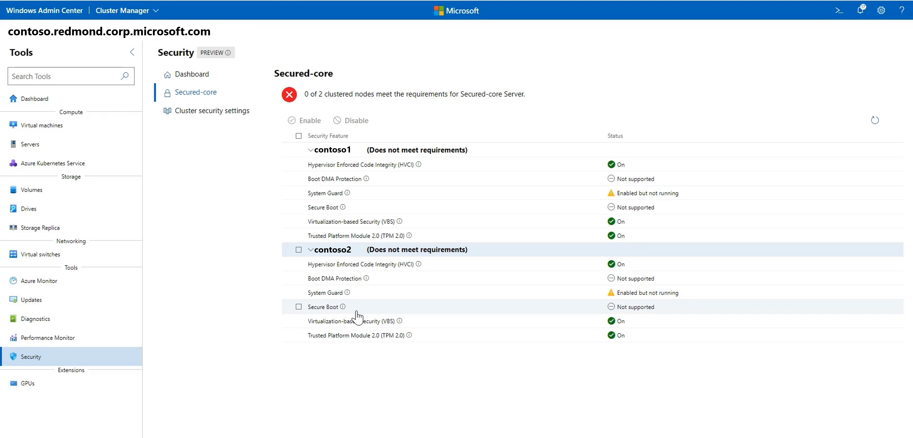

# Manage a hyper-converged infrastructure by using Windows Admin Center

A hyper-converged infrastructure consolidates software-defined compute, storage, and networking into one cluster to provide high-performance, cost-effective, and scalable virtualization. This capability was introduced in Windows Server 2016 with [Storage Spaces Direct](/azure/azure-local/concepts/storage-spaces-direct-overview), [Software Defined Networking (SDN)](/azure/azure-local/concepts/software-defined-networking), and [Hyper-V](../../../virtualization/hyper-v/hyper-v-on-windows-server.md).

You can use Windows Admin Center to manage and monitor a hyper-converged infrastructure that's running Windows Server 2016 or Windows Server 2019. Windows Admin Center is the next-generation management tool for Windows Server. It's the successor to traditional "in-box" tools like Server Manager. It's free and can be installed and used without an internet connection.


Some of the features that this article describes are available only in Windows Admin Center Preview. For more information, see [Windows Admin Center overview](../overview.md).

> [!TIP]
> Looking to acquire a hyper-converged infrastructure? We recommend [these Windows Server SDN solutions](https://microsoft.com/wssd) from our partners. They're designed, assembled, and validated against our reference architecture to help ensure compatibility and reliability, so you get up and running quickly.

## Key features

Highlights of Windows Admin Center for hyper-converged infrastructures include:

- **Unified dashboard for compute, storage, and networking**. View your virtual machines (VMs), host servers, volumes, drives, and more within one purpose-built, consistent, interconnected experience.
- **Creation and management of storage spaces and Hyper-V virtual machines**. Use simple workflows to create, open, resize, and delete volumes. Or use workflows to create, start, connect to, and move virtual machines.
- **Powerful cluster-wide monitoring**. The dashboard graphs memory and CPU usage, storage capacity, input/output operations per second (IOPS), throughput, and latency in real time across every server in the cluster. Get clear alerts when something isn't right.
- **Software Defined Networking support**. Manage and monitor virtual networks and subnets, connect virtual machines to virtual networks, and monitor the SDN infrastructure.

We're actively developing Windows Admin Center for hyper-converged infrastructures. It receives frequent updates that improve existing features and add new features.

## Before you start

To manage your cluster as a hyper-converged infrastructure in Windows Admin Center, make sure that the cluster is running Windows Server 2016 or Windows Server 2019. Also make sure that you enabled Hyper-V and Storage Spaces Direct for it. Optionally, the cluster can also have Software Defined Networking enabled and managed through Windows Admin Center.

> [!TIP]
> Windows Admin Center also offers a general-purpose management experience for any cluster that supports any workload. It's available for Windows Server 2012 and later. If this option sounds like a better fit, when you add your cluster to Windows Admin Center, select [Failover Cluster](manage-failover-clusters.md) instead of **Hyper-Converged Cluster**.

### Prepare your Windows Server 2016 cluster for Windows Admin Center

Windows Admin Center for hyper-converged infrastructures depends on management APIs added after Windows Server 2016 was released. Before you can manage your Windows Server 2016 cluster by using Windows Admin Center, you need to perform these two steps:

1. Verify that every server in the cluster installed the [2018-05 Cumulative Update for Windows Server 2016 (KB4103723)](https://support.microsoft.com/help/4103723/windows-10-update-kb4103723) or later. To download and install this update, go to **Settings** > **Update & Security** > **Windows Update** and select **Check online for updates from Microsoft Update**.

2. Run the following PowerShell cmdlet as administrator on the cluster:

   ```powershell
    Add-ClusterResourceType -Name "SDDC Management" -dll "$env:SystemRoot\Cluster\sddcres.dll" -DisplayName "SDDC Management"
   ```

> [!TIP]
> You need to run the cmdlet only once, on any server in the cluster. You can run it locally in Windows PowerShell or use CredSSP to run it remotely. Depending on your configuration, you might not be able to run this cmdlet from within Windows Admin Center.

### Prepare your Windows Server 2019 cluster for Windows Admin Center

If your cluster runs Windows Server 2019, the preceding steps are not necessary. Just add the cluster to Windows Admin Center, as described [later in this article](#add-a-hyper-converged-cluster).

### Configure Software Defined Networking (optional)

You can configure your hyper-converged infrastructure running Windows Server 2016 or 2019 to use Software Defined Networking by following these steps:

1. Prepare the virtual hard disk (VHD) of the operating system, which is the same operating system that you installed on the hyper-converged infrastructure hosts. This VHD will be used for all NC-series, Software Load Balancer (SLB), and gateway VMs.

2. Download all the folders and files under SDN Express from [GitHub](https://github.com/Microsoft/SDN/tree/master/SDNExpress).

3. Prepare a different VM by using the deployment console. This VM should be able to access the SDN hosts. Also, the VM should have the Remote Server Administration Tools (RSAT) Hyper-V package installed.

4. Copy everything that you downloaded for SDN Express to the deployment console VM, and share this **SDNExpress** folder. Make sure every host can access the **SDNExpress** shared folder, as defined in line 8 of the configuration file:

   ```
    \\$env:Computername\SDNExpress
   ```
5. Copy the VHD of the operating system to the **images** folder under the **SDNExpress** folder on the deployment console VM.

6. Modify the SDN Express configuration based on your environment setup.

7. Run PowerShell with admin privileges to deploy SDN:

   ```powershell
    .\SDNExpress.ps1 -ConfigurationDataFile .\your_fabricconfig.PSD1 -verbose
   ```

The deployment takes around 30 to 45 minutes.

## Start managing your hyper-converged infrastructure

After your Hyper-Converged Infrastructure is deployed, you can manage it by using Windows Admin Center.

### Install Windows Admin Center

If you haven't already, download and install Windows Admin Center. The fastest way to get up and running is to install it on your Windows 10 computer and manage your servers remotely. This process takes less than five minutes. [Download now](../overview.md), or [learn more about other installation options](../deploy/install.md).

### Add a hyper-converged cluster

To add your cluster to Windows Admin Center:

1. Under **All Connections**, select **+ Add**.

2. Select **Hyper-Converged Cluster Connection** as the connection type.

3. Enter the name of the cluster. If you're prompted, select the credentials to use.

4. Select **Add** to finish.

The cluster is added to your list of connections. Select it to open the dashboard.


### Add an SDN-enabled hyper-converged cluster (Windows Admin Center Preview)

The latest version of Windows Admin Center Preview supports Software Defined Networking management for hyper-converged infrastructures. By adding a network controller REST URI to your hyper-converged cluster connection, you can use Hyper-converged Cluster Manager to manage your SDN resources and monitor the SDN infrastructure.

1. Under **All Connections**, select **+ Add**.

2. Select **Hyper-Converged Cluster Connection** as the connection type.

3. Enter the name of the cluster. If you're prompted, select the credentials to use.

4. Select **Configure the Network Controller**.

5. Enter the network controller URI value, and then select **Validate**.

   

6. Select **Add** to finish.

The cluster is added to your list of connections. Select it to open the dashboard.

> [!IMPORTANT]
> SDN environments with Kerberos authentication for Northbound communication are currently not supported.

## Frequently asked questions

### Are there differences between managing Windows Server 2016 and managing Windows Server 2019?

Yes. Windows Admin Center for hyper-converged infrastructures receives frequent updates that improve the experience for both Windows Server 2016 and Windows Server 2019. However, certain new features are available only for Windows Server 2019. An example is the toggle for deduplication and compression.

### Can I use Windows Admin Center to manage Storage Spaces Direct for other use cases (not hyper-converged), such as converged Scale-Out File Server or Microsoft SQL Server?

Windows Admin Center for hyper-converged infrastructures does not provide management or monitoring options specifically for other use cases of Storage Spaces Direct. For example, it can't create file shares. However, the dashboard and core features, such as creating volumes or replacing drives, work for any Storage Spaces Direct cluster.

### What's the difference between a failover cluster and a hyper-converged cluster?

In general, the term *hyper-converged* refers to running Hyper-V and Storage Spaces Direct on the same clustered servers to virtualize compute and storage resources. In the context of Windows Admin Center, when you select **+ Add** in the list of connections, you can choose between these connection types:

- **Failover cluster connection**: The successor to the Failover Cluster Manager desktop app. It provides a familiar, general-purpose management experience for any cluster that supports any workload, including Microsoft SQL Server. It's available for Windows Server 2012 and later.

- **Hyper-converged cluster connection**: An experience tailored for Storage Spaces Direct and Hyper-V. It features the dashboard and emphasizes charts and alerts for monitoring. It's available for Windows Server 2016 and Windows Server 2019.

### Why do I need the latest cumulative update for Windows Server 2016?

Windows Admin Center for hyper-converged infrastructures depends on management APIs developed since Windows Server 2016 was released. These APIs are added in the [2018-05 Cumulative Update for Windows Server 2016 (KB4103723)](https://support.microsoft.com/help/4103723/windows-10-update-kb4103723), available as of May 8, 2018.

### How much does it cost to use Windows Admin Center?

You can use Windows Admin Center (available as a separate download) with valid licenses of Windows Server or Windows 10 at no additional cost. It's licensed under a Windows supplement to the Microsoft Software License Terms.

### Does Windows Admin Center require System Center?

No.

### Does Windows Admin Center require an internet connection?

No.

Although Windows Admin Center offers powerful and convenient integration with the Microsoft Azure cloud platform, the core management and monitoring experience for hyper-converged infrastructures is completely on-premises. You can install and use it without an internet connection.

## Things to try

Now that you understand the basics of using Windows Admin Center to manage and monitor a hyper-converged infrastructure, you can try more tasks in your environment.

### Manage Storage Spaces Direct volumes

If you're just getting started, here are some quick videos to help you learn how Windows Admin Center for hyper-converged infrastructures is organized and works. Please exercise good judgment and be careful with production environments. These videos were recorded with Windows Admin Center version 1804 and an Insider Preview build of Windows Server 2019.

#### Create a three-way mirror volume

> [!VIDEO https://www.youtube-nocookie.com/embed/o66etKq70N8]

#### Create a mirror-accelerated parity volume

> [!VIDEO https://www.youtube-nocookie.com/embed/R72QHudqWpE]

#### Open a volume and add files

> [!VIDEO https://www.youtube-nocookie.com/embed/j59z7ulohs4]

#### Turn on deduplication and compression

> [!VIDEO https://www.youtube-nocookie.com/embed/PRibTacyKko]

#### Expand a volume

> [!VIDEO https://www.youtube-nocookie.com/embed/hqyBzipBoTI]

#### Delete a volume

> [!VIDEO https://www.youtube-nocookie.com/embed/DbjF8r2F6Jo]

### Create a virtual machine

1. On the left pane, select **Virtual Machines**.

2. At the top of the **Virtual Machines** pane, select the **Inventory** tab, and then select **New**.

3. Enter the virtual machine name, and choose between generation 1 and generation 2.

4. Choose a host for the virtual machine, or use the recommended host.

5. Choose a path for the virtual machine files. Select a volume from the dropdown list, or select **Browse** to choose a folder. The virtual machine configuration files and virtual hard disk file will be saved in a single folder under the `\Hyper-V\[virtual machine name]` path of the selected volume or path.

6. Choose the number of virtual processors and whether you want nested virtualization enabled. Configure memory settings, network adapters, and virtual hard disks. Choose whether you want to install an operating system from an .iso image file or from the network.

7. Select **Create**.

8. After the virtual machine is created and appears in the list of virtual machines, start it.

9. Connect to the virtual machine's console via VMConnect to install the operating system. Select the virtual machine from the list, and then select **More** > **Connect** to download the .rdp file. Open the .rdp file in the Remote Desktop Connection app. Because you're connecting to the virtual machine's console, you need to enter the Hyper-V host's admin credentials.

[Learn more about virtual machine management with Windows Admin Center](manage-virtual-machines.md).

### Pause and safely restart a server

1. On the left pane of the dashboard, select **Servers**. Or, on the tile in the lower-right corner of the dashboard, select the **VIEW SERVERS >** link.

2. Switch from the **Summary** tab to the **Inventory** tab.

3. Select a server to open its details.

4. Select **Pause server for maintenance**. If it's safe to proceed, this action moves virtual machines to other servers in the cluster. The server has a status of **Draining** during this process.

   If you want, you can watch the virtual machines move on the **Virtual machines** > **Inventory** pane, where the grid clearly shows their host server. After all the virtual machines move, the server status is **Paused**.

5. Select **Manage server** to access all the per-server management tools in Windows Admin Center.

6. Select **Restart**, and then select **Yes**.

7. Back on the dashboard, the server is colored red while it's down. After it's back up, go to the **Server** page and select **Resume server from maintenance** to set the server status to **Up**. In time, virtual machines will move back. No user action is required.

### Replace a failed drive

1. When a drive fails, an alert appears in the **Alerts** area of the dashboard.

   Or to browse through drives and see their status for yourself, you can either:

   - Select **Drives** on the left pane.
   - Select the **VIEW DRIVES >** link on the tile in the lower-right corner.

   On the **Inventory** tab, the grid supports sorting, grouping, and keyword search.

2. On the dashboard, select the alert to see details, like the drive's physical location.

   To learn more, select the **Go to drive** shortcut to the **Drive** detail page.

3. If your hardware supports it, you can select **Turn light on/off** to control the drive's indicator light.

4. Storage Spaces Direct automatically retires and evacuates failed drives. When this process happens, the drive status is **Retired**, and its storage capacity bar is empty.

5. Remove the failed drive and insert its replacement.

6. In **Drives** > **Inventory**, the new drive appears. In time, the alert will clear, volumes will repair back to **OK** status, and storage will rebalance onto the new drive. No user action is required.

### Manage virtual networks (SDN-enabled HCI clusters via Windows Admin Center Preview)

1. On the left pane, select **Virtual Networks**.

   

2. On the **Inventory** tab, select **New** to create a new virtual network and subnets. Or choose an existing virtual network and then select **Settings** to modify its configuration.

3. Select an existing virtual network to view VM connections to virtual network subnets and access control lists applied to virtual network subnets.

### Connect a virtual machine to a virtual network (SDN-enabled HCI clusters via Windows Admin Center Preview)

1. On the left pane, select **Virtual Networks**.

2. Choose an existing virtual machine, select **Settings**, and then open the **Networks** tab.

3. Configure the **Virtual Network** and **Virtual Subnet** fields to connect the virtual machine to a virtual network.


You can also configure the virtual network when you're creating a virtual machine.

### Monitor Software Defined Networking infrastructure (SDN-enabled HCI clusters via Windows Admin Center Preview)

1. On the left pane, select **SDN Monitoring**.

2. View detailed information about the health of your network controller, software load balancer, and virtual gateway. You can also monitor your virtual gateway pool, public and private IP pool usage, and SDN host status.


### Manage GPUs

1. On the left pane, select **GPUs**.

2. View the available GPUs from your clustered VMs, and provide GPU acceleration to workloads running in the clustered VMs through Discrete Device Assignment. [Learn more about using GPUs with clustered VMs](https://aka.ms/useGPUWithClusteredVM).



### Use the security tool

1. On the left pane, select **Security**.

2. Select the **Secured-core** tab, and then enable or disable the available security features.



## Give us feedback

The most important benefit of frequent updates is to hear what's working and what needs to be improved. Here are some ways to let us know what you're thinking:

- [Submit ideas for feature requests and provide feedback](https://aka.ms/wacfeedback)
- [Join the Windows Admin Center forum on Microsoft Tech Community](https://techcommunity.microsoft.com/t5/Windows-Server-Management/bd-p/WindowsServerManagement)
- Tweet to `@servermgmt`

### Related content

- [Windows Admin Center overview](../overview.md)
- [Storage Spaces Direct overview](/azure/azure-local/concepts/storage-spaces-direct-overview)
- [Hyper-V technology overview](../../../virtualization/hyper-v/hyper-v-on-windows-server.md)
- [Software Defined Networking in Azure Stack HCI and Windows Server](/azure/azure-local/concepts/software-defined-networking)

