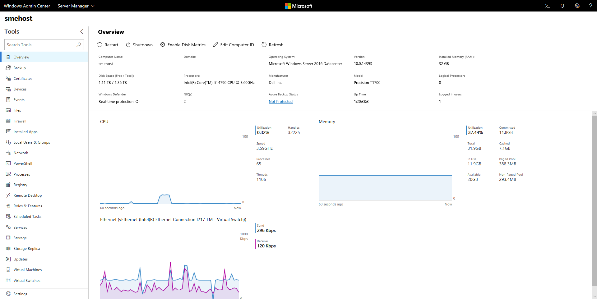

# Manage Servers with Windows Admin Center

>Applies To: Windows Server (Semi-Annual Channel), Windows Server 2016, Windows Server 2012 R2, Windows Server 2012, Windows 10

> [!Tip]
> New to Windows Admin Center?
> [Learn more about Windows Admin Center](../understand/windows-admin-center.md) or [Download now](https://aka.ms/WACDownload).

## Managing Windows Server machines

You can add individual servers running Windows Server 2012 or later to Windows Admin Center to manage the server with a comprehensive set of tools including Certificates, Devices, Events, Processes, Roles and Features, Updates, Virtual Machines and more.

## Adding a server to Windows Admin Center

To add a server to Windows Admin Center:

1. Click **+ Add** under All Connections.
2. Choose to add a **Server Connection**.
3. Type the name of the server and, if prompted, the credentials to use.
4. Click **Submit** to finish.

The server will be added to your connection list on the Overview page. Click it to connect to the server.

> [!NOTE]
> You can also add [failover clusters](manage-failover-clusters.md) or [hyper-converged clusters](manage-hyper-converged.md) as a separate connection in Windows Admin Center.

## Tools

The following tools are available for server connections:

| Tool | Description |
| ---- | ----------- |
| [Overview](#overview) | View server details and control server state | 
| [Certificates](#certificates) | View and modify certificates | 
| [Devices](#devices) | View and modify devices | 
| [Events](#events) | View events | 
| [Files](#files) | Browse files and folders | 
| [Firewall](#firewall) | View and modify firewall rules | 
| [Local Users and Groups](#local-users-and-groups) | View and modify local users and groups | 
| [Network](#network) | View and modify network devices | 
| [PowerShell](#powershell) | Interact with server via PowerShell | 
| [Processes](#processes) | View and modify running processes | 
| [Registry](#registry) | View and modify registry entries | 
| [Remote Desktop](#remote-desktop) | Interact with server via Remote Desktop | 
| [Roles and Features](#roles-and-features) | View and modify roles and features | 
| [Services](#services) | View and modify services | 
| [Storage](#storage) | View and modify storage devices | 
| [Storage Replica](https://docs.microsoft.com/en-us/windows-server/storage/storage-replica/storage-replica-ui) | Use Storage Replica to manage server-to-server storage replication | 
| [Updates](#updates) | View installed and check for new updates | 
| [Virtual Machines](manage-virtual-machines.md) | View and manage virtual machines | 
| [Virtual Switches](#virtual-switches) | View and manage virtual switches | 

## Overview

**Overview** Allows you to see the current state of CPU, memory, and network performance, as well as perform operations and modify settings on a target computer or server.

### Features

The following features are supported in Server Manager Overview:

- View server details
- View CPU activity
- View memory activity
- View network activity
- Restart server
- Shutdown server
- Enable disk metrics on server
- Edit Computer ID on server

### Proposed Features

The following features have been proposed for Server Manager Overview:

|Feature Request|
|-------|
|[[Overview] [Export] Availability to Export into an Excel Report Performance Metrics such as CPU, RAM, Storage, VMs, etc](https://windowsserver.uservoice.com/forums/295071/suggestions/31632592)|
|[[Overview] Historical performance data for dashboard statistics](https://windowsserver.uservoice.com/forums/295071/suggestions/31779562)|
|[[Overview] Impact Alert for Shutdown/Restart](https://windowsserver.uservoice.com/forums/295071/suggestions/32024263)|
|[[Overview] Show Computer/Server Build Number on Home Page](https://windowsserver.uservoice.com/forums/295071/suggestions/32697718)|
|[[Overview] System uptime and logged in users](https://windowsserver.uservoice.com/forums/295071/suggestions/31801321)|
|[[Overview] [Computer ID] Add 'OU Path' at 'Join to Domain' option](https://windowsserver.uservoice.com/forums/295071/suggestions/31824241)|
|[[Overview] [Disk Metrics] Disk latency and queue](https://windowsserver.uservoice.com/forums/295071/suggestions/31691191)|
|[[Overview] [Disk Metrics] Display Drive Letter Name in Graph](https://windowsserver.uservoice.com/forums/295071/suggestions/31641190)|
|[[Overview] Adding IP address on the server overview page](https://windowsserver.uservoice.com/forums/295071/suggestions/33080716)|
|[[Overview] [RD Settings] see and change the users that are allowed RDP access on the server](https://windowsserver.uservoice.com/forums/295071/suggestions/31598437)
|[**See all or propose new feature**](https://windowsserver.uservoice.com/forums/295071/filters/top?category_id=319162&query=%5BOverview%5D)

## Certificates

**Certificates** allows you to manage certificate stores on a computer or server.

### Features

The following features are supported in Certificates:

- Browse and search existing certificates
- View certificate details
- Export certificates
- Renew certificates
- Request new certificates
- Delete certificates

### Proposed Features

The following features have been proposed for Certificates:

|Feature Request|
|-------|
|[[Certificates] Create certificate requests](https://windowsserver.uservoice.com/forums/295071/suggestions/31702627)|
|[[Certificates] Manage Private Keys](https://windowsserver.uservoice.com/forums/295071/suggestions/33308506)
|[**See all or propose new feature**](https://windowsserver.uservoice.com/forums/295071/filters/top?category_id=319162&query=%5BCertificates%5D)

## Devices

**Devices** allows you to manage connected devices on a computer or server.

### Features

The following features are supported in Devices:

- Browse and search devices
- View device details
- Disable a device
- Update driver on a device

### Proposed Features

The following features have been proposed for Devices:

|Feature Request|
|-------|
|[[Devices] Hidden devices in device manager should not appear in Windows Admin Center by default](https://windowsserver.uservoice.com/forums/295071/suggestions/31918396)
|[**See all or propose new feature**](https://windowsserver.uservoice.com/forums/295071/filters/top?category_id=319162&query=%5BDevices%5D)

## Events

**Events** allows you to manage event logs on a computer or server.

### Features

The following features are supported in Events:

- Browse and search events
- View event details
- Clear events from the log
- Export events from the log

### Proposed Features

The following features have been proposed for Events:

|Feature Request|
|-------|
|[[Events] Modify Subscriptions in Event Viewer](https://windowsserver.uservoice.com/forums/295071/suggestions/31852813)|
|[[Events] Event details and keyboard navigation](https://windowsserver.uservoice.com/forums/295071/suggestions/32398108)|
|[[Events] [Filter] [GUI] improvements](https://windowsserver.uservoice.com/forums/295071/suggestions/31701994)|
|[[Events] [Filter] Include keyword field in filter panel](https://windowsserver.uservoice.com/forums/295071/suggestions/31481797)|
|[[Events] Colour coding/Icons to more easily distinguish Errors from Warnings](https://windowsserver.uservoice.com/forums/295071/suggestions/31702081)|
|[[Events] Indicators in the Event trees](https://windowsserver.uservoice.com/forums/295071/suggestions/33616717)
|[**See all or propose new feature**](https://windowsserver.uservoice.com/forums/295071/filters/top?category_id=319162&query=%5BEvents%5D)

## Files

**Files** allows you to manage files and folders on a computer or server.

### Features

The following features are supported in Files:

- Browse files and folders
- Search for a file or folder
- Create a new folder
- Delete a file or folder
- Download a file or folder
- Upload a file or folder
- Rename a file or folder
- Extract a zip file
- View file or folder properties

### Proposed Features

The following features have been proposed for Files:

|Feature Request|
|-------|
|[[Files] Improvements on Files module](https://windowsserver.uservoice.com/forums/295071/suggestions/31598218)|
|[[Files] Upload progress](https://windowsserver.uservoice.com/forums/295071/suggestions/32588972)|
|[[Files] - Visual representation of Free Space](https://windowsserver.uservoice.com/forums/295071/suggestions/31933906)|
|[[Files] Drive Free space and Total Directory size](https://windowsserver.uservoice.com/forums/295071/suggestions/31656802)|
|[[Files] File Sharing option and management](https://windowsserver.uservoice.com/forums/295071/suggestions/31702198)|
|[[Files] File Viewer / Editor](https://windowsserver.uservoice.com/forums/295071/suggestions/32520424)|
|[[Files] Share Management - Show hidden shares](https://windowsserver.uservoice.com/forums/295071/suggestions/31667824)|
|[[Files] Support UNC path](https://windowsserver.uservoice.com/forums/295071/suggestions/32868157)
|[**See all or propose new feature**](https://windowsserver.uservoice.com/forums/295071/filters/top?category_id=319162&query=%5BFiles%5D)

## Firewall

**Firewall** allows you to manage firewall settings and rules on a computer or server.

### Features

The following features are supported in Firewall:

- View an overview of firewall settings
- View incoming firewall rules
- View outgoing firewall rules
- Search firewall rules
- View firewall rule details
- Create a new firewall rule
- Enable or disable a firewall rule
- Delete a firewall rule
- Edit the properties of a firewall rule

### Proposed Features

The following features have been proposed for Firewall:

|Feature Request|
|-------|
|[[Firewall] Disable/Enable firewall](https://windowsserver.uservoice.com/forums/295071/suggestions/32514262)|
|[[Firewall] Improvements on the Firewall module](https://windowsserver.uservoice.com/forums/295071/suggestions/31598275)|
|[[Firewall] Toggle default Firewall rules](https://windowsserver.uservoice.com/forums/295071/suggestions/31702117)|
|[[Firewall] Windows Firewall - Show active rules](https://windowsserver.uservoice.com/forums/295071/suggestions/32200756)|
|[[Firewall] Windows Firewall - Show content of firewall log](https://windowsserver.uservoice.com/forums/295071/suggestions/32200795)
|[**See all or propose new feature**](https://windowsserver.uservoice.com/forums/295071/filters/top?category_id=319162&query=%5BFirewall%5D)

## Local Users and Groups

**Local Users and Groups** allows you to manage security groups and users that exist locally on a computer or server.

### Features

The following features are supported in Local Users and Groups:

- View and search users and groups
- Create a new user or group
- Manage a user's group membership
- Delete a user or group
- Change a user's password
- Edit the properties of a user or group

### Proposed Features

The following features have been proposed for Local Users and Groups:

|Feature Request|
|-------|
|[[Local users and Groups] Add User account options (must/cannot change password, never expires, etc.)](https://windowsserver.uservoice.com/forums/295071/suggestions/31481842)
|[**See all or propose new feature**](https://windowsserver.uservoice.com/forums/295071/filters/top?category_id=319162&query=%5BLocal%20users%20and%20Groups%5D)

## Network

**Network** allows you to manage network devices and settings on a computer or server.

### Features

The following features are supported in Network:

- Browse and search existing network adapters
- View details of a network adapter
- Edit properties of a network adapter

### Proposed Features

The following features have been proposed for Network:

|Feature Request|
|-------|
|[[Network] Access to the advanced properties on the ethernet connection](https://windowsserver.uservoice.com/forums/295071/suggestions/31627183)|
|[[Network] Add a netstat view for listening and connected ports](https://windowsserver.uservoice.com/forums/295071/suggestions/31599178)|
|[[Network] Edit advanced settings in network](https://windowsserver.uservoice.com/forums/295071/suggestions/31702132)|
|[[Network] Ethernet rename](https://windowsserver.uservoice.com/forums/295071/suggestions/32258310)|
|[[Network] Loading network adapters takes time](https://windowsserver.uservoice.com/forums/295071/suggestions/31702315)|
|[[Network] Network edit description of a Adapter](https://windowsserver.uservoice.com/forums/295071/suggestions/32122996)|
|[[Network] Network settings](https://windowsserver.uservoice.com/forums/295071/suggestions/33309295)|
|[[Network] network status switch](https://windowsserver.uservoice.com/forums/295071/suggestions/32361943)|
|[[Networking] LBFO NIC Teaming option](https://windowsserver.uservoice.com/forums/295071/suggestions/32234938)
|[**See all or propose new feature**](https://windowsserver.uservoice.com/forums/295071/filters/top?category_id=319162&query=%5BNetwork%5D)

## PowerShell

**PowerShell** allows you to interact with a computer or server via a PowerShell session.

### Features

The following features are supported in PowerShell:

- Create an interactive PowerShell session on the server
- Disconnect from PowerShell session on the server

### Proposed Features

The following features have been proposed for PowerShell:

|Feature Request|
|-------|
|[[PowerShell] Maintain Powershell Credentials when selecting other tools in the same session](https://windowsserver.uservoice.com/forums/295071/suggestions/32666164)|
|[[Powershell] Copy/Paste Keyboard shortcuts](https://windowsserver.uservoice.com/forums/295071/suggestions/32504629)
|[**See all or propose new feature**](https://windowsserver.uservoice.com/forums/295071/filters/top?category_id=319162&query=%5BPowerShell%5D)

## Processes

**Processes** allows you to manage running processes on a computer or server.

### Features

The following features are supported in Processes:

- Browse and search for running processes
- View process details
- Start a process
- End a process
- Create a process dump
- Find process handles

The following features have been proposed for Processes:

|Feature Request|
|-------|
|[[Processes] Add advanced details (like SysInternals Process Explorer)](https://windowsserver.uservoice.com/forums/295071/suggestions/31481923)
|[**See all or propose new feature**](https://windowsserver.uservoice.com/forums/295071/filters/top?category_id=319162&query=%5BProcesses%5D)

## Registry

**Registry** allows you to manage registry keys and values on a computer or server.

### Features

The following features are supported in Registry:

- Browse registry keys and values
- Add or modify registry values
- Delete registry values

### Proposed Features

The following features have been proposed for Registry:

|Feature Request|
|-------|
|[[Registry] navigation with keyboard](https://windowsserver.uservoice.com/forums/295071/suggestions/31702123)|
|[[Registry] Search/Browse/Jump to path](https://windowsserver.uservoice.com/forums/295071/suggestions/31702231)
|[**See all or propose new feature**](https://windowsserver.uservoice.com/forums/295071/filters/top?category_id=319162&query=%5BRegistry%5D)

## Remote Desktop

**Remote Desktop** allows you to interact with a computer or server via an interactive desktop session.

### Features

The following features are supported in Remote Desktop:

- Start an interactive remote desktop session
- Disconnect from a remote desktop session
- Send Ctrl+Alt+Del to a remote desktop session

### Proposed Features

The following features have been proposed for Remote Desktop:

|Feature Request|
|-------|
|[[Remote Desktop] Add Remote Desktop Gateway RDC option to Windows Admin Center](https://windowsserver.uservoice.com/forums/295071/suggestions/33852331)|
|[[Remote Desktop] Additional settings](https://windowsserver.uservoice.com/forums/295071/suggestions/33606349)|
|[[Remote Desktop] On Remote desktop replace "Disconnect" with "Sign Out"](https://windowsserver.uservoice.com/forums/295071/suggestions/33307051)|
|[[Remote Desktop] RDP Custom Port](https://windowsserver.uservoice.com/forums/295071/suggestions/33245668)|
|[[Remote Desktop] RDP session shadowing](https://windowsserver.uservoice.com/forums/295071/suggestions/32325262)
|[**See all or propose new feature**](https://windowsserver.uservoice.com/forums/295071/filters/top?category_id=319162&query=%5BRemote%20Desktop%5D)

## Roles and Features

**Roles and Features** allows you to manage roles and features on a server.

### Features

The following features are supported in Roles and Features:

- Browse list of roles and features on a server
- View role or feature details
- Install a role or feature
- Remove a role or feature

### Proposed Features

The following features have been proposed for Roles and Features:

|Feature Request|
|-------|
|[[Roles & Features] Allow searching and filter in Roles & Features](https://windowsserver.uservoice.com/forums/295071/suggestions/31645315)|
|[[Roles & Features] Improvements on the Roles & Features module](https://windowsserver.uservoice.com/forums/295071/suggestions/31598326)|
|[[Roles and Features] Filter](https://windowsserver.uservoice.com/forums/295071/suggestions/31702240)
|[**See all or propose new feature**](https://windowsserver.uservoice.com/forums/295071/filters/top?category_id=319162&query=%5BRoles%20and%20Features%5D)

## Services

**Services** allows you to manage services on a computer or server.

### Features

The following features are supported in Services:

- Browse and search services on a server
- View details of a service
- Start a service
- Pause a service
- Edit the properties of a service

### Proposed Features

The following features have been proposed for Services:

|Feature Request|
|-------|
|[[Services Module] Improvements on the Services module](https://windowsserver.uservoice.com/forums/295071/suggestions/31598380)|
|[[Services] Add Log On As column to Services management.](https://windowsserver.uservoice.com/forums/295071/suggestions/33637168)|
|[[Services] Edit SNMP Settings](https://windowsserver.uservoice.com/forums/295071/suggestions/33567214)|
|[[Services] Highlight stopped services that should start automatically](https://windowsserver.uservoice.com/forums/295071/suggestions/31702258)|
|[[Services] Show service user under the Services screen](https://windowsserver.uservoice.com/forums/295071/suggestions/33636025)|
|[[Services] Update ID/password in services](https://windowsserver.uservoice.com/forums/295071/suggestions/33656947)
|[**See all or propose new feature**](https://windowsserver.uservoice.com/forums/295071/filters/top?category_id=319162&query=%5BServices%5D)

## Storage

**Storage** allows you to manage storage devices on a computer or server.

### Features

The following features are supported in Storage:

- Browse and search existing disks on a server
- View disk details
- Create a volume
- Initialize a disk
- Create, attach, and detach a virtual hard disk (VHD)
- Take a disk offline
- Format a volume
- Resize a volume
- Edit volume properties
- Delete a volume
- Install Quota Management

### Proposed Features

The following features have been proposed for Storage:

|Feature Request|
|-------|
|[[Storage] Extend virtualdisk](https://windowsserver.uservoice.com/forums/295071/suggestions/33670837)|
|[[Storage] Manage Storage Spaces](https://windowsserver.uservoice.com/forums/295071/suggestions/31657348)|
|[[Storage] Please add unmount iso option to the storage volumes area](https://windowsserver.uservoice.com/forums/295071/suggestions/32545918)|
|[[Storage] update-hoststoragecache](https://windowsserver.uservoice.com/forums/295071/suggestions/33643864)|
|[[Storage] Storage window doesn't refresh properly](https://windowsserver.uservoice.com/forums/295071/suggestions/32075065)
|[**See all or propose new feature**](https://windowsserver.uservoice.com/forums/295071/filters/top?category_id=319162&query=%5BStorage%5D)

## Updates

**Updates** allows you to manage Microsoft and/or Windows Updates on a computer or server.

### Features

The following features are supported in Updates:

- View available Windows or Microsoft Updates
- View a list of update history
- Install Updates
- Check online for updates from Microsoft Update

### Proposed Features

The following features have been proposed for Updates:

|Feature Request|
|-------|
|[[Updates] Install Option for Downloaded Updates](https://windowsserver.uservoice.com/forums/295071/suggestions/33076789)|
|[[Updates] Windows Update msrc severity sort order](https://windowsserver.uservoice.com/forums/295071/suggestions/32289211)|
|[[Updates] Windows Update Overview](https://windowsserver.uservoice.com/forums/295071/suggestions/31957363)|
|[[Updates] Allow removal of Windows updates](https://windowsserver.uservoice.com/forums/295071/suggestions/31736929)|
|[[Updates] Allow us to choose which Updates are installed + add a date picker for scheduled restart](https://windowsserver.uservoice.com/forums/295071/suggestions/31577008)|
|[[Updates] Windows updates should not show hidden updates](https://windowsserver.uservoice.com/forums/295071/suggestions/33458738)
|[**See all or propose new feature**](https://windowsserver.uservoice.com/forums/295071/filters/top?category_id=319162&query=%5BUpdates%5D)

## Virtual Switches

**Virtual Switches** allows you to manage Hyper-V virtual switches on a computer or server.

### Features

The following features are supported in Virtual Switches:

- Browse and search Virtual Switches on a server
- Create a new Virtual Switch
- Rename a Virtual Switch
- Delete an existing Virtual Switch
- Edit the properties of a Virtual Switch

### Proposed Features

The following features have been proposed for Virtual Switches:

|Feature Request|
|-------|
|[[Virtual Switch] Allow Add, Edit, Remove of Management OS vNICs](https://windowsserver.uservoice.com/forums/295071/suggestions/31776181)|
|[[Virtual Switch] Show More Information for Physical Adapter Selection](https://windowsserver.uservoice.com/forums/295071/suggestions/31776094)
|[**See all or propose new feature**](https://windowsserver.uservoice.com/forums/295071/filters/top?category_id=319162&query=%5BVirtual%20Switches%5D)
