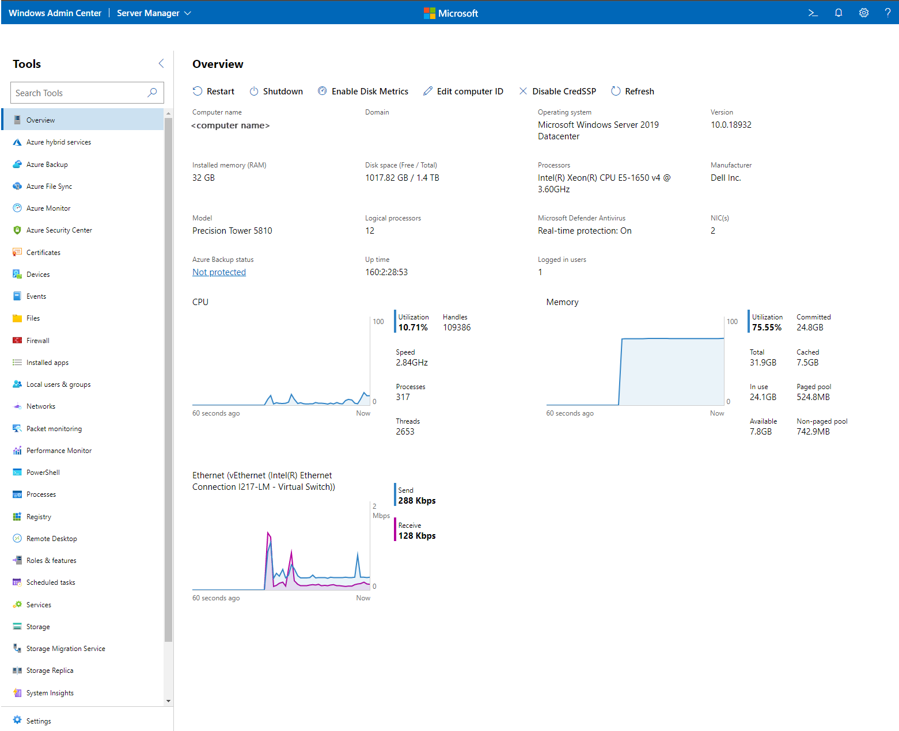

# Manage servers in Windows Admin Center

> [!Tip]
> New to Windows Admin Center?
> [Download or learn more about Windows Admin Center](../overview.md).

You can add individual servers running Windows Server to Windows Admin Center so that you can manage them by using a comprehensive set of tools.

## Procedure for adding a server to Windows Admin Center

1. Under **All connections**, select **+ Add**.
2. For the **Servers** resource type, select **Add**.
3. Enter the name of the server. If you're prompted, enter the credentials to use.
4. Select **Add** to finish.

The server is added to your list of connections on the **All connections** page. Select it to connect to the server.

> [!NOTE]
> You can also add [failover clusters](manage-failover-clusters.md) or [hyper-converged clusters](manage-hyper-converged.md) as a separate connection in Windows Admin Center.

## Summary of tools

The following table briefly describes the tools that are available in Windows Admin Center for server connections. Sections in this article provide more details for all the tools except Performance Monitor and Packetmon (whose links go to blog posts).

| Tool | Description |
| ---- | ----------- |
| [Overview](#overview) | View server details and control server state. |
| [Settings](#settings) | View and modify services. |
| [Active Directory](#active-directory-preview) | Manage Active Directory. |
| [Azure Backup](#azure-backup) | View and configure Azure Backup. |
| [Azure File Sync](#azure-file-sync) | View and configure Azure File Sync. |
| [Azure hybrid center](#azure-hybrid-center) | View and configure Azure hybrid services. |
| [Azure Monitor](#azure-monitor) | View and configure Azure Monitor. |
| [Certificates](#certificates) | View and modify certificates. |
| [Containers](#containers) | View containers. |
| [Devices](#devices) | View and modify devices. |
| [DHCP](#dhcp) | View and manage DHCP server configuration. |
| [DNS](#dns) | View and manage DNS server configuration. |
| [Events](#events) | View events. |
| [Files](#files) | Browse through files and folders. |
| [Firewall](#firewall) | View and modify firewall rules. |
| [Installed apps](#installed-apps) | View and remove installed apps. |
| [Local users & groups](#local-users--groups) | View and modify local users and groups. |
| [Microsoft Defender for Cloud](#microsoft-defender-for-cloud) | View and configure Microsoft Defender for Cloud. |
| [Networks](#networks) | View and modify network devices. |
| [Packetmon](https://aka.ms/wac1908) | Monitor network packets. |
| [Performance Monitor](https://aka.ms/perfmon-blog) | View performance counters and reports. |
| [PowerShell](#powershell) | Interact with servers via PowerShell. |
| [Processes](#processes) | View and modify running processes. |
| [Registry](#registry) | View and modify registry entries. |
| [Remote Desktop](#remote-desktop) | Interact with servers via Remote Desktop. |
| [Roles & features](#roles--features) | View and modify roles and features. |
| [Scheduled tasks](#scheduled-tasks) | View and modify scheduled tasks. |
| [Security](#security) | View and modify security settings. |
| [Services](#services) | View and modify services. |
| [Storage](#storage) | View and modify storage devices. |
| [Storage Migration Service](#storage-migration-service) | Migrate servers and file shares to Azure or Windows Server 2019. |
| [Storage Replica](#storage-replica) | Manage server-to-server storage replication. |
| [System Insights](#system-insights) | Get increased insight into the functioning of your servers. |
| [Updates](#updates) | View installed updates and check for new updates. |
| [Virtual machines](manage-virtual-machines.md) | View and manage virtual machines. |
| [Virtual switches](#virtual-switches) | View and manage virtual switches. |

## Overview

The **Overview** page shows the current state of CPU, memory, and network performance. You can also use it to perform operations and modify settings on a target computer or server.

**Overview** supports these features:

- View server details.
- View CPU activity.
- View memory activity.
- View network activity.
- Restart the server.
- Shut down the server.
- Enable disk metrics on the server.
- Edit the computer ID on the server.
- View the baseboard management controller (BMC) IP address with a hyperlink. This feature requires a BMC that's compatible with Intelligent Platform Management Interface (IPMI).

## Active Directory (preview)

**Active Directory** is an early preview that's available on the [extension feed](../configure/using-extensions.md).

The following Active Directory management features are available:

- Create a user.
- Create a group.
- Search for users, computers, and groups.
- View a details pane for users, computers, and groups when they're selected in a grid.
- Perform global grid actions for users, computers, and groups (disable, enable, and remove).
- Reset user passwords.
- Configure basic properties and group memberships for user objects.
- Configure delegation to a single machine for computer objects.
- Manage membership for group objects. (Add or remove one user at a time.)

## Azure Backup

Use **Azure Backup** to help protect your Windows server from corruptions, attacks, or disasters by backing up your server directly to Microsoft Azure.
[Learn more about Azure Backup](https://aka.ms/windows-admin-center-backup).

The following features are available:

- View an overview of your Azure backup status.
- Configure backup items and schedule.
- Start or stop a backup job.
- View backup job history and status.
- View recovery points and recover data.
- Delete backup data.

## Azure File Sync

Use **Azure File Sync** to sync your file server with the cloud.
[Learn more about Azure File Sync](../azure/azure-file-sync.md).

## Azure hybrid center

**Azure hybrid center** is your centralized location for learning about and onboarding to Azure hybrid services. [Learn more about Azure hybrid services in Windows Admin Center](../azure/index.md).

## Azure Monitor

Use **Azure Monitor** to monitor your servers and configure alerts.
[Learn more about Azure Monitor](../azure/azure-monitor.md).

## Certificates

Use **Certificates** to manage certificate stores on a computer or server.

The following features are available:

- Browse through and search for existing certificates.
- View certificate details.
- Export certificates.
- Renew certificates.
- Request new certificates.
- Delete certificates.

## Containers

Use **Containers** to view the containers on a Windows Server container host. In the case of a running Windows Server Core container, you can view the event logs and access the command-line interface of the container. It's available on the [extension feed](../configure/using-extensions.md).

## Devices

Use **Devices** to manage connected devices on a computer or server.

The following features are available:

- Browse through and search for devices.
- View device details.
- Disable a device.
- Update a driver on a device.

## DHCP

Use **DHCP** to manage connected devices on a computer or server. It's available on the [extension feed](../configure/using-extensions.md).

The following features are available:

- Create, configure, and view IPv4 and IPv6 scopes.
- Create address exclusions, and configure start and end IP addresses.
- Create address reservations, and configure client MAC address (IPv4), DUID (IPv6), and IAID (IPv6).

## DNS

Use **DNS** to manage connected devices on a computer or server. It's available on the [extension feed](../configure/using-extensions.md).

The following features are available:

- View details of DNS forward lookup zones, reverse lookup zones, and DNS records.
- Create forward lookup zones (primary, secondary, and stub), and configure the properties of forward lookup zones.
- Create Host (A or AAAA), CNAME, and MX types of DNS records.
- Configure the properties of DNS records.
- Create IPv4 and IPv6 reverse lookup zones (primary, secondary, and stub), and configure the properties of reverse lookup zones.
- Create PTR and CNAME types of DNS records under reverse lookup zones.

## Events

Use **Events** to manage event logs on a computer or server.

The following features are available:

- Browse through and search for events.
- View event details.
- Clear events from the log.
- Export events from the log.
- Create workspaces (preview).
- Save workspaces (preview).
- Delete workspaces (preview).
- View events in a stacked bar format (preview).

## Files

Use **Files** to manage files and folders on a computer or server.

The following features are available:

- Browse through files and folders.
- Search for a file or folder.
- Create a folder.
- Delete a file or folder.
- Download a file or folder.
- Upload a file or folder.
- Rename a file or folder.
- Extract a .zip file.
- Copy and move files and folders.
- View file or folder properties.
- Add, edit, or remove file shares.
- Modify user and group permissions on file shares.
- Modify the security of a file server.

## Firewall

Use **Firewall** to manage firewall settings and rules on a computer or server.

The following features are available:

- View an overview of firewall settings.
- View incoming firewall rules.
- View outgoing firewall rules.
- Search for firewall rules.
- View firewall rule details.
- Create a firewall rule.
- Enable or disable a firewall rule.
- Delete a firewall rule.
- Edit the properties of a firewall rule.

## Installed apps

Use **Installed apps** to list and uninstall applications that are installed.

## Local users & groups

Use **Local users & groups** to manage security groups and users that exist locally on a computer or server.

The following features are available:

- View and search for users and groups.
- Create a user or group.
- Manage a user's group membership.
- Delete a user or group.
- Change a user's password.
- Edit the properties of a user or group.

## Microsoft Defender for Cloud

**Microsoft Defender for Cloud** is a cloud-native application protection platform. It has a set of security measures and practices that help protect cloud-based applications from various cyberthreats and vulnerabilities.

## Networks

Use **Networks** to manage network devices and settings on a computer or server.

The following features are available:

- Browse through and search for existing network adapters.
- View the details of a network adapter.
- Edit the properties of a network adapter.
- Create an [Azure Network Adapter (preview feature)](https://techcommunity.microsoft.com/t5/networking-blog/top-10-networking-features-in-windows-server-2019-3-azure/ba-p/339780).

## PowerShell

Use **PowerShell** to interact with a computer or server via a PowerShell session.

The following features are available:

- Create an interactive PowerShell session on a server.
- Disconnect from a PowerShell session on a server.

## Processes

Use **Processes** to manage running processes on a computer or server.

The following features are available:

- Browse through and search for running processes.
- View process details.
- Start a process.
- End a process.
- Create a process dump.
- Find process handles.

## Registry

Use **Registry** to manage registry keys and values on a computer or server.

The following features are available:

- Browse through registry keys and values.
- Add or modify registry values.
- Delete registry values.

## Remote Desktop

Use **Remote Desktop** to interact with a computer or server via an interactive desktop session.

The following features are available:

- Start an interactive remote desktop session.
- Disconnect from a remote desktop session.
- Send Ctrl+Alt+Delete to a remote desktop session.

## Roles & features

Use **Roles & features** to manage roles and features on a server.

The following features are available:

- Browse through roles and features on a server.
- View role or feature details.
- Install a role or feature.
- Remove a role or feature.

## Scheduled tasks

Use **Scheduled tasks** to manage scheduled tasks on a computer or server.

The following features are available:

- Browse the task scheduler library.
- Edit scheduled tasks.
- Enable and disable scheduled tasks.
- Start and stop scheduled tasks.
- Create scheduled tasks.

## Security

Use **Security** to manage your security settings on a computer or server.

The following features are available:

- Run and schedule virus scans.
- Enable and disable real-time threat protection.
- View threat history.
- Check secured-core status.
- Enable or disable secured-core security features.

## Services

Use **Services** to manage services on a computer or server.

The following features are available:

- Browse through and search for services on a server.
- View details of a service.
- Start a service.
- Pause a service.
- Restart a service.
- Edit the properties of a service.

## Settings

**Settings** is a central location to manage settings on a computer or server.

The following features are available:

- View and modify file share settings.
- View and modify user and system environment variables.
- View and modify the power configuration.
- View and modify Remote Desktop settings.
- View and modify settings for role-based access control.
- View and modify Hyper-V host settings, if applicable.

## Storage

Use **Storage** to manage storage devices on a computer or server.

The following features are available:

- Browse through and search for existing disks on a server.
- View disk details.
- Create a volume.
- Initialize a disk.
- Create, attach, and detach a virtual hard disk.
- Take a disk offline.
- Format a volume.
- Resize a volume.
- Edit volume properties.
- Delete a volume.
- Install Quota Management.
- Manage [File Server Resource Manager quotas](../../../storage/fsrm/quota-management.md).

## Storage Migration Service

Use **Storage Migration Service** to migrate servers and file shares to Azure or Windows Server 2019, without requiring apps or users to change anything. [Get an overview of Storage Migration Service](../../../storage/storage-migration-service/overview.md).

> [!NOTE]
> Storage Migration Service requires Windows Server 2019.

## Storage Replica

Use **Storage Replica** to manage server-to-server storage replication.
[Learn more about Storage Replica](../../../storage/storage-replica/server-to-server-storage-replication.md).

## System Insights

**System Insights** introduces predictive analytics natively in Windows Server to give you increased insight into the functioning of your server.
[Get an overview of System Insights](../../system-insights/overview.md).

> [!NOTE]
> System Insights requires Windows Server 2019.

## Updates

Use **Updates** to manage Microsoft and Windows updates on a computer or server.

The following features are available:

- View available Microsoft and Windows updates.
- View the update history.
- Install updates.
- Check online for updates from Microsoft Update.
- Manage [Azure Update Management](/azure/automation/update-management/overview) integration.

## Virtual machines

See [Manage virtual machines by using Windows Admin Center](manage-virtual-machines.md).

## Virtual switches

Use **Virtual switches** to manage Hyper-V virtual switches on a computer or server.

The following features are available:

- Browse through and search for virtual switches on a server.
- Create a virtual switch.
- Rename a virtual switch.
- Delete a virtual switch.
- Edit the properties of a virtual switch.
