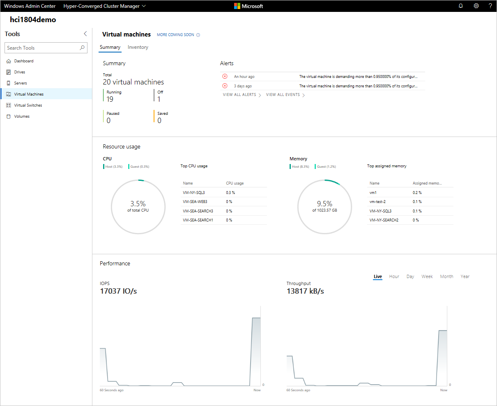
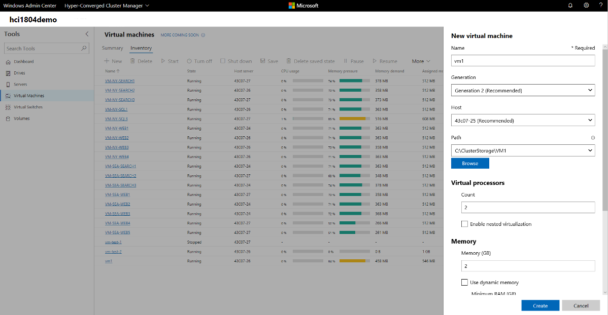
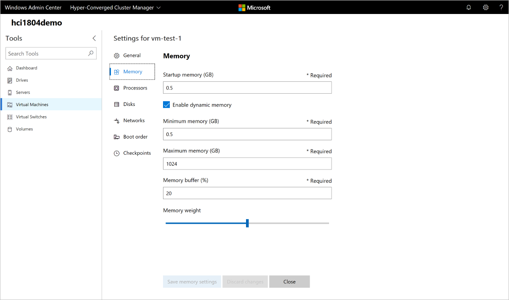
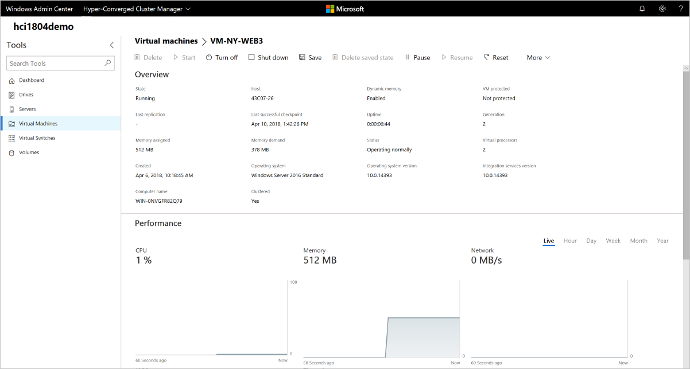
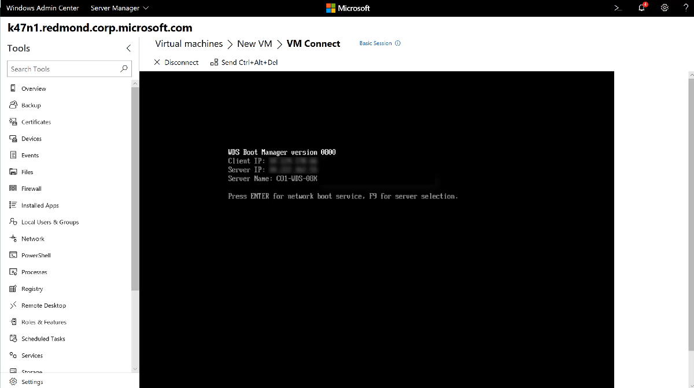
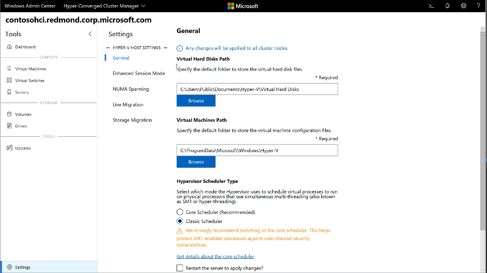

# Managing Virtual Machines with Windows Admin Center

>Applies To: Windows Admin Center, Windows Admin Center Preview

The Virtual Machines tool is available in [Server](manage-servers.md), [Failover Cluster](manage-failover-clusters.md) or [Hyper-Converged Cluster](manage-hyper-converged.md) connections if the Hyper-V role is enabled on the server or cluster. You can use the Virtual Machines tool to manage Hyper-V hosts running Windows Server 2012 or later, either installed with Desktop Experience or as Server Core. Hyper-V Server 2012, 2016 and 2019 are also supported.

## Key features

Highlights of the Virtual Machines tool in Windows Admin Center include:

- **High-level Hyper-V host resource monitoring.** View overall CPU and memory usage, IO performance metrics, VM health alerts and events for the Hyper-V host server or entire cluster in a single dashboard.
- **Unified experience bringing Hyper-V Manager and Failover Cluster Manager capabilities together.** View all the virtual machines across a cluster and drill down into a single virtual machine for advanced management and troubleshooting.
- **Simplified, yet powerful workflows for virtual machine management.** New UI experiences tailored to IT administration scenarios to create, manage and replicate virtual machines.

Here are some of the Hyper-V tasks you can do in Windows Admin Center:

- [Monitor Hyper-V host resources and performance](#monitor-hyper-v-host-resources-and-performance)
- [View virtual machine inventory](#view-virtual-machine-inventory)
- [Create a new virtual machine](#create-a-new-virtual-machine)
- [Change virtual machine settings](#change-virtual-machine-settings)
- [Live migrate a virtual machine to another cluster node](#live-migrate-a-virtual-machine-to-another-cluster-node)
- [Advanced management and troubleshooting for a single virtual machine](#advanced-management-and-troubleshooting-for-a-single-virtual-machine)
- [Manage a virtual machine through the Hyper-V host (VMConnect)](#manage-a-virtual-machine-through-the-hyper-v-host-vmconnect)
- [Change Hyper-V host settings](#change-hyper-v-host-settings)
- [View Hyper-V event logs](#view-hyper-v-event-logs)
- [Protect virtual machines with Azure Site Recovery](#protect-virtual-machines-with-azure-site-recovery)

## Monitor Hyper-V host resources and performance



1. Click the **Virtual Machines** tool from the left side navigation pane.
2. There are two tabs at the top of the **Virtual Machines** tool, the **Summary** tab and the **Inventory** tab. The **Summary** tab provides a holistic view of Hyper-V host resources and performance for the current server or entire cluster, including the following:
    - The number of VMs grouped by state - running, off, paused and saved
    - Recent health alerts or Hyper-V event log events (Alerts are only available for hyper-converged clusters running Windows Server 2016 or later)
    - CPU and memory usage with host vs guest breakdown
    - Top VMs consuming the most CPU and memory resources
    - Live and historical data line charts for IOPS and IO throughput (Storage performance line charts are only available for hyper-converged clusters running Windows Server 2016 or later. Historical data is only available for hyper-converged clusters running Windows Server 2019)

## View virtual machine inventory


1. Click the **Virtual Machines** tool from the left side navigation pane.
2. There are two tabs at the top of the **Virtual Machines** tool, the **Summary** tab and the **Inventory** tab. The **Inventory** tab lists the virtual machines available on the current server or entire cluster, and provides commands to manage individual virtual machines. You can:
    - View a list of the virtual machines running on the current server or cluster.
    - View the virtual machine's state and host server if you are viewing virtual machines for a cluster. Also view CPU and memory usage from the host perspective, including memory pressure, memory demand and assigned memory, and the virtual machine's uptime, heartbeat status and protection status using Azure Site Recovery.
    - [Create a new virtual machine](#create-a-new-virtual-machine).
    - Delete, start, turn off, shut down, pause, resume, reset or rename a virtual machine. Also save the virtual machine, delete a saved state, or create a checkpoint.
    - [Change settings for a virtual machine](#change-virtual-machine-settings).
    - Connect to a virtual machine console using VMConnect via the Hyper-V host.
    - [Replicate a virtual machine using Azure Site Recovery](#protect-virtual-machines-with-azure-site-recovery).
    - For operations that can be run on multiple VMs, such as Start, Shut down, Save, Pause, Delete, Reset, you can select multiple VMs and run the operation at once.

NOTE: If you are connected to a cluster, the Virtual Machine tool will only display clustered virtual machines. We plan to also show non-clustered virtual machines in the future.

## Create a new virtual machine



1. Click the **Virtual Machines** tool from the left side navigation pane.
2. At the top of the Virtual Machines tool, choose the **Inventory** tab, then click **New** to create a new virtual machine.
3. Enter the virtual machine name and choose between generation 1 and 2 virtual machines.
4. If you are creating a virtual machine on a cluster, you can choose which host to initially create the virtual machine on. If you are running Windows Server 2016 or later, the tool will provide a host recommendation for you.
5. Choose a path for the virtual machine files. Choose a volume from the dropdown list or click **Browse** to choose a folder using the folder picker. The virtual machine configuration files and virtual hard disk file will be saved in a single folder under the `\Hyper-V\\[virtual machine name]` path of the selected volume or path.

   >[!Tip]
   > In the folder picker, you can browse to any available SMB share on the network by entering the path in the **Folder name** field as ```\\server\share```. Using a network share for VM storage will require [CredSSP](../understand/faq.md#does-windows-admin-center-use-credssp).

6. Choose the number of virtual processors, whether you want nested virtualization enabled, configure memory settings, network adapters, virtual hard disks and choose whether you want to install an operating system from an .iso image file or from the network.
7. Click **Create** to create the virtual machine.
8. Once the virtual machine is created and appears in the virtual machine list, you can start the virtual machine.
9. Once the virtual machine is started, you can connect to the virtual machine's console via VMConnect to install the operating system. Select the virtual machine from the list, click **More** > **Connect** to download the .rdp file. Open the .rdp file in the Remote Desktop Connection app. Since this is connecting to the virtual machine's console, you will need to enter the Hyper-V host's admin credentials.

## Change virtual machine settings



1. Click the **Virtual Machines** tool from the left side navigation pane.
2. At the top of the Virtual Machines tool, choose the **Inventory** tab. Choose a virtual machine from the list and click **More** > **Settings**.
3. Switch between the **General**, **Security**, **Memory**, **Processors**, **Disks**, **Networks**, **Boot order** and **Checkpoints** tab, configure the necessary settings, then click **Save** to save the current tab's settings. The settings available will vary depending on the virtual machine's generation. Also, some settings cannot be changed for running virtual machines and you will need to stop the virtual machine first.

## Live migrate a virtual machine to another cluster node

If you are connected to a cluster, you can live migrate a virtual machine to another cluster node.

1. From a Failover Cluster or Hyper-converged cluster connection, click the **Virtual Machines** tool from the left side navigation pane.
2. At the top of the Virtual Machines tool, choose the **Inventory** tab. Choose a virtual machine from the list and click **More** > **Move**.
3. Choose a server from the list of available cluster nodes and click **Move**.
4. Notifications for the move progress will be displayed in the upper right corner of Windows Admin Center. If the move is successful, you will see the Host server name changed in the virtual machine list.

## Advanced management and troubleshooting for a single virtual machine



You can view detailed information and performance charts for a single virtual machine from the single virtual machine page.

1. Click the **Virtual Machines** tool from the left side navigation pane.
2. At the top of the Virtual Machines tool, choose the **Inventory** tab. Click on the name of a virtual machine from the virtual machine list.
3. From the single virtual machine page, you can:
    - View detailed information for the virtual machine.
    - View Live and historical data line charts for CPU, memory, network, IOPS and IO throughput (Historical data is only available for hyper-converged clusters running Windows Server 2019)
    - View, create, apply, rename and delete checkpoints.
    - View details for the virtual machine's virtual hard disk (.vhd) files, network adapters and host server.
    - Delete, start, turn off, shut down, pause, resume, reset or rename the virtual machine. Also save the virtual machine, delete a saved state, or create a checkpoint.
    - [Change settings for the virtual machine](#change-virtual-machine-settings).
    - Connect to the virtual machine console using VMConnect via the Hyper-V host.
    - [Replicate the virtual machine using Azure Site Recovery](#protect-virtual-machines-with-azure-site-recovery).

## Manage a virtual machine through the Hyper-V host (VMConnect)



1. Click the **Virtual Machines** tool from the left side navigation pane.
2. At the top of the Virtual Machines tool, choose the **Inventory** tab. Choose a virtual machine from the list and click **More** > **Connect** or **Download RDP file**. **Connect** will allow you to interact with the guest VM through the Remote Desktop web console, integrated in to Windows Admin Center. **Download RDP file** will download an .rdp file that you can open with the Remote Desktop Connection application (mstsc.exe). Both options will use VMConnect to connect to the guest VM through the Hyper-V host and will require you to enter administrator credentials for the Hyper-V host server.

## Change Hyper-V host settings



1. On a Server, Hyper-converged Cluster or Failover Cluster connection, click the **Settings** menu at the bottom of the left side navigation pane.
2. On a Hyper-V host server or cluster, you will see a **Hyper-V Host Settings** group with the following sections:
    - General: Change virtual hard disks and virtual machines file path, and hypervisor schedule type (if supported)
    - Enhanced Session Mode
    - NUMA Spanning
    - Live Migration
    - Storage Migration
3. If you make any Hyper-V host setting changes in a Hyper-converged Cluster or Failover Cluster connection, the change will be applied to all cluster nodes.

## View Hyper-V event logs

You can view Hyper-V event logs directly from the Virtual Machines tool.

1. Click the **Virtual Machines** tool from the left side navigation pane.
2. At the top of the Virtual Machines tool, choose the **Summary** tab. In the top right Events section, click **VIEW ALL EVENTS**.
3. The Event Viewer tool will show the Hyper-V event channels in the left pane. Choose a channel to view the events in the right pane. If you are managing a failover cluster or hyper-converged cluster, the event logs will display events for all cluster nodes, displaying the host server in the Machine column.

## Protect virtual machines with Azure Site Recovery

You can use Windows Admin Center to configure Azure Site Recovery and replicate your on-premises virtual machines to Azure. [Learn more](../azure/azure-site-recovery.md)

## More coming

Virtual machine management in Windows Admin Center is actively under development and new features will be added in the near future. You can view the status and vote for features in UserVoice:

- [Import/Export virtual machines](https://windowsserver.uservoice.com/forums/295071-management-tools/suggestions/31481971--virtual-machines-import-export-vms)
- [Sort virtual machines in folders](https://windowsserver.uservoice.com/forums/295071-management-tools/suggestions/31494712--virtual-machines-ability-to-sort-vm-into-folder)
- [Support additional virtual machine settings](https://windowsserver.uservoice.com/forums/295071-management-tools/suggestions/31915264--virtual-machines-expose-all-configurable-setting)
- [Hyper-V Replica support](https://windowsserver.uservoice.com/forums/295071-management-tools/suggestions/32040253--virtual-machines-setup-and-manage-hyper-v-replic)
- [Delegate virtual machine ownership](https://windowsserver.uservoice.com/forums/295071-management-tools/suggestions/31663837--virtual-machines-owner-delegation)
- [Clone virtual machine](https://windowsserver.uservoice.com/forums/295071-management-tools/suggestions/31783288--virtual-machines-add-a-button-to-clone-a-vm)
- [Create a template from an existing virtual machine](https://windowsserver.uservoice.com/forums/295071-management-tools/suggestions/31494649--virtual-machines-create-a-template-from-an-exist)
- [View virtual machines across Hyper-V hosts](https://windowsserver.uservoice.com/forums/295071-management-tools/suggestions/31734559--virtual-machines-find-vms-on-host-screen)
- [Configure VLAN in New Virtual Machine pane](https://windowsserver.uservoice.com/forums/295071-management-tools/suggestions/31710979--virtual-machines-new-new-vm-pane-need-vlan-opt)

[See all or propose new features](https://windowsserver.uservoice.com/forums/295071/filters/top?category_id=319162&query=%5Bvirtual%20machines%5D).
