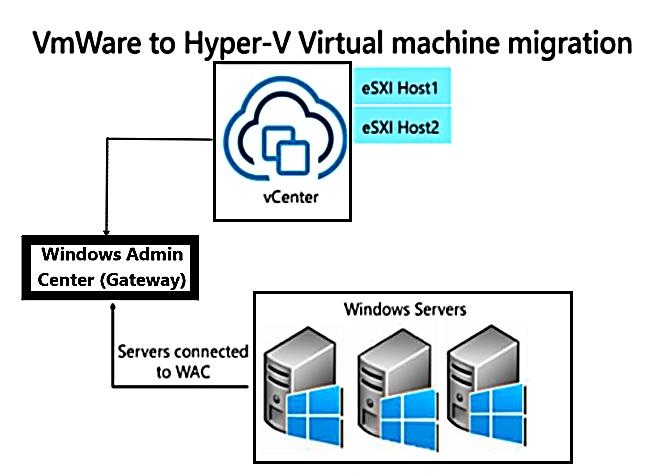
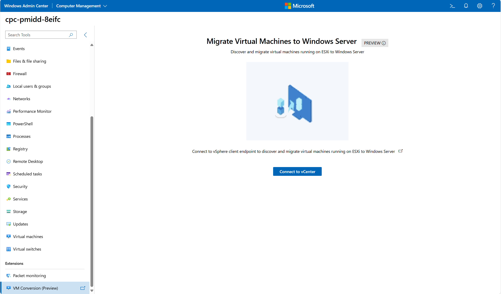
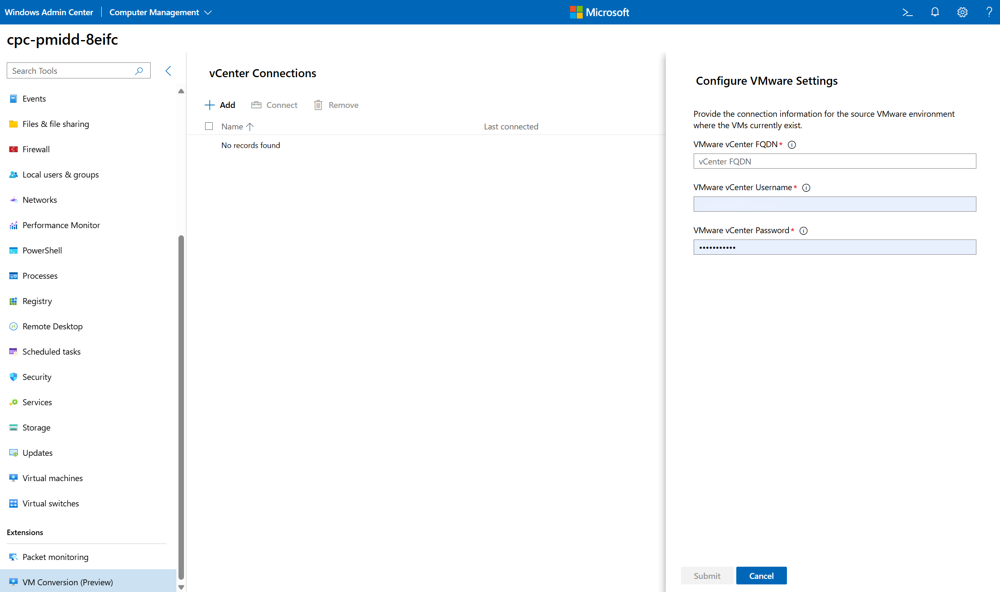
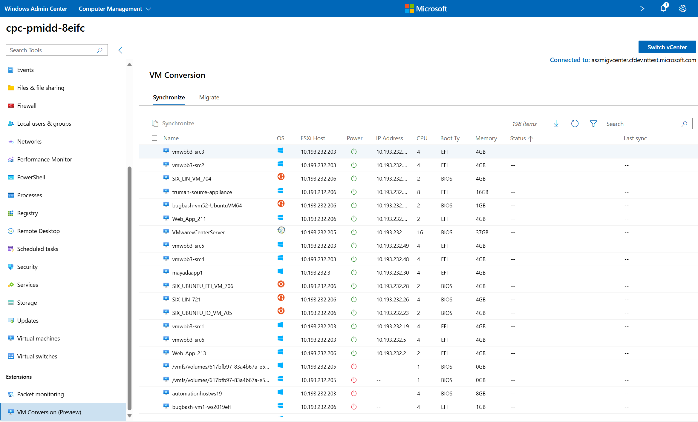
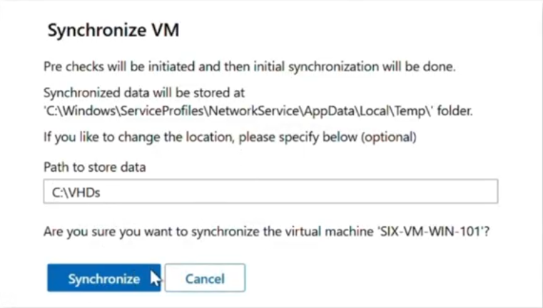
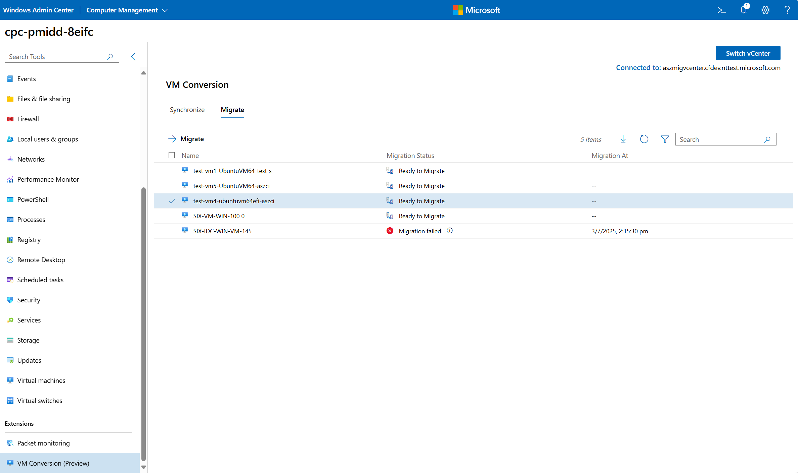
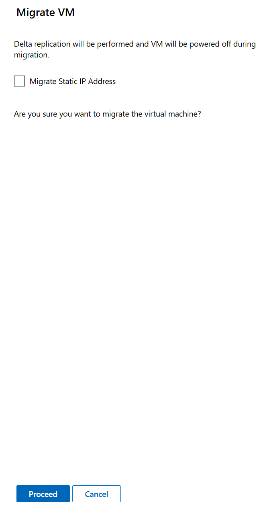

# Migrate VMware virtual machines to Hyper-V in Windows Admin Center (Preview)

> [!IMPORTANT]
> The VM Conversion extension is currently in PREVIEW.
> This information relates to a prerelease product that may be substantially modified before it's released. Microsoft makes no warranties, expressed or implied, with respect to the information provided here.

You can use Windows Admin Center to migrate VMware virtual machines from vCenter to Hyper-V with the **VM Conversion extension**. This lightweight tool enables online replication with minimal downtime for both Windows and Linux virtual machines. The conversion tool is easy and fast to set up, at no cost to customers.

In this article, you learn how to install and configure the extension, follow the synchronization and migration workflow, and find answers to common questions.

## Feature overview

The **VM Conversion extension** provides the following key features:

- **Bulk migration**: Supports a batch of 10 virtual machines migration at-a-time. This enables admins to group virtual machines based on:

  - **Application dependency** – virtual machines that are part of the same application stack or service.
  - **Cluster dependency** – virtual machines that need to be distributed on nodes within same cluster.
  - **Business boundaries** – virtual machines servicing different business within a company. For example, test machines and pre-production machines.
  - **Rack dependency** – virtual machines running on hosts on a rack.

- **Cluster-aware migration**: Supports migration virtual machines from eSXI hosts to Windows Server Failover clusters.

- **Static IP configurations**: Persists the static IP configurations of virtual machines from source to destination Hyper-V hosts. This reduces post-migration tasks and enables seamless network continuity.

- ​**Secure Boot and UEFI template configuration**: Provides enhanced security and compliance.​
  - Integrated osType across the migration flow for accurate secure boot and UEFI setup.​
  - Secure boot settings are dynamically configured based on OS, either Windows or Linux.​
  - Added error handling for unsupported OS types.

- **Localization support**: Improves user experience using this tool in different languages.

- **Multiple vCenter connections**: Users can add multiple vCenter endpoints in order to switch between vCenters.
​
- **Multi-disk support**: Ensures all attached virtual disks are migrated and synchronized for virtual machines running complex workloads.​

- **Prechecks**: Catches failures early in replication, and migration phases.​

- **Cleanup**: Removes VMware Tools from Windows VMs post-migration.



## Prerequisites

Before you begin, review the prerequisites and ensure your environment meets the requirements.

### Windows Admin Center Gateway prerequisites

- Install PowerCLI.
  - Install using the PowerShell command: `Install-Module -Name VMware.PowerCLI`

- Install:
  - [Microsoft Visual C++ Redistributable](/cpp/windows/latest-supported-vc-redist)
  - [Visual C++ Redistributable Packages for Visual Studio 2013](https://www.microsoft.com/download/details.aspx?id=40784)

- Download [VMware Virtual Disk Development Kit (VDDK) version 8.0.3](https://developer.broadcom.com/sdks/vmware-virtual-disk-development-kit-vddk/latest/). Extract the contents, and copy to the directory: *C:\Program Files\WindowsAdminCenter\Service\VDDK*.

- Ensure that the Hyper-V role is installed. This is typically already enabled.

- Use Windows Admin Center Gateway V2 – version `2410` build number `2.4.12.10`

### vCenter or ESXI host prerequisites

None.

### Windows Server host prerequisites

None.

## Supported vCenter versions

- The extension supports VMware VCenter version 6.x or 7.x.
- To connect to vCenter from the extension, keep the following vCenter information at hand:
  - Fully Qualified Domain Name (FQDN)
  - Username
  - Password

## Supported guest operating systems

The following operating systems can use the VM Conversion extension:

Windows operating systems:

- Windows Server 2025, 2022, 2022 Azure Edition, 2019, 2016, 2012 R2
- Windows 10

RHEL-based operating systems:

- Alma Linux*
- CentOS
- Red Hat Linux 9.0

Debian-based operating systems:

- Ubuntu Linux
- Ubuntu 20.04, 24.04
- Debian 11, 12

*For Linux guests, [Hyper-V drivers must be installed](https://www.microsoft.com/download/details.aspx?id=55106&msockid=15b6b5ffb158644112aea6d8b0e26503) before initiating migration. This is essential to ensure successful post-migration boot.

## Prechecks

Prechecks are run before the synchronization and migrations steps to see whether the virtual machines can be successfully migrated.

### Synchronization prechecks

1. No active snapshots exist on the virtual machine.​

1. VMware PowerCLI is installed on the Windows Admin Center Gateway machine.​

1. Microsoft Visual C++ Redistributable packages (versions 2013 and latest) are installed on the Windows Admin Center Gateway machine.​

1. VDDK package is present at:​ `C:\Program Files\WindowsAdminCenter\Service\VDDK` on the Windows Admin Center Gateway machine.​

1. Target disk path for synchronization is valid.​

1. Destination Hyper-V host has sufficient memory and disk space.​

1. Change Block Tracking (CBT) is supported on the VM.

### Migration prerechecks

1. Destination Hyper-V host has sufficient vCPU availability.​

1. No existing virtual machine with the same name on the destination Hyper-V host.​

1. Hyper-V role is enabled on the target Hyper-V host.​

1. Synchronized `.vhdx` file exists.​

1. No active snapshots on the virtual machine.​

## Install the VM Conversion extension in Windows Admin Center

Complete the following steps to install the **VM Conversion** extension.

1. Open Windows Admin Center.

1. Select the **Settings** button in the top-right. In the left pane, select **Extensions**.

1. The Available Extensions tab lists the extensions on the feed that are available for installation.

1. Search for **VM Conversion Extension** in **Available extensions** and select **Install.**

1. Once installed, ensure VM Conversion extension is visible in the Windows Admin Center under: **Extensions** > **VM Conversion**.

## Synchronize virtual machines using the VM Conversion extension

Complete the following steps to synchronize VMware virtual machines in Windows Admin Center.

1. Connect to the Hyper-V server in Windows Admin Center that you want the VM to be migrated.

1. Go to the VM Conversion extension in the left panel under **Extensions** > **VM Conversion**.

1. Select **Connect to vCenter**.

    [](media/migrate-vmware-to-hyper-v/connect-to-v-center.png#lightbox)

1. Enter the vCenter FQDN, vCenter username, and vCenter password.

    [](media/migrate-vmware-to-hyper-v/configure-vmware-settings.png#lightbox)

1. In the virtual machine list, select up to 10 virtual machines to synchronize.

    [](media/migrate-vmware-to-hyper-v/synchronize-tab.png#lightbox)

1. Select **Synchronize**. In the Synchronize VM window, enter in the **path to store data**. Select **Synchronize**.

    [](media/migrate-vmware-to-hyper-v/synchronize-dialog.png#lightbox)

1. You see notifications appear with the progress for: prechecks, preparing the environment, snapshot creation, and finalizing synchronization. Confirm that the VHDX file is created in the folder path specified.

1. Wait for the sync to complete 100%.

    [](media/migrate-vmware-to-hyper-v/migrate-tab.png#lightbox)

## Migrate virtual machines using the VM Conversion extension

Complete the following steps to migrate VMware virtual machines to Hyper-V in Windows Admin Center.

1. Go to the **Migrate** tab, and select the VM to migrate. Select **Migrate**.

1. In the Migrate VM window, check the box if you want to **migrate the static IP address** for each VM. Select **Proceed** in the confirmation box to start the migration.

    During the migration, the following steps are performed: run migration prechecks, ensure sufficient disk space, perform delta replication, power off source VM, execute final delta sync, and import VM into Hyper-V.

    [](media/migrate-vmware-to-hyper-v/migrate-vm-dialog.png#lightbox)

1. Wait for virtual machine migration to complete. After the VM is migrated, the migration status shows **Destination VM created. Migration completed (100%).**

1. The migrated virtual machine can be managed using the Hyper-V Manager, or in Windows Admin Center.

## View logs

### Browser console logs

1. Open your browser settings, and navigate to **More Tools** > **Developer Tools**.
1. Check the **Console** tab.
1. Look for any error or warning messages and share them as needed.

### Event viewer logs

1. On the Windows Admin Center server, open **Event Viewer**.
1. Expand **Applications and Services Logs** in the left pane.
1. Select **WindowsAdminCenter**.
1. Filter and review logs for **Errors**, **Warnings**, and **Informational** messages relevant to the VM Conversion extension.

### VM conversion logs

1. Connect to the Windows Admin Center server.
1. Find the file located at `C:\ProgramFiles\WindowsAdminCenter\Service\VMConversion_log.txt`.

## Frequently asked questions

1. Can I migrate both Windows and Linux virtual machines?

    Yes, the tool supports migration of both Windows and Linux VMs. For Linux, make sure Hyper-V drivers are installed before migration to ensure a smooth boot on the destination server.

1. Which VMware versions are supported?

    The tool supports vCenter and ESXi versions 6.x and 7.x.

1. Does the tool support both Static and DHCP IP addresses?

    Yes, DHCP and Static IP addresses works automatically. For Static IP configuration of linux vms; Hyper-V drivers should be preinstalled using [Install Linux Integration Services (LIS) on Hyper-V VM](https://poweradm.com/install-linux-integration-services-hyper-v/).

1. How does the tool handle VM boot types?

    The tool automatically detects the source VM’s boot type. **BIOS boot** creates a Generation 1 VM on Hyper-V.**UEFI boot** creates a Generation 2 VM on Hyper-V.

1. What are the current limitations of this migration tool?

    The Resync option provides the capability to do data synchronization between initial replication and delta replication. The Resync option isn't supported. VMware Tools aren't automatically uninstalled post-migration—remove them manually if needed.

1. What should I know about the source VM before migrating?

    Ensure there are no active snapshots exist for the VM—the initial sync fails otherwise. You have the FQDN and credentials for your vCenter endpoint.

1. How to Create Network Shares on a Windows Server Cluster for Clustering Support?

    To create a network share on a clustered Windows Server (for VM synchronization or migration scenarios), follow these steps:
    1. RDP into your Windows Server Cluster node.
    1. Press Windows + R, type cluadmin.msc, and hit Enter. This opens the Failover Cluster Manager.
    1. In the left pane, expand your cluster and navigate to Roles.
    1. Follow the detailed steps in this [Setting up highly available file shares in Windows Server 2022](https://4sysops.com/archives/setting-up-highly-available-file-shares-in-windows-server-2022/)
    1. Sometimes, it may take a few minutes for the drive to become ready before it can be added as a network file share. Wait patiently if that happens.
    1. Once configured, the network share folder is ready for use in VM synchronization and migration workflows.

1. Why are migrated VM disks showing as Dynamic instead of Static (Fixed)?

    The VM Conversion tool currently migrates disks as **dynamically expanding (thin provisioned)** VHDX files, which means only the used portion of the disk is copied—not the full allocated size.

    During migration, a VM with a **provisioned size of 500 GB** but **actual usage of 250 GB** results in a 250 GB dynamic VHDX on the destination. While this is space-efficient, it may cause storage management issues later.

    After migration, customers should convert the VHDX to a fixed size to reflect the full provisioned storage: `Convert-VHD -Path "C:\VMs\MyDisk.vhdx" -DestinationPath "C:\VMs\MyDisk_Fixed.vhdx" -VHDType Fixed`.

1. Is VMWare to Azure Local migration supported?

    No, migration to Azure Local isn't supported by this tool. Use Azure Migrate to migrate virtual machines to Azure Local.

1. How is static IP supported?

    Static IP is supported using scripts. When a static IP is detected, the VM credentials are collected to run the script and capture the IP address details. It's then persisted on the target Hyper-V host post cutover phase.

1. Does the tool support virtual machines running on a virtual storage area network (vSAN)?

    No, the tool doesn't support virtual machines running on vSAN?

1. Is this tool available in Windows Admin Center on portal?

    No, the conversion tool is only available in Windows Admin Center on-premise.

## Known issues

### Migrated VM disks are created as dynamically expanding (thin) VHDX files rather than fixed-size disks

**Mitigation**: After migration, convert them to fixed-size to ensure predictable storage usage and prevents overcommitment. Convert to fixed-size disks using the PowerShell command:​

```powershell
Convert-VHD -Path "<path>.vhdx" -DestinationPath "<path>_Fixed.vhdx" -VHDType Fixed​
```

### Hyper-V drivers must be installed on Linux machines before starting migration

**Mitigation**: Download and install [Linux Integration Services v4.3](https://www.microsoft.com/download/details.aspx?id=55106) for Hyper-V and Azure from the Microsoft Download Center.​

### VMware Tools aren't automatically uninstalled for Linux VMs after migration

**Mitigation**: Uninstall them manually if no longer needed.​

### BIOS serial number and UUID migration

**Mitigation**: [Update VM BIOS UUID and Serial Number](https://microsoftapc-my.sharepoint.com/:t:/g/personal/pmiddha_microsoft_com/Edpcw1mLospJuiPPMpPNGp8BMxYpWTVdQ_5OEQyfk3mlCw?e=zLOGjj)

## Future roadmap

The following features aren't available in this preview, but might be available in future releases:

- **Resync support**: The ability to synchronize data between initial and delta replication.

- **Cancel, Pause, and Resume**: options during synchronization.

- **Azure Arc enablement** of migrated virtual machines.​

- **Migration support for vSAN-based infrastructures**.

- **Networking enhancements** including VLAN tagging.​

- **Improved bulk migration with queuing support**.
