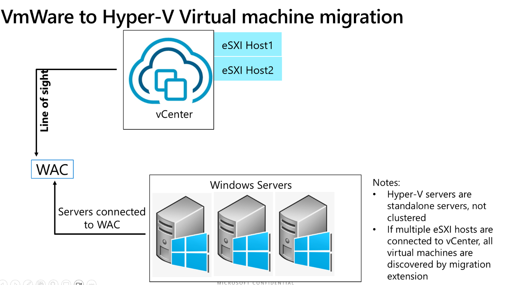

# Migrate a VMWare virtual machine to Hyper-V in Windows Admin Center

You can use Windows Admin Center to migrate virtual machines (VMs) from VMware vCenter to Hyper-V. This article explains how to install and configure the VM Conversion extension, outlines the migration workflow, and provides troubleshooting tips. Before you begin, review the prerequisites and ensure your environment meets the requirements.

## Prerequisites

- Install instructions for Power CLI on machine where the WAC gateway is
  installed using:

  - [Install
    PowerCLI](https://techdocs.broadcom.com/us/en/vmware-cis/vcf/power-cli/latest/powercli/installing-vmware-vsphere-powercli/install-powercli.html)

  - [Install PowerCLI
    Offline](https://techdocs.broadcom.com/us/en/vmware-cis/vcf/power-cli/latest/powercli/installing-vmware-vsphere-powercli/install-powercli-offline.html)

- Install Microsoft Visual C++ Redistributable on machine where WAC
  gateway is installed using [Latest supported Visual C++
  Redistributable downloads \| Microsoft
  Learn](https://learn.microsoft.com/en-us/cpp/windows/latest-supported-vc-redist?view=msvc-170)
  and [Download Visual C++ Redistributable Packages for Visual Studio
  2013 from Official Microsoft Download
  Center](https://nam06.safelinks.protection.outlook.com/?url=https%3A%2F%2Fwww.microsoft.com%2Fen-us%2Fdownload%2Fdetails.aspx%3Fid%3D40784&data=05%7C02%7CShanmugha.Satheesh%40microsoft.com%7C611a36293a004a6f795108dd58d92dce%7C72f988bf86f141af91ab2d7cd011db47%7C1%7C0%7C638764412540102080%7CUnknown%7CTWFpbGZsb3d8eyJFbXB0eU1hcGkiOnRydWUsIlYiOiIwLjAuMDAwMCIsIlAiOiJXaW4zMiIsIkFOIjoiTWFpbCIsIldUIjoyfQ%3D%3D%7C0%7C%7C%7C&sdata=C0ha8JRZvlCEhXmtwysh4mf2uocMLpxrKx9nd6dKU7k%3D&reserved=0).

- Hyper-V should already be installed on WAC gateway

- WAC Gateway V2 – GA version

- VCenter version: 7.x or above

- Download the VDDK 8.0.3 version from the [VMware Virtual Disk Development Kit (VDDK)](https://developer.broadcom.com/sdks/vmware-virtual-disk-development-kit-vddk/latest/)
  , extract it, and copy the extracted contents to the following
  directory: *"C:\Program Files\WindowsAdminCenter\Service\VDDK"*

## Things you need to know:

- FQDN of vCenter endpoint

- Login credentials of vCenter

## Install the extension

1. Download the extension provided in a local folder in WAC machine. (C:\Extension)

1. Open Windows Admin Center and navigate to the "Extensions" section.

1. Add the local directory to Feeds.

1. Search for **VM Conversion Extension** in **Available extensions** and click **Install.**

1. Once installed, ensure VM Conversion extension is visible in the WAC under: Connect to standalone server > Left panel > Extensions > VM migration.

Supported scenario topology

## Test migration workflow

1. Connect to Hyper-V/Windows server (**Datacenter-Server-001**) in WAC that you want the VM to be migrated.

1. Go to VM migration tool in left panel.

1. Connect to vCenter.

1. Look up the virtual machine that needs to be migrated.

1. Select the Virtual machine (Windows/Linux) to migrate.

1. Click on synchronize. You'll see the synchronize progress in the UX. The VHD file will be created in the folder mentioned in the pop-up box.

1. Wait for synchronize to complete 100%

1. Go to **Migrate** tab, select the VM to migrate. Click migrate. Delta replication will be triggered. Virtual machine will be briefly turned off, during cut-over. New virtual machine will be created on the
Windows Server **(Datacenter-Server-001)**.

1. Wait for virtual machine migration to complete.

1. Lifecycle management: Manage the migrated virtual machine using VM manager in WAC.

## View logs

1. Open your browser settings, navigate to More Tools > Developer Tools. Check the Console tab. Share any error log statements you see there.

2. Open Event Viewer, expand Applications and Services Logs in the left pane. Select WindowsAdminCenter, and filter the logs to capture errors. Kindly share those details as well.

3. Share the file located at C:\ProgramFiles\WindowsAdminCenter\Service\VMConversion_log.txt file.

## Known limitations

- Currently only 1-VM migration at a time is supported.

- At-scale experience: work-in-progress

- Host networking settings do not persist from eSXI host to Hyper-V host

- VM Tools not uninstalled after VM is migrated. Feature is in roadmap.
