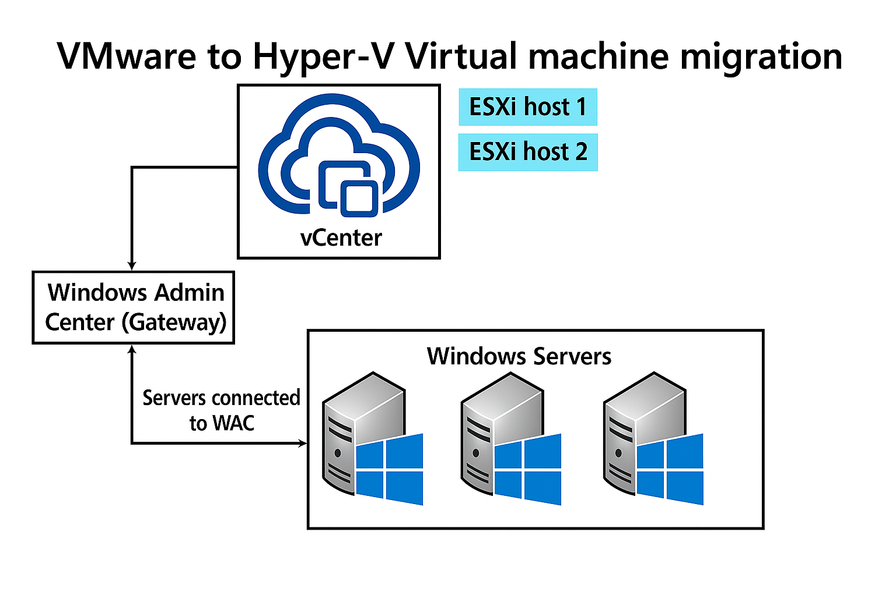

# Migrate a VMware virtual machine to Hyper-V in Windows Admin Center

You can use Windows Admin Center (WAC) to migrate virtual machines (VMs) from VMware vCenter to Hyper-V. This article explains how to install and configure the VM Conversion extension, outlines the migration workflow, and provides troubleshooting tips. Before you begin, review the prerequisites and ensure your environment meets the requirements.

## Prerequisites

- Hyper-V is installed on WAC gateway.

- WAC Gateway V2 – GA version.

- VMware VCenter version 7.x or above is installed. Keep the following vCenter information handy:
  - Fully Qualified Domain Name (FQDN)
  - Username
  - Password

- Install either [PowerCLI](https://techdocs.broadcom.com/us/en/vmware-cis/vcf/power-cli/latest/powercli/installing-vmware-vsphere-powercli/install-powercli.html) or [PowerCLI Offline](https://techdocs.broadcom.com/us/en/vmware-cis/vcf/power-cli/latest/powercli/installing-vmware-vsphere-powercli/install-powercli-offline.html)

- Install [Microsoft Visual C++ Redistributable](/cpp/windows/latest-supported-vc-redist) on machine where WAC
  gateway is installed.

- Download the latest [VMware Virtual Disk Development Kit (VDDK)](https://developer.broadcom.com/sdks/vmware-virtual-disk-development-kit-vddk/latest/), extract it, and copy the extracted contents to the following directory: *"C:\Program Files\WindowsAdminCenter\Service\VDDK"*.

## Install the extension

1. Open Windows Admin Center.

1. Select the **Settings** button in the top-right. In the left pane, select **Extensions**.

1. The Available Extensions tab lists the extensions on the feed that are available for installation.

1. Search for **VM Conversion Extension** in **Available extensions** and select **Install.**

1. Once installed, ensure VM Conversion extension is visible in the WAC under: **Extensions** > **VM Migration**.

## Supported scenario topology

## Migrate a VM migration using the conversion extension

1. Connect to the Hyper-V server (**Datacenter-Server-001**) in WAC that you want the VM to be migrated.

1. Go to the VM migration tool in the left panel under **Extensions** > **VM Migration**.

1. Select **Connect to vCenter**.

    

1. Enter the vCenter FQDN, vCenter username, and vCenter password.

    

1. Look up the virtual machine that needs to be migrated.

1. Select the Virtual machine (Windows/Linux) to migrate.

    

1. Select on **Synchronize**. In the Synchronize VM window, enter in the **path to store data**. Select **Synchronize**.
 
    

1. You see notifications appear with the progress. Confirm that the VHD file is created in the folder path specified.

1. Wait for the sync to complete 100%.

    

1. Go to the **Migrate** tab, and select the VM to migrate. Select **Migrate**. Select **Proceed** in the confirmation box. Delta replication is triggered. The virtual machine is briefly turned off during cut-over. The new virtual machine is created on the server **(Datacenter-Server-001)**.

    

1. Wait for virtual machine migration to complete.

1. The migrated virtual machine can be managed using the Hyper-V Manager, or in WAC.

## View logs

1. Open your browser settings, and navigate to **More Tools** > **Developer Tools**. Check the Console tab.

2. Open Event Viewer, expand **Applications and Services Logs** in the left pane. To view errors, select WindowsAdminCenter, and filter the logs.

3. Find the file located at `C:\ProgramFiles\WindowsAdminCenter\Service\VMConversion_log.txt`.

## Known limitations

- Only 1-VM migration at a time is supported.

- At-scale experience: work-in-progress

- Host networking settings don't persist from eSXI host to Hyper-V host

- VM Tools aren't uninstalled after the VM is migrated. Feature is in roadmap.
