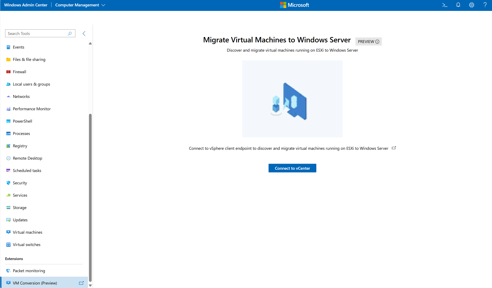
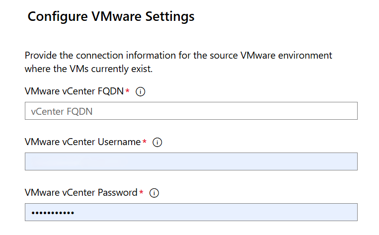

# Migrate a VMware virtual machine to Hyper-V in Windows Admin Center

You can use Windows Admin Center to migrate virtual machines (VMs) from VMware vCenter to Hyper-V with the VM Conversion extension. The VM Conversion extension is a powerful, lightweight solution that allows you to migrate virtual machines with minimal downtime on both Windows and Linux machines.

This article explains how to install and configure the extension, outlines the migration workflow, and provides answers to frequently asked questions. Before you begin, review the prerequisites and ensure your environment meets the requirements.

The VM Conversion extension provides the following features:

- **Bulk migration support**: Enables selection and migration of up to 10 VMs in a single operation, streamlining the process.
- **Remote server migration**: Supports migration to Hyper-V servers that aren't locally hosted.
- **Cluster server migration**: Facilitates VM migration to clustered Hyper-V environments for high availability.
- **Static IP retention**: Automatically preserves the original static IPv4 address post-migration, minimizing manual reconfiguration.
- **Multi-vCenter connection support**: Allows managing and switching between multiple vCenter instances within the same interface.
- **Custom sync path selection via file browser**: Offers an easy-to-use file browse option for specifying target disk paths.
- **Localization support**: Enables multi-language support to enhance usability for global audiences.

## Prerequisites

- Hyper-V is installed on Windows Admin Center gateway.

- [PowerCLI](https://techdocs.broadcom.com/us/en/vmware-cis/vcf/power-cli/latest/powercli/installing-vmware-vsphere-powercli/install-powercli.html) is installed

- [Microsoft Visual C++ Redistributable](/cpp/windows/latest-supported-vc-redist) is installed on machine with the Windows Admin Center gateway.

- [VMware Virtual Disk Development Kit (VDDK)](https://developer.broadcom.com/sdks/vmware-virtual-disk-development-kit-vddk/latest/) is downloaded. Extract it, and copy the extracted contents to the directory: *C:\Program Files\WindowsAdminCenter\Service\VDDK*.

- Windows Admin Center Gateway V2 – GA version.

- VMware VCenter version 6.x or higher is installed. Keep the following vCenter information at hand:
  - Fully Qualified Domain Name (FQDN)
  - Username
  - Password

- Ensure that the VM to be migrated has no active snapshots. If snapshots exist, initial sync prechecks fail.

- For Alma Linux guests, Hyper-V drivers must be installed before initiating migration. This is essential to ensure successful post-migration boot.

## Supported operating systems

The following operating systems can use the VM Conversion extension:

- Windows Server 2025 Standard
- Windows Server 2022 Standard
- Alma Linux
- Ubuntu Desktop 20.04.6 LTS
- CentOS
- Ubuntu Desktop 20.04
- Red Hat Linux 9.0
- Windows 2008R2 SP1
- Windows 2012R2
- Windows 2016
- Windows 2022 Azure Edition
- Ubuntu 24.04
- Debian 11 and 12

## Install the extension

1. Open Windows Admin Center.

1. Select the **Settings** button in the top-right. In the left pane, select **Extensions**.

1. The Available Extensions tab lists the extensions on the feed that are available for installation.

1. Search for **VM Conversion Extension** in **Available extensions** and select **Install.**

1. Once installed, ensure VM Conversion extension is visible in the Windows Admin Center under: **Extensions** > **VM Conversion**.

## Supported scenario topology

## Migrate a VM migration using the conversion extension

1. Connect to the Hyper-V server in Windows Admin Center that you want the VM to be migrated.

1. Go to the VM migration tool in the left panel under **Extensions** > **VM Conversion**.

1. Select **Connect to vCenter**.

    

1. Enter the vCenter FQDN, vCenter username, and vCenter password.

    

1. In the virtual machine list, select up to 10 virtual machines to migrate.

    

1. Select **Synchronize**. In the Synchronize VM window, enter in the **path to store data**. Select **Synchronize**.
 
    

1. You see notifications appear with the progress for: prechecks, preparing the environment, snapshot creation, and finalizing synchronization. Confirm that the VHD file is created in the folder path specified.

1. Wait for the sync to complete 100%.

    

1. Go to the **Migrate** tab, and select the VM to migrate. Select **Migrate**.

1. In the Migrate VM window, check the box if you want to **migrate the static IP address** for each VM. Select **Proceed** in the confirmation box to start the migration.

    During the migration, the following steps are performed: run migration prechecks, ensure sufficient disk space, perform delta replication, power off source VM, execute final delta sync, and import VM into Hyper-V.

    

1. Wait for virtual machine migration to complete. After the VM is migrated, the migration status shows **Destination VM created. Migration completed (100%).**

1. The migrated virtual machine can be managed using the Hyper-V Manager, or in Windows Admin Center.

## View logs

### Browser console logs

1. Open your browser settings, and navigate to **More Tools** > **Developer Tools**.
1. Check the **Console** tab.
1. Look for any error or warning messages and share them as needed.

### Event viewer logs

1. On the Windows Admin Center server, open **Event Viewer**.
1. Expand **Applications and Services Logs** in the left pane.
1. Select **WindowsAdminCenter**.
1. Filter and review logs for **Errors**, **Warnings**, and **Informational** messages relevant to the VM Conversion extension.

### VM conversion logs

1. Connect to the Windows Admin Center server.
1. Find the file located at `C:\ProgramFiles\WindowsAdminCenter\Service\VMConversion_log.txt`.

## View frequently asked questions

1. Can I migrate both Windows and Linux virtual machines?

    Yes—the tool supports migration of both Windows and Linux VMs. For Alma Linux, make sure Hyper-V drivers are installed before migration to ensure a smooth boot on the destination server.

1. Which VMware versions are supported?

    The tool supports vCenter and ESXi versions 6.x and higher.

1. Does the tool support both Static and DHCP IP addresses?

    Yes. DHCP works automatically; no manual action needed. For Static IP, a script is provided to manually persist the original static IP on the destination server. Learn more about how to [Maintain static IP addresses during migration (preview)](/azure/azure-local/migrate/migrate-maintain-ip-addresses?tabs=linux).

1. How does the tool handle VM boot types?

    The tool automatically detects the source VM’s boot type. **BIOS boot** creates a Generation 1 VM on Hyper-V.**UEFI boot** creates a Generation 2 VM on Hyper-V.

1. What are the current limitations of this migration tool?

    The Resync option provides the capability to do data synchronization between initial replication and delta replication. The Resync option isn't supported. VMware Tools aren't automatically uninstalled post-migration—remove them manually if needed.

1. What should I know about the source VM before migrating?

    Ensure there are no active snapshots exist for the VM — the initial sync fails otherwise. You have the FQDN and credentials for your vCenter endpoint.

1. Ubuntu Desktop 20.04 or Red Hat Linux 9.0 VMs may fail to boot correctly after migration. How can I get the VM to boot correctly after migration?

    Disable the Secure Boot option resolves the issue for these Linux VMs. You can do this using PowerShell:
`Set-VMFirmware -VMName "<VM Name>" -EnableSecureBoot Off`.

1. How to Create Network Shares on a Windows Server Cluster for Clustering Support?

    To create a network share on a clustered Windows Server (for VM synchronization or migration scenarios), follow these steps:
    1. RDP into your Windows Server Cluster node.
    1. Press Windows + R, type cluadmin.msc, and hit Enter. This opens the Failover Cluster Manager.
    1. In the left pane, expand your cluster and navigate to Roles.
    1. Follow the detailed steps in this [Setting up highly available file shares in Windows Server 2022](https://4sysops.com/archives/setting-up-highly-available-file-shares-in-windows-server-2022/)
    1. Sometimes, it may take a few minutes for the drive to become ready before it can be added as a network file share. Wait patiently if that happens.
    1. Once configured, the network share folder is ready for use in VM synchronization and migration workflows.
