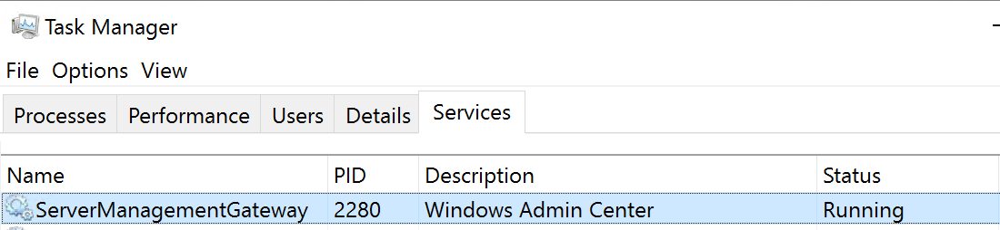

# Troubleshooting Windows Admin Center

>Applies To: Windows Admin Center, Windows Admin Center Preview

> [!Important]
> This guide will help you diagnose and resolve issues that are preventing you from using Windows Admin Center. If you are having an issue with a specific tool, please check to see if you are experiencing a [known issue.](http://aka.ms/wacknownissues)

<a id="toc"></a>

## Quick links

* I get a **This site/page can't be reached** error in my web browser (select your deployment type)
    * [I have Windows Admin Center installed as an App on Windows 10](#whitescreenw10)
    * [I have Windows Admin Center installed as an Gateway on Windows Server](#whitescreenws)
    * [I have Windows Admin Center installed as an Gateway on an Azure VM](#whitescreenzvm)

* [Windows Admin Center home page loads, but I'm stuck on the Add Connection pane, or I can't connect to any machine.](#winvercompat)

* [I get the message: "Error while loading the module. Rpc: Expired retries 'Ping'."](#winvercompat)

* [I get the message: "Cant connect securely to this page. This might be because the site uses outdated or unsafe TLS security settings."](#tls)

* [I can connect to some servers, but not others](#connectionissues)

* [I'm using Windows Admin Center in a **workgroup**](#workgroup)

* [I previously had Windows Admin Center installed, and now nothing else can use the same TCP/IP port](#urlacl)

* [My issue is not listed here, or the steps on this page did not resolve my issue.](#filebug)

## I get a **This site/page can't be reached** error in my web browser

<a id="whitescreenw10"></a>

### If you've installed Windows Admin Center as an **App on Windows 10**

* Check to make sure Windows Admin Center is running. Look for the Windows Admin Center icon  in the System tray or **Windows Admin Center Desktop / SmeDesktop.exe** in Task Manager. If not, launch **Windows Admin Center** from the Start Menu.

> [!NOTE] 
> After rebooting, you must launch Windows Admin Center from the Start Menu.  

* [Check the Windows version](#winvercompat)

* Make sure you are using either Microsoft Edge or Google Chrome as your web browser.

* Did you select the correct certificate on [first launch?](launch.md)

  * Try opening your browser in a private session - if that works, you'll need to clear your cache.

[[back to top]](#toc)

<a id="whitescreenws"></a>

### If you've installed Windows Admin Center as a **Gateway on Windows Server**
* [Check the Windows version](#winvercompat) of the client and server.
* Make sure you are using either Microsoft Edge or Google Chrome as your web browser.

* On the server, open Task Manager > Services and make sure **ServerManagementGateway / Windows Admin Center** is running.


* Test the network connection to the Gateway (replace \<values> with the information from your deployment)
```powershell
Test-NetConnection -Port <port> -ComputerName <gateway> -InformationLevel Detailed
```

[[back to top]](#toc)

<a id="whitescreenazvm"></a>  

### If you've installed Windows Admin Center in an Azure Windows Server VM

* [Check the Windows version](#winvercompat)
* Did you add an inbound port rule for HTTPS? 
* [Learn more about installing Windows Admin Center in an Azure VM](https://docs.microsoft.com/en-us/windows-server/manage/windows-admin-center/configure/azure-integration#use-a-windows-admin-center-gateway-deployed-in-azure)

[[back to top]](#toc)

<a id="winvercompat"></a>

## Check the Windows version

* Open the run dialog (Windows Key + R) and launch ```winver```.

* If you are using Windows 10 version 1703 or below, Windows Admin Center is not supported on your version of Microsoft Edge. Either upgrade to a recent version of Windows 10 or use Chrome.

* If you are using an insider preview version of Windows 10 or Server with a build version between 17134 and 17637, Windows Admin Center has a [known incompatibility.](known-issues.md#previous-insider-preview-builds-of-windows-10--window-server-2019-rs5)

## Make sure the Windows Remote Management (WinRM) service is running on both the gateway machine and managed node

* Open the run dialog with WindowsKey + R
* Type ```services.msc``` and press enter
* In the window that opens, look for Windows Remote Management (WinRM), make sure it is running and set to automatically start

## Did you upgrade your server from 2016 to 2019?

* This may have cleared your trusted hosts settings. [Follow these instructions to update your trusted hosts settings.](#configure-trustedHosts) 

[[back to top]](#toc)

<a id="tls"></a>

## I get the message: "Cant connect securely to this page. This might be because the site uses outdated or unsafe TLS security settings.

<!--REF: https://docs.microsoft.com/en-us/iis/get-started/whats-new-in-iis-10/http2-on-iis#when-is-http2-not-supported -->
Your machine is restricted to HTTP/2 connections. Windows Admin Center uses integrated Windows authentication, which is not supported in HTTP/2. Add the following two registry values under the ```HKEY_LOCAL_MACHINE\SYSTEM\CurrentControlSet\Services\Http\Parameters``` key to remove the HTTP/2 restriction:

```
EnableHttp2Cleartext=dword:00000000
EnableHttp2Tls=dword:00000000
```

[[back to top]](#toc)

<a id="connectionissues"></a> 

## I can connect to some servers, but not others
* Log on to the gateway machine locally and try to ```Enter-PSSession <machine name>``` in PowerShell, replacing \<machine name> with the name of the Machine you are trying to manage in Windows Admin Center. 

* If your environment uses a workgroup instead of a domain, see [using Windows Admin Center in a workgroup](#workgroup).

* **Using local administrator accounts:** If you are using a local user account that is not the built-in administrator account, you will need to enable the policy on the target machine by running the following command in PowerShell or at a Command Prompt as Administrator on the target machine:

    REG ADD HKLM\SOFTWARE\Microsoft\Windows\CurrentVersion\Policies\System /v LocalAccountTokenFilterPolicy /t REG_DWORD /d 1

[[back to top]](#toc)

<a id="workgroup"></a>

## Using Windows Admin Center in a workgroup 

### What account are you using?
Make sure the credentials you are using are a member of the target server's local administrators group. In some cases, WinRM also requires membership in the Remote Management Users group. If you are using a local user account that is **not the built-in administrator account**, you will need to enable the policy on the target machine by running the following command in PowerShell or at a Command Prompt as Administrator on the target machine:

```
REG ADD HKLM\SOFTWARE\Microsoft\Windows\CurrentVersion\Policies\System /v LocalAccountTokenFilterPolicy /t REG_DWORD /d 1
```
### Are you connecting to a workgroup machine on a different subnet?

To connect to a workgroup machine that is not on the same subnet as the gateway, make sure the firewall port for WinRM (TCP 5985) allows inbound traffic on the target machine. You can run the following command in PowerShell or at a Command Prompt as Administrator on the target machine to create this firewall rule:

- **Windows Server**

        Set-NetFirewallRule -Name WINRM-HTTP-In-TCP-PUBLIC -RemoteAddress Any

- **Windows 10**

       Set-NetFirewallRule -Name WINRM-HTTP-In-TCP -RemoteAddress Any

### Configure TrustedHosts

When installing Windows Admin Center, you are given the option to let Windows Admin Center manage the gateway's TrustedHosts setting. This is required in a workgroup environment, or when using local administrator credentials in a domain. If you choose to forego this setting, you must configure TrustedHosts manually.

**To modify TrustedHosts using PowerShell commands:**

1. Open an Administrator PowerShell session.
2. View your current TrustedHosts setting:

        Get-Item WSMan:\localhost\Client\TrustedHosts

    > [!WARNING]
    > If the current setting of your TrustedHosts is not empty, the commands below will overwrite your setting. We recommend that you save the current setting to a text file with the following command so you can restore it if needed:

    > `Get-Item WSMan:localhost\Client\TrustedHosts | Out-File C:\OldTrustedHosts.txt`

3. Set TrustedHosts to the NetBIOS, IP, or FQDN of the machines you
intend to manage:

        Set-Item WSMan:localhost\Client\TrustedHosts -Value '192.168.1.1,server01.contoso.com,server02'

    > [!TIP] 
    >For an easy way to set all TrustedHosts at once, you can use a wildcard.

    >     Set-Item WSMan:\localhost\Client\TrustedHosts -Value '*'

4. When you are done testing, you can issue the following command from an elevated PowerShell session to clear your TrustedHosts setting:

        Clear-Item WSMan:localhost\Client\TrustedHosts

5. If you had previously exported your settings, open the file, copy the values, and use this command:

        Set-Item WSMan:localhost\Client\TrustedHosts -Value '<paste values from text file>'## Credentials ##

[[back to top]](#toc)

<a id="urlacl"></a>

## I previously had Windows Admin Center installed, and now nothing else can use the same TCP/IP port

Manually run these two commands in an elevated command prompt:

```
netsh http delete sslcert ipport=0.0.0.0:443
netsh http delete urlacl url=https://+:443/
```

[[back to top]](#toc)

<a id="azissue"></a>

## Having an issue with an Azure-related feature?

Please send us an email at wacAzureFeedback@microsoft.com with the following information:
* General issue information from the [questions listed below](#filebug). 
* Describe your issue and the steps you took to reproduce the issue. 
* Did you previously register your gateway to Azure using the New-AadApp.ps1 downloadable script and then upgrade to version 1807? Or did you register your gateway to Azure using the UI from gateway Settings > Azure?
* Is your Azure account associated with multiple directories/tenants?
    * If yes: When registering the Azure AD application to Windows Admin Center, was the directory you used your default directory in Azure? 
* Does your Azure account have access to multiple subscriptions?
* Does the subscription you were using have billing attached?
* Were you logged in to multiple Azure accounts when you encountered the issue?
* Does your Azure account require multi-factor authentication?
* Is the machine you are trying to manage an Azure VM?
* Is Windows Admin Center installed on an Azure VM?

[[back to top]](#toc)

<a id="filebug"></a>

## Still not working, or is your issue not captured here? [troubleshooting common questions]

Go to Event Viewer > Application and Services > Microsoft-ServerManagementExperience and look for any errors or warnings.

File a bug on our [UserVoice](https://windowsserver.uservoice.com/forums/295071/category/319162?query=%5BBug%5D) that describes your issue.

Please include any errors or warning you find in the event log, as well as the following information: 

* Platform where Windows Admin Center is **installed** (Windows 10 or Windows Server):
    * If installed on Server, what is the Windows [version](#winvercompat) of **the machine running the browser** to access Windows Admin Center: 
    * Are you using the self-signed certificate created by the installer?
    * If you are using your own certificate, does the subject name match the machine?
    * If you are using your own certificate, does it specify an alternate subject name?
* Did you install with the default port setting?
    * If not, which port did you specify?
* Is the machine where Windows Admin Center is **installed** joined to a domain?
* Windows [version](#winvercompat) where Windows Admin Center is **installed**:
* Is the machine that you are **trying to manage** joined to a domain?
* Windows [version](#winvercompat) of the machine that you are **trying to manage**:
* What browser are you using?
    * If you are using Google Chrome, what is the version? (Help > About Google Chrome)

[[back to top]](#toc)