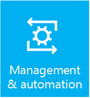

# Management and Automation in Windows Server 2016

>Applies To: Windows Server&reg; 2016, Windows Server&reg; 2012 R2, Windows Server&reg; 2012

 Management and automation features and tools help IT pros run and manage Windows Server.  

## [Server Manager](http://technet.microsoft.com/library/mt126175.aspx)

The content in this section describes how to use Server Manager in Windows Server to manage both local and remote Windows-based servers from desktop computers.  

## [Remote Server Administration Tools](http://technet.microsoft.com/library/mt126174.aspx)  

 To ease remote server management, you can download and install Remote Server Administration Tools for Windows 10&reg;. Remote Server Administration Tools for Windows 10&reg; includes Server Manager, Microsoft Management Console (MMC) snap-ins, consoles, Windows PowerShell cmdlets and providers, and some command-line tools for managing roles and features that run on Windows Server 2016.  

## [Windows Server Update Services &#40;WSUS&#41;](windows-server-update-services/get-started/Windows-Server-Update-Services-WSUS.md)  

The content in this section describes how to configure and manage WSUS. In this section you will find information about installing the WSUS Server Role, configuring WSUS servers, as well as managing updates, and managing WSUS client computers and WSUS computer groups.  

## See Also  
- [Manage connections from Windows operating system components to Microsoft services](https://technet.microsoft.com/itpro/windows/manage/manage-connections-from-windows-operating-system-components-to-microsoft-services)
- [Configure Windows telemetry in your organization](https://technet.microsoft.com/itpro/windows/manage/configure-windows-telemetry-in-your-organization)