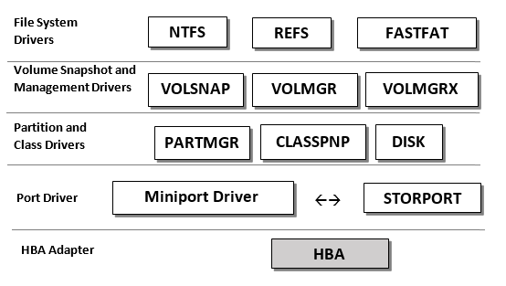

# Performance Tuning for Storage Subsystems

Decisions about how to design or configure storage software and hardware usually consider performance. Performance is improved or degraded as a result of trade-offs between multiple factors such as cost, reliability, availability, power, or ease-of-use. There are many components involved in handling storage requests as they work their way through the storage stack to the hardware, and trade-offs are made between such factors at each level. File cache management, file system architecture, and volume management translate application calls into individual storage access requests. These requests traverse the storage driver stack and generate streams of commands that are presented to the disk storage subsystem. The sequence and quantity of calls and the subsequent translation can improve or degrade performance.

The following figure shows the storage architecture, which includes many components in the driver stack.

The layered driver model in Windows sacrifices some performance for maintainability and ease-of-use (in terms of incorporating drivers of varying types into the stack). The following sections discuss tuning guidelines for storage workloads.

**In this section:**

-   [Choosing Storage for Storage Subsystem Performance](./Section_5.1-choosing-storage-for-storage-subsystem-performance.md)

-   [Using Storage Spaces for Storage Subsystem Performance](./Section_5.2-using-storage-spaces-for-storage-subsystem-performance.md)

-   [Using Storage-related Parameters and Performance Counters](./Section_5.3-using-storage-related-parameters-and-performance-counters.md)

-   [Using Storage Drivers for Storage Subsystem Performance](./Section_5.4-using-storage-drivers-for-storage-subsystem-performance.md)
